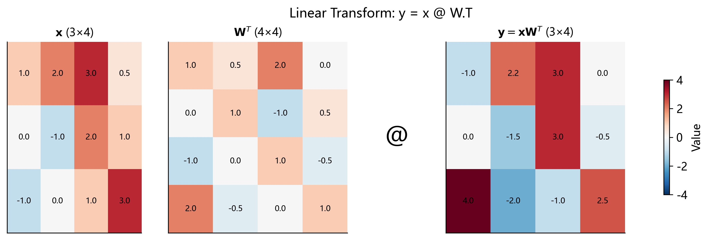

# 01 — 线性变换 (Linear Transform)

> **一句话总结**: 线性变换 $y = xW^T + b$ 是深度学习中最基础, 最普遍的运算 — — Qwen2-VL-2B-Instruct 中超过 99% 的参数都存在于线性层里.

---

## 1. 为什么要关心线性变换?

假设你是一名建筑师, 面前有一张蓝图. 蓝图上每个点都用二维坐标 $(x, y)$ 表示. 现在你想把整座建筑放大 2 倍, 旋转 30°, 然后向右平移 10 米 — — 这三步操作, 本质上就是一次**仿射变换** (affine transform).

在深度学习中, 我们面对的不是二维蓝图, 而是 1280 维的视觉特征, 1536 维的文本向量. 但核心思想完全一样: **通过一组可学习的参数, 把数据从一个空间"搬运"到另一个空间**. 模型的"智慧"几乎全部编码在这些参数矩阵里.

线性变换之所以如此重要, 是因为它是 Transformer 的"砖块" — —

- 每次计算 Query, Key, Value 时要做线性变换
- 前馈网络 (MLP) 的每一层是线性变换
- 最后把隐藏向量映射到词表 (vocabulary) 也是线性变换
- 甚至 patch embedding 的底层也可以理解为一种线性变换

可以毫不夸张地说: **理解了线性变换, 你就理解了深度学习的骨架. **

---

## 2. 前置知识: 矩阵乘法

在深入线性变换之前, 我们必须确保矩阵乘法的概念足够扎实.

### 2.1 行向量 × 列向量 = 标量

两个长度相同的向量做**内积** (dot product / inner product):

$$
\mathbf{a} \cdot \mathbf{b} = \sum_{k=1}^{n} a_k b_k
$$

例如:

$$
[1, 2, 3] \cdot [4, 5, 6] = 1 \times 4 + 2 \times 5 + 3 \times 6 = 4 + 10 + 18 = 32
$$

这个操作有一个直观的几何含义: 它衡量两个向量"有多对齐". 如果两个向量完全正交, 内积为零; 方向相同时内积最大. 后面我们会看到, Transformer 中的注意力机制正是利用了这一点.

### 2.2 矩阵乘法的维度法则

矩阵 $A \in \mathbb{R}^{m \times n}$ 乘以矩阵 $B \in \mathbb{R}^{n \times p}$ 得到 $C \in \mathbb{R}^{m \times p}$:

$$
C_{ij} = \sum_{k=1}^{n} A_{ik} \cdot B_{kj}
$$

关键约束: **$A$ 的列数必须等于 $B$ 的行数**. 用一个简单的记忆法:

$$
(\underbrace{m \times n}_{A}) \times (\underbrace{n \times p}_{B}) = (\underbrace{m \times p}_{C})
$$

中间的 $n$ 必须匹配, 然后"消掉", 留下外侧的 $m$ 和 $p$.

### 2.3 完整的手算示例

让我们用一个 $2 \times 3$ 矩阵乘以 $3 \times 2$ 矩阵来练习:

$$
A = \begin{bmatrix} 1 & 2 & 3 \\ 4 & 5 & 6 \end{bmatrix}, \quad
B = \begin{bmatrix} 7 & 8 \\ 9 & 10 \\ 11 & 12 \end{bmatrix}
$$

$$
C = AB = \begin{bmatrix}
1\cdot7 + 2\cdot9 + 3\cdot11 & 1\cdot8 + 2\cdot10 + 3\cdot12 \\
4\cdot7 + 5\cdot9 + 6\cdot11 & 4\cdot8 + 5\cdot10 + 6\cdot12
\end{bmatrix}
= \begin{bmatrix}
7 + 18 + 33 & 8 + 20 + 36 \\
28 + 45 + 66 & 32 + 50 + 72
\end{bmatrix}
= \begin{bmatrix}
58 & 64 \\
139 & 154
\end{bmatrix}
$$

每个输出元素都是一次内积运算. $C$ 有 $2 \times 2 = 4$ 个元素, 每个元素需要 3 次乘法和 2 次加法, 总共 $4 \times 3 = 12$ 次乘法.

一般地, $m \times n$ 乘 $n \times p$ 需要 $m \times n \times p$ 次乘法 — — 这就是为什么大模型的计算量如此惊人.

---

## 3. 线性变换的数学定义

### 3.1 纯线性映射

一个**线性映射** (linear map) $f: \mathbb{R}^{d_{\text{in}}} \to \mathbb{R}^{d_{\text{out}}}$ 必须满足两个性质:

1. **可加性**: $f(\mathbf{u} + \mathbf{v}) = f(\mathbf{u}) + f(\mathbf{v})$
2. **齐次性**: $f(c\mathbf{u}) = c \cdot f(\mathbf{u})$

线性代数最核心的定理之一告诉我们: **任何线性映射都可以用一个矩阵来表示**. 也就是说, 存在矩阵 $W$, 使得:

$$
f(\mathbf{x}) = W\mathbf{x}
$$

### 3.2 仿射变换 = 线性 + 平移

在神经网络中, 我们通常使用的是**仿射变换** (affine transform):

$$
f(\mathbf{x}) = W\mathbf{x} + \mathbf{b}
$$

这里 $\mathbf{b}$ 是偏置向量 (bias), 它打破了纯线性映射"原点不动"的限制. 虽然严格意义上仿射变换不是线性的 (它不满足 $f(\mathbf{0}) = \mathbf{0}$), 但在深度学习领域, 大家习惯性地把它称为"线性层" (linear layer).

### 3.3 PyTorch 约定: $y = xW^T + b$

这里有一个容易让初学者困惑的地方. 数学教科书写的是 $y = Wx + b$, 其中 $x$ 是列向量. 但在 PyTorch 的 `nn.Linear` 中, 公式变成了:

$$
y = xW^T + b
$$

为什么? 原因在于**数据的存储方式**.

在深度学习框架中, 数据以**行优先** (row-major) 的方式存储. 一个 batch 的数据是一个矩阵, 每一**行**代表一个样本:

$$
X = \begin{bmatrix} \text{--- 样本 1 ---} \\ \text{--- 样本 2 ---} \\ \vdots \\ \text{--- 样本 } n \text{ ---} \end{bmatrix} \in \mathbb{R}^{n \times d_{\text{in}}}
$$

而 PyTorch 的 `nn.Linear(in_features, out_features)` 将权重存储为形状 $(d_{\text{out}}, d_{\text{in}})$, 即每一**行**对应一个输出神经元的权重.

为了让维度匹配:

$$
\underbrace{X}_{n \times d_{\text{in}}} \times \underbrace{W^T}_{d_{\text{in}} \times d_{\text{out}}} = \underbrace{Y}_{n \times d_{\text{out}}}
$$

所以需要对 $W$ 做转置. 如果你去看 PyTorch 源码, 会发现 `F.linear` 的核心就是 `input @ weight.t()`.

> **直觉**: 数学家喜欢列向量, 程序员喜欢行向量. $xW^T$ 就是在"行向量的世界"里做线性变换.

---

## 4. 几何直觉

线性变换在几何上到底做了什么? 我们可以从低维的例子建立直觉, 然后推广到高维.

### 4.1 二维空间中的旋转

考虑一个旋转矩阵:

$$
R(\theta) = \begin{bmatrix} \cos\theta & -\sin\theta \\ \sin\theta & \cos\theta \end{bmatrix}
$$

当 $\theta = 90°$ 时, $R = \begin{bmatrix} 0 & -1 \\ 1 & 0 \end{bmatrix}$, 它把向量 $(1, 0)$ 映射到 $(0, 1)$ — — 逆时针旋转了 90°.

### 4.2 缩放

$$
S = \begin{bmatrix} 2 & 0 \\ 0 & 3 \end{bmatrix}
$$

这个矩阵把 $x$ 方向拉伸 2 倍, $y$ 方向拉伸 3 倍. 对角矩阵就是各轴独立缩放.

### 4.3 投影 (降维)

$$
P = \begin{bmatrix} 1 & 0 & 0 \\ 0 & 1 & 0 \end{bmatrix}
$$

这个 $2 \times 3$ 矩阵把三维向量"投影"到二维 — — 丢掉了第三个维度.

### 4.4 升维

$$
U = \begin{bmatrix} 1 & 0 \\ 0 & 1 \\ 0 & 0 \end{bmatrix}
$$

这个 $3 \times 2$ 矩阵把二维向量"嵌入"到三维空间中.

### 4.5 任意矩阵 = 旋转 + 缩放 + 旋转

这就是**奇异值分解** (SVD) 的几何含义: 任何矩阵 $W$ 都可以分解为 $W = U \Sigma V^T$, 即先旋转 ($V^T$), 再缩放 ($\Sigma$), 再旋转 ($U$).

在高维空间中, 线性变换做的事情本质上相同 — — 只不过我们无法直观"看到"1280 维空间中的旋转和拉伸. 但数学不在乎维度的高低, 规则完全一样.

### 4.6 偏置的几何含义: 平移

纯线性变换 $y = Wx$ 必须将原点映射到原点. 加上偏置 $b$ 后, $y = Wx + b$ 允许将输出空间整体平移 — — 这相当于在高维空间中"移动坐标原点".

在二维中, 这很直观: $W$ 做旋转和缩放, $b$ 做平移. 三者组合就能实现任意的刚性变换和拉伸.

---

## 5. 详细数值示例

我们用一个 $3 \times 2$ 的权重矩阵来做一个完整的手算, 展示每一步的乘法和加法.

### 5.1 设定

输入向量 $x = [1.0, 2.0, 3.0]$ ($d_{\text{in}} = 3$), 权重和偏置:

$$
W = \begin{bmatrix} 0.1 & 0.2 & 0.3 \\ 0.4 & 0.5 & 0.6 \end{bmatrix} \in \mathbb{R}^{2 \times 3}, \quad b = \begin{bmatrix} 0.01 \\ 0.02 \end{bmatrix}
$$

这里 $d_{\text{out}} = 2$, 所以输出将是一个 2 维向量.

### 5.2 第一步: 转置 $W$

$$
W^T = \begin{bmatrix} 0.1 & 0.4 \\ 0.2 & 0.5 \\ 0.3 & 0.6 \end{bmatrix} \in \mathbb{R}^{3 \times 2}
$$

维度检查: $x$ 是 $1 \times 3$, $W^T$ 是 $3 \times 2$, 乘积将是 $1 \times 2$. ✅

### 5.3 第二步: 逐元素计算 $xW^T$

**输出第 1 个元素** ($x$ 与 $W^T$ 第 1 列的内积):

$$
y_1 = 1.0 \times 0.1 + 2.0 \times 0.2 + 3.0 \times 0.3 = 0.1 + 0.4 + 0.9 = 1.4
$$

**输出第 2 个元素** ($x$ 与 $W^T$ 第 2 列的内积):

$$
y_2 = 1.0 \times 0.4 + 2.0 \times 0.5 + 3.0 \times 0.6 = 0.4 + 1.0 + 1.8 = 3.2
$$

所以 $xW^T = [1.4, 3.2]$.

### 5.4 第三步: 加偏置

$$
y = [1.4, 3.2] + [0.01, 0.02] = [1.41, 3.22]
$$

### 5.5 换个角度看: 输出是输入特征的"加权组合"

注意 $y_1 = 0.1 x_1 + 0.2 x_2 + 0.3 x_3 + 0.01$. 这说明输出的每个维度都是输入所有维度的一个**加权和** (再加上偏置). 权重矩阵的每一行定义了一种"组合方式".

这就是为什么线性层也叫做**全连接层** (fully connected layer) — — 输出的每个神经元都和输入的每个神经元相连.

### 5.6 batch 处理示例

如果我们有 3 个样本组成一个 batch:

$$
X = \begin{bmatrix} 1.0 & 2.0 & 3.0 \\ 0.5 & 1.5 & 2.5 \\ -1.0 & 0.0 & 1.0 \end{bmatrix} \in \mathbb{R}^{3 \times 3}
$$

那么 $Y = XW^T + b$ 中, **同一个 $W$ 和 $b$ 被应用到每一行**:

$$
Y = \begin{bmatrix}
1.0 \cdot 0.1 + 2.0 \cdot 0.2 + 3.0 \cdot 0.3 + 0.01 & 1.0 \cdot 0.4 + 2.0 \cdot 0.5 + 3.0 \cdot 0.6 + 0.02 \\
0.5 \cdot 0.1 + 1.5 \cdot 0.2 + 2.5 \cdot 0.3 + 0.01 & 0.5 \cdot 0.4 + 1.5 \cdot 0.5 + 2.5 \cdot 0.6 + 0.02 \\
-1.0 \cdot 0.1 + 0.0 \cdot 0.2 + 1.0 \cdot 0.3 + 0.01 & -1.0 \cdot 0.4 + 0.0 \cdot 0.5 + 1.0 \cdot 0.6 + 0.02
\end{bmatrix}
$$

$$
= \begin{bmatrix} 1.41 & 3.22 \\ 1.11 & 2.47 \\ 0.21 & 0.22 \end{bmatrix}
$$

这就是 batch 处理的魔力 — — **一次矩阵乘法同时处理所有样本**, 在 GPU 上可以高度并行化.

---

## 6. 参数计数与内存

### 6.1 参数量公式

一个线性层 `Linear(d_in, d_out, bias=True)` 的参数量为:

$$
\text{参数量} = d_{\text{in}} \times d_{\text{out}} + d_{\text{out}} = d_{\text{out}}(d_{\text{in}} + 1)
$$

其中 $d_{\text{in}} \times d_{\text{out}}$ 是权重矩阵, $d_{\text{out}}$ 是偏置向量. 偏置相对于权重来说通常可以忽略不计.

### 6.2 内存占用

以 float32 (4 字节/参数) 为例:

| 层                              | 参数量                                | 内存 (float32) |
| ------------------------------- | ------------------------------------- | -------------- |
| Vision fc1: $1280 \to 5120$     | $1280 \times 5120 + 5120 = 6,558,720$ | 约 25 MB       |
| Text gate_proj: $1536 \to 8960$ | $1536 \times 8960 = 13,762,560$       | 约 52.5 MB     |
| Text down_proj: $8960 \to 1536$ | $8960 \times 1536 = 13,762,560$       | 约 52.5 MB     |

Qwen2-VL-2B 总共约 20 亿参数 (约 7.5 GB float32 / 约 3.7 GB float16), 其中绝大部分都在线性层中.

### 6.3 计算量 (FLOPs)

一个线性层的前向计算量约为 $2 \times n \times d_{\text{in}} \times d_{\text{out}}$ FLOPs (每次乘加算 2 次浮点运算), 其中 $n$ 是输入的 token 数. 对于一个序列长度为 3602 的 text gate_proj 层:

$$
\text{FLOPs} = 2 \times 3602 \times 1536 \times 8960 \approx 9.9 \times 10^{10} \approx 99 \text{ GFLOPs}
$$

仅仅一个线性层的一次前向传播就接近 100 GFLOPs! 这就是为什么 GPU 加速如此重要.

---

## 7. 线性变换在 Transformer 中无处不在

Transformer 架构中几乎每个组件都依赖线性变换. 让我们逐一梳理.

### 7.1 注意力机制中的 QKV 投影

在自注意力 (self-attention) 中, 输入 $x$ 需要被投影为 Query, Key, Value 三个表示:

$$
Q = xW_Q^T + b_Q, \quad K = xW_K^T + b_K, \quad V = xW_V^T + b_V
$$

每一个投影都是一个线性变换. 之后还有一个输出投影 $O = \text{Attn}(Q,K,V) W_O^T$. 所以**一个注意力层就包含 4 个线性变换**.

### 7.2 前馈网络 (MLP)

标准 Transformer 的前馈网络是两个线性层夹一个激活函数:

$$
\text{MLP}(x) = \sigma(xW_1^T + b_1) W_2^T + b_2
$$

Qwen2-VL 的文本侧使用了门控 MLP (gated MLP), 涉及三个线性层 (gate_proj, up_proj, down_proj).

### 7.3 嵌入层 (Embedding)

Token embedding 其实就是一个没有偏置的线性层, 只不过输入是 one-hot 编码的, 所以矩阵乘法退化为简单的"查表"操作.

### 7.4 语言模型头 (LM Head)

最后一层把隐藏向量映射到词表大小: $\text{logits} = h W_{\text{lm\_head}}^T$, 维度为 $1536 \to 151936$.

---

## 8. 万能近似定理 — — 为什么线性层 + 非线性 = 强大

一个自然的问题是: 既然线性变换只能做旋转, 缩放和平移, 为什么神经网络能够逼近任意复杂的函数?

答案在于**万能近似定理** (Universal Approximation Theorem). 1989 年, George Cybenko 证明了: 一个包含足够多隐藏神经元的单层前馈网络 (即一个线性变换 + 一个非线性激活函数 + 另一个线性变换) 可以以任意精度逼近任何连续函数.

关键在于**非线性激活函数** (如 ReLU, GELU, SiLU). 如果没有它, 多层线性变换的叠加仍然只是一个线性变换:

$$
W_2 (W_1 x) = (W_2 W_1) x = W' x
$$

两层等价于一层! 激活函数打破了这个限制, 使得每一层都能引入新的"折叠"和"弯曲".

---

## 9. 权重初始化 — — 为什么它重要

线性层的权重不能全部初始化为零 (否则所有神经元的输出相同, 梯度也相同, 无法"打破对称性"). 常见的初始化策略包括:

- **Xavier 初始化** (Glorot, 2010): $W \sim \mathcal{U}\left(-\sqrt{\frac{6}{d_{\text{in}} + d_{\text{out}}}}, \sqrt{\frac{6}{d_{\text{in}} + d_{\text{out}}}}\right)$. 目标是让输入和输出的方差保持一致.

- **Kaiming 初始化** (He, 2015): $W \sim \mathcal{N}\left(0, \sqrt{\frac{2}{d_{\text{in}}}}\right)$. 专为 ReLU 激活设计, 因为 ReLU 会"杀死"一半的激活值.

对于 Transformer, 通常使用类似 Xavier 的策略, 并可能对残差路径上的某些层做额外的缩放. 好的初始化能让训练更快收敛, 更稳定.

---

## 10. 历史脉络

| 年代 | 里程碑                                                                                 |
| ---- | -------------------------------------------------------------------------------------- |
| 1943 | McCulloch & Pitts 提出人工神经元模型 — — 本质是一个线性变换 + 阈值函数                 |
| 1958 | Rosenblatt 的感知机 (Perceptron) — — 单层线性变换 + 阶跃函数                           |
| 1986 | Rumelhart, Hinton & Williams 的反向传播算法 — — 使多层线性变换可训练                   |
| 1989 | Cybenko 的万能近似定理 — — 理论上证明了单隐层网络的表达能力                            |
| 2010 | Glorot (Xavier) 初始化 — — 解决深层网络的梯度消失问题                                  |
| 2017 | Vaswani et al. 的 Transformer — — 将线性变换与注意力机制结合, 开创了现代大语言模型时代 |

---

## 11. 常见误解与陷阱

### 误解 1: "线性层就是简单的乘法, 没什么好学的"

线性层的**计算**确实简单, 但它的**参数**承载了模型的全部知识. GPT-4, Qwen, LLaMA 等大模型之间的差异, 很大程度上就在于这些权重矩阵中的数值不同.

### 误解 2: "$W$ 和 $W^T$ 没区别"

维度必须匹配! 如果 $W$ 的形状是 $(d_{\text{out}}, d_{\text{in}})$, 那么 $xW$ 是非法的 ($d_{\text{in}} \neq d_{\text{out}}$, 除非恰好相等), 而 $xW^T$ 才是正确的.

### 误解 3: "不需要偏置也行"

这取决于架构设计. 在 Qwen2-VL 中:

- **Vision encoder 的线性层大多有偏置** (如 fc1, fc2)
- **Text decoder 的 MLP 线性层没有偏置** (gate_proj, up_proj, down_proj)
- 这是设计选择 — — 去掉偏置可以减少参数量, 而且在有 LayerNorm/RMSNorm 的情况下偏置的作用会被减弱

### 误解 4: "线性层可以学到任何东西"

单独的线性层只能学线性关系 (超平面, 旋转, 缩放等). 它不能学到"如果 $x > 5$ 则输出 1, 否则输出 0"这样的非线性关系. 必须和非线性激活函数配合才行.

---

## 12. Qwen2-VL-2B-Instruct 中的所有线性层

下面列出 Qwen2-VL-2B-Instruct 中所有线性层的精确形状.

### 12.1 Vision Encoder (32 个 block)

每个 vision block 包含:

| 线性层      | 权重形状 $(d_{\text{out}}, d_{\text{in}})$ | 参数量    | 偏置         |
| ----------- | ------------------------------------------ | --------- | ------------ |
| `attn.qkv`  | $(3840, 1280)$                             | 4,915,200 | ✅ $(3840,)$ |
| `attn.proj` | $(1280, 1280)$                             | 1,638,400 | ✅ $(1280,)$ |
| `mlp.fc1`   | $(5120, 1280)$                             | 6,553,600 | ✅ $(5120,)$ |
| `mlp.fc2`   | $(1280, 5120)$                             | 6,553,600 | ✅ $(1280,)$ |

> 注意: `attn.qkv` 将 Q, K, V 三个投影合并为一个矩阵. $3840 = 3 \times 1280 = 3 \times 16 \text{ heads} \times 80 \text{ head\_dim}$

每个 block 线性层参数: $4,915,200 + 3,840 + 1,638,400 + 1,280 + 6,553,600 + 5,120 + 6,553,600 + 1,280 = 19,672,320$

32 个 block 合计: $19,672,320 \times 32 = 629,514,240 \approx 6.3 \text{亿参数}$

### 12.2 Vision 额外组件

| 线性层                                 | 权重形状       | 参数量     | 偏置 |
| -------------------------------------- | -------------- | ---------- | ---- |
| `patch_embed` (Conv3D 等价)            | 视具体实现而定 | —          | —    |
| `merger.mlp.0` (fc)                    | $(3584, 5120)$ | 18,350,080 | ✅   |
| `merger.mlp.2` (fc)                    | $(3584, 3584)$ | 12,845,056 | ✅   |
| `merger.ln_q` (LayerNorm 含可学习参数) | —              | —          | —    |

### 12.3 Text Decoder (28 层)

每层包含:

| 线性层             | 权重形状 $(d_{\text{out}}, d_{\text{in}})$ | 参数量     | 偏置         |
| ------------------ | ------------------------------------------ | ---------- | ------------ |
| `self_attn.q_proj` | $(1536, 1536)$                             | 2,359,296  | ✅ $(1536,)$ |
| `self_attn.k_proj` | $(256, 1536)$                              | 393,216    | ✅ $(256,)$  |
| `self_attn.v_proj` | $(256, 1536)$                              | 393,216    | ✅ $(256,)$  |
| `self_attn.o_proj` | $(1536, 1536)$                             | 2,359,296  | ❌           |
| `mlp.gate_proj`    | $(8960, 1536)$                             | 13,762,560 | ❌           |
| `mlp.up_proj`      | $(8960, 1536)$                             | 13,762,560 | ❌           |
| `mlp.down_proj`    | $(1536, 8960)$                             | 13,762,560 | ❌           |

> 注意 GQA (Grouped-Query Attention): $Q$ 有 12 个 head, 但 $K$, $V$ 只有 2 个 head. 所以 K/V 投影的输出维度是 $2 \times 128 = 256$, 远小于 Q 的 $12 \times 128 = 1536$. 这大大减少了 KV cache 的内存占用.

每层线性层参数: $2,359,296 + 1,536 + 393,216 + 256 + 393,216 + 256 + 2,359,296 + 13,762,560 + 13,762,560 + 13,762,560 = 46,794,752$

28 层合计: $46,794,752 \times 28 = 1,310,253,056 \approx 13.1 \text{亿参数}$

### 12.4 LM Head

| 线性层    | 权重形状         | 参数量      | 偏置 |
| --------- | ---------------- | ----------- | ---- |
| `lm_head` | $(151936, 1536)$ | 233,373,696 | ❌   |

这是模型中最大的单个线性层 — — $1536 \to 151936$, 将隐藏向量映射到词表空间. 仅这一个层就有 2.3 亿参数!

---

## 13. NumPy 实现

```python
import numpy as np

def linear(x: np.ndarray, weight: np.ndarray, bias: np.ndarray | None = None) -> np.ndarray:
    """
    线性变换: y = x @ weight.T + bias

    参数:
        x:      输入张量，形状 (..., d_in)
                最后一维是特征维度，前面可以有任意多个 batch 维度
                例如 (n, d_in) 或 (batch, seq_len, d_in)

        weight: 权重矩阵，形状 (d_out, d_in)
                这是 PyTorch nn.Linear 的存储格式
                每一行代表一个输出神经元对应的权重

        bias:   偏置向量，形状 (d_out,)，可选
                如果为 None，则不加偏置

    返回:
        y:      输出张量，形状 (..., d_out)

    实现细节:
        1. x @ weight.T 等价于对 x 的最后一维做矩阵乘法
           NumPy 的 @ 运算符会自动处理高维 broadcasting
           例如 (batch, seq, d_in) @ (d_in, d_out) → (batch, seq, d_out)
        2. bias 通过 broadcasting 自动加到最后一维上
    """
    # 核心计算：矩阵乘法
    # x 的形状:       (..., d_in)
    # weight.T 的形状: (d_in, d_out)
    # 结果的形状:      (..., d_out)
    y = x @ weight.T

    # 如果有偏置，利用 broadcasting 加上
    # bias 的形状: (d_out,) 会自动扩展匹配 y 的前面维度
    if bias is not None:
        y = y + bias

    return y


# ============================================================
# 验证示例
# ============================================================
if __name__ == "__main__":
    # 示例 1：单样本
    x = np.array([[1.0, 2.0, 3.0]])          # (1, 3)
    W = np.array([[0.1, 0.2, 0.3],
                  [0.4, 0.5, 0.6]])           # (2, 3)
    b = np.array([0.01, 0.02])                # (2,)

    y = linear(x, W, b)
    print(f"单样本: {y}")                      # [[1.41, 3.22]]

    # 示例 2：batch 处理
    X_batch = np.array([[1.0, 2.0, 3.0],
                        [0.5, 1.5, 2.5],
                        [-1.0, 0.0, 1.0]])    # (3, 3)
    Y_batch = linear(X_batch, W, b)
    print(f"Batch:\n{Y_batch}")

    # 示例 3：模拟 Qwen2-VL Vision MLP fc1
    # 输入: (14308, 1280)  权重: (5120, 1280)  偏置: (5120,)
    # 输出: (14308, 5120)
    rng = np.random.default_rng(42)
    x_vision = rng.standard_normal((14308, 1280)).astype(np.float32)
    W_fc1 = rng.standard_normal((5120, 1280)).astype(np.float32) * 0.01
    b_fc1 = np.zeros(5120, dtype=np.float32)

    y_vision = linear(x_vision, W_fc1, b_fc1)
    print(f"\nVision MLP fc1 输出形状: {y_vision.shape}")  # (14308, 5120)
    print(f"参数量: {W_fc1.size + b_fc1.size:,}")          # 6,558,720
```

---

## 14. 与相关概念的对比

| 概念                      | 与线性变换的关系                                                                                                           |
| ------------------------- | -------------------------------------------------------------------------------------------------------------------------- |
| **卷积层 (Conv)**         | 卷积是一种"权值共享"的线性变换 — — 不同位置共享同一组权重. 全连接层则是每个位置有独立的权重. 1×1 卷积完全等价于线性层.     |
| **矩阵分解 (LoRA)**       | LoRA 把一个大的权重更新 $\Delta W$ 分解为两个小矩阵的乘积 $\Delta W = BA$ (低秩近似), 从而用更少的参数做微调.              |
| **Attention**             | 注意力的 $QK^T$ 计算本质上也是一个矩阵乘法, 但 $K$ 不是可学习的权重, 而是由输入动态生成的.                                 |
| **Embedding**             | `nn.Embedding(vocab_size, dim)` 实际存储的就是一个 $(V, d)$ 的矩阵. 输入 token ID 做 one-hot 编码后乘这个矩阵, 等价于查表. |
| **BatchNorm / LayerNorm** | 归一化后的 `scale` 和 `shift` 参数本质上是一个对角线性变换 (逐元素乘法和加法), 不涉及完整的矩阵乘法.                       |

---

## 15. 小结

线性变换 $y = xW^T + b$ 是整个深度学习的基石. 它的数学形式极其简单 — — 就是矩阵乘法加上偏置 — — 但正是这种简单性使它能够:

1. 高效地在 GPU 上并行执行 (BLAS 库对矩阵乘法有极致优化)
2. 通过反向传播轻松计算梯度 ($\frac{\partial L}{\partial W} = x^T \frac{\partial L}{\partial y}$)
3. 与非线性激活函数组合后逼近任意复杂函数

在 Qwen2-VL-2B-Instruct 中, 线性层承载了约 20 亿参数中的绝大部分. 理解了线性变换, 你就掌握了阅读整个模型架构的钥匙.

---

## 验证

运行以下命令验证我们的纯 NumPy 实现与 Qwen2-VL 模型实际输出的一致性:

```bash
python -m operators.01_linear.impl
```

该脚本会加载模型的真实权重和预先 dump 的激活值, 分别验证 Vision MLP fc1 和 Text gate_proj 两个线性层.


