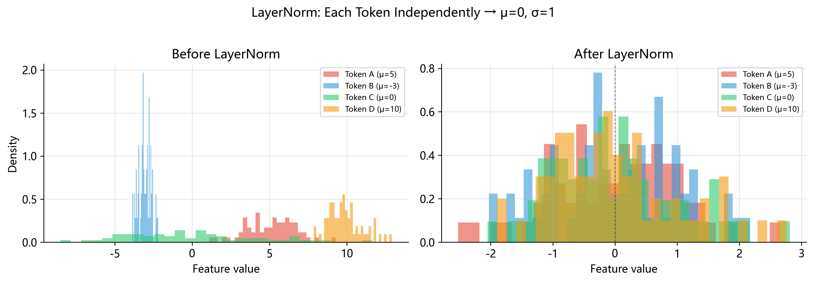

# Layer Normalization (层归一化)

> **一句话总结**: Layer Normalization 对每个样本的特征向量独立做"去均值, 除标准差"的标准化,
> 再用可学习的 $\gamma$ (weight) 和 $\beta$ (bias) 做仿射变换, 使深度网络每一层的输入分布更加稳定.

---

## 1. 从生活中的例子说起

假设你是一位大学老师, 期末要给学生一个综合成绩. 你手上有三门课的分数:

| 学生 | 数学 (满分 150) | 英语 (满分 100) | 体育 (满分 30) |
| ---- | --------------- | --------------- | -------------- |
| 小明 | 120             | 85              | 25             |
| 小红 | 135             | 72              | 20             |

如果你直接把三门分数加起来, 数学的权重天然就高 — — 因为它满分 150, 波动范围最大. 体育满分才 30, 对总分几乎没有影响. 这显然不公平.

最常见的做法是 **标准化** (standardization): 对每门课, 算出全班的平均分和标准差, 然后把每个分数变成 $z = \frac{x - \mu}{\sigma}$. 这个 $z$ 值告诉你"这个分数比平均高了几个标准差". 数学 120 分和英语 85 分, 经过标准化后可能都变成 $z \approx 0.8$ — — 说明它们在各自科目中的"相对水平"差不多.

这就是 **z-score** (标准分数), 统计学里最基础的概念之一. Layer Normalization 的数学核心, 和这个 z-score 一模一样.

---

## 2. 从"考试标准化"到"神经网络归一化"

### 2.1 深度网络的困境: Internal Covariate Shift

在深度神经网络中, 每一层的输出就是下一层的输入. 训练过程中, 每次参数更新后, 每一层的输出分布都会发生变化. 对于第 $l+1$ 层来说, 它的"教材" (输入分布) 在不断改变 — — 就好像你每天上课, 老师用的教材版本都不一样.

这个现象被称为 **Internal Covariate Shift** (内部协变量偏移), 由 Ioffe 和 Szegedy 在 2015 年的论文中正式提出. 它带来两个严重问题:

1. **训练不稳定**: 下游层必须不断适应上游层变化的输出分布, 导致梯度要么爆炸要么消失.
2. **需要极小的学习率**: 为了防止梯度爆炸, 只能用很小的学习率, 训练速度极慢.

解决思路很直接: 如果每一层的输入分布能保持稳定, 训练不就好办了吗? 于是, **归一化** (normalization) 技术应运而生.

### 2.2 历史脉络: 从 Batch Normalization 到 Layer Normalization

**2015 年 — Batch Normalization (BN) 诞生**

Ioffe 和 Szegedy 在 ICML 2015 上发表了划时代的论文 _"Batch Normalization: Accelerating Deep Network Training by Reducing Internal Covariate Shift"_. 核心思想是: 在每个 mini-batch 内, 对**每个特征**分别计算均值和方差, 然后做标准化. BN 的效果立竿见影 — — 它让 ImageNet 上的训练速度提升了 14 倍, 甚至超越了当时的 state-of-the-art. 一时间, BN 成了深度学习的标配组件.

**2016 年 — Layer Normalization (LN) 诞生**

然而, BN 有一些先天不足 (后面详细讨论). 2016 年, Ba, Kiros 和 Hinton 在 arXiv:1607.06450 上发表了 _"Layer Normalization"_, 提出了一种不依赖 batch 的归一化方式: 对**每个样本**的**所有特征**计算均值和方差, 然后做标准化. 这个看似微小的变化, 彻底解决了 BN 在序列模型和小 batch 场景下的问题, 成为了后来所有 Transformer 模型的标准组件.

---

## 3. Batch Normalization vs. Layer Normalization: 到底区别在哪?

为了真正理解 LayerNorm, 我们必须先理解 BatchNorm, 然后对比两者的差异. 这是很多初学者混淆的地方, 所以我们用一个具体的张量来说明.

### 3.1 一个具体例子

假设有一个形状为 $(B, D) = (3, 4)$ 的张量 — — 3 个样本, 每个样本 4 个特征:

$$\mathbf{X} = \begin{bmatrix} 1 & 2 & 3 & 4 \\ 5 & 6 & 7 & 8 \\ 9 & 10 & 11 & 12 \end{bmatrix}$$

**Batch Normalization: 沿"竖直方向" (batch 维) 归一化**

BN 对每一**列** (每个特征) 分别计算均值和方差:

- 特征 0: 值为 $[1, 5, 9]$, $\mu_0 = 5$, $\sigma_0^2 = \frac{(1-5)^2 + (5-5)^2 + (9-5)^2}{3} = \frac{32}{3} \approx 10.67$
- 特征 1: 值为 $[2, 6, 10]$, $\mu_1 = 6$, $\sigma_1^2 \approx 10.67$
- 特征 2, 3 类推......

每个特征有自己的 $\mu$ 和 $\sigma^2$, 但这些统计量是**跨样本**计算的.

**Layer Normalization: 沿"水平方向" (特征维) 归一化**

LN 对每一**行** (每个样本) 分别计算均值和方差:

- 样本 0: 值为 $[1, 2, 3, 4]$, $\mu_0 = 2.5$, $\sigma_0^2 = 1.25$
- 样本 1: 值为 $[5, 6, 7, 8]$, $\mu_1 = 6.5$, $\sigma_1^2 = 1.25$
- 样本 2: 值为 $[9, 10, 11, 12]$, $\mu_2 = 10.5$, $\sigma_2^2 = 1.25$

每个样本有自己的 $\mu$ 和 $\sigma^2$, 统计量完全**不依赖其他样本**.

### 3.2 为什么 Transformer 选择了 LayerNorm?

BatchNorm 在 CNN 时代表现优异, 但在 Transformer 时代遇到了几个致命问题:

**问题一: 变长序列. ** 自然语言中每个句子长度不同. 一个 batch 中, 句子 A 有 10 个 token, 句子 B 有 50 个 token. BN 需要对同一位置的所有样本求均值 — — 但位置 11 到 50 只有句子 B 有值, 统计量不可靠.

**问题二: 推理时的 batch size. ** BN 需要一个 mini-batch 来计算统计量. 训练时 batch size 可能是 32 或 64, 但推理时往往只有一个样本 (batch size = 1). 为此, BN 必须在训练时维护 **running mean** 和 **running variance** — — 引入了额外的状态和复杂性.

**问题三: 分布式训练中的同步. ** 在多 GPU 训练时, BN 需要跨 GPU 同步 batch 统计量 (Synchronized BatchNorm), 带来额外的通信开销. LayerNorm 完全不需要跨样本通信.

LayerNorm 完全没有这些问题: 它对每个样本独立计算, 不需要 batch 信息, 不需要 running statistics, batch size 为 1 也能正常工作. 这就是为什么, 从 2017 年的原始 Transformer 论文开始, 几乎所有 Transformer 模型 — — 包括 GPT, BERT, LLaMA, Qwen — — 都使用 LayerNorm (或其变体 RMSNorm).

---

## 4. 均值和方差: 从第一性原理出发

### 4.1 总体均值 (Population Mean)

给定 $N$ 个数值 $x_1, x_2, \ldots, x_N$, 总体均值定义为:

$$\mu = \frac{1}{N} \sum_{i=1}^{N} x_i$$

均值的几何含义: 它是这组数据的"重心". 如果把数据看成一维数轴上的点, 均值就是让这些点"左右平衡"的位置.

### 4.2 总体方差 (Population Variance)

方差衡量数据的"分散程度" — — 距离均值越远, 方差越大:

$$\sigma^2 = \frac{1}{N} \sum_{i=1}^{N} (x_i - \mu)^2$$

注意分母是 $N$, 不是 $N-1$. 标准差则是方差的正平方根: $\sigma = \sqrt{\sigma^2}$. 方差的单位是"原始数据单位的平方", 标准差的单位和原始数据相同, 更直观 — — "数据平均偏离均值有多远".

### 4.3 样本方差与 Bessel 校正

在统计学中, 如果我们只有来自某个总体的一个**样本**, 想要**估计**总体方差, 应该除以 $N-1$:

$$s^2 = \frac{1}{N-1} \sum_{i=1}^{N} (x_i - \bar{x})^2$$

这叫做 **Bessel's correction** (贝塞尔校正). 为什么要减 1? 直觉上: 我们用样本均值 $\bar{x}$ 代替了真实均值 $\mu$, 而 $\bar{x}$ 是从数据本身算出来的, 它天然地"更靠近"数据点, 导致 $(x_i - \bar{x})^2$ 系统性地偏小. 除以 $N-1$ 修正了这个偏差. 更严格地说, $N$ 个数据在约束 $\sum(x_i - \bar{x}) = 0$ 下只有 $N-1$ 个**自由度** (degrees of freedom).

### 4.4 LayerNorm 用的是哪个?

**LayerNorm 使用总体方差 (除以 $N$). ** 原因很简单: 我们并不是从某个总体中"抽样" — — 我们拿到的就是完整的特征向量本身. 对于一个 1280 维的向量, 这 1280 个值就是全部数据, 不是什么"样本". 因此, 除以 $N$ 是正确的.

在 NumPy 中, `np.var()` 默认使用 `ddof=0`, 即除以 $N$ — — 这正好是 LayerNorm 需要的. 如果误用 `ddof=1` (除以 $N-1$), 结果会略有偏差.

---

## 5. 标准化过程 (Z-Score)

### 5.1 第一步: 中心化 (Centering)

$x_i' = x_i - \mu$ — — 把数据的均值"搬"到 0. 几何上, 它把数据点"云"的重心移到了原点. 中心化之后, $\sum x_i' = 0$, 正负值相互抵消.

### 5.2 第二步: 缩放 (Scaling)

$z_i = \frac{x_i'}{\sigma} = \frac{x_i - \mu}{\sigma}$ — — 把数据的标准差变为 1. 几何上, 如果中心化把数据云移到了原点, 缩放就是把数据云"压缩"或"拉伸"成一个单位球.

这两步合起来, 就是统计学中经典的 **z-score 变换**. 变换后, $\mathbb{E}[z] = 0$, $\text{Var}[z] = 1$.



### 5.3 几何直觉

想象一组二维数据点形成一个扁长的椭圆形"云":

1. **中心化**前: 椭圆中心不在原点, 比如在 $(100, 200)$ 附近
2. **中心化**后: 椭圆中心移到原点 $(0, 0)$
3. **缩放**后: 椭圆变成圆 (各方向标准差都是 1)

LayerNorm 对特征维度做的就是这件事 — — 把沿特征维的"椭圆"变成"圆球".

---

## 6. 为什么需要 $\epsilon$? 不只是"防止除零"

很多教程会一笔带过: "$\epsilon$ 是为了防止除零". 但这个解释太表面了. 让我们用一个具体的数值例子来理解它的真正作用.

### 6.1 一个数值实验

考虑一个几乎所有元素都相同的向量: $x = [1.0000,\ 1.0001,\ 1.0002,\ 1.0003]$

**均值**: $\mu = 1.00015$

**方差**:

$$\sigma^2 = \frac{(-0.00015)^2 + (-0.00005)^2 + (0.00005)^2 + (0.00015)^2}{4} = \frac{5.0 \times 10^{-8}}{4} = 1.25 \times 10^{-8}$$

**标准差**: $\sigma = \sqrt{1.25 \times 10^{-8}} \approx 1.118 \times 10^{-4}$

这里方差很小但不为零, 除法还能正常工作. 但如果 $x = [1.0, 1.0, 1.0, 1.0]$ (完全相同), 方差为 0, $\frac{x_i - \mu}{\sigma} = \frac{0}{0}$ — — 直接产生 `NaN`.

即使值不完全相同, 只要方差极小 (比如 $10^{-20}$), $\sigma \approx 10^{-10}$, 除以它会把微小的差异放大到天文数字 ($10^{10}$ 量级) — — 这就是**数值不稳定**.

### 6.2 $\epsilon$ 的拯救

加入 $\epsilon$ 后, 分母变成 $\sqrt{\sigma^2 + \epsilon}$.

- 当 $\sigma^2$ 正常时 (如 $1.25$), $\epsilon = 10^{-6}$ 完全可忽略: $\sqrt{1.25 + 10^{-6}} \approx 1.11803$
- 当 $\sigma^2 = 0$ 时, $\epsilon$ 提供"地板": $\sqrt{0 + 10^{-6}} = 10^{-3}$, 归一化结果为 $\frac{0}{0.001} = 0$ — — 合理而非 `NaN`

$\epsilon$ 的典型取值是 $10^{-5}$ (PyTorch 默认) 或 $10^{-6}$ (Qwen2-VL 使用的值). 它不是"可有可无"的小技巧, 而是保证数值稳定性的**必要**组件.

---

## 7. 仿射变换: 为什么归一化之后还要"反操作"?

标准化把所有特征都变成了均值 0, 标准差 1 的分布. 这很好, 但有一个问题: **也许网络需要的不是 $\mathcal{N}(0, 1)$ 分布**.

### 7.1 可学习的 $\gamma$ (weight) 和 $\beta$ (bias)

LayerNorm 在标准化之后, 对每个特征 $j$ 施加仿射变换: $y_j = \gamma_j \cdot \hat{x}_j + \beta_j$. 其中 $\hat{x}_j$ 是标准化后的值, $\gamma_j$ 和 $\beta_j$ 是**可学习参数**, 数量等于特征维度 $D$.

对于 Qwen2-VL 视觉编码器的 LayerNorm, $D = 1280$, 因此每个 LayerNorm 层有 weight ($\gamma$) 1280 个参数 + bias ($\beta$) 1280 个参数 = 2560 个参数.

### 7.2 特殊情况

**当 $\gamma = \mathbf{1}$, $\beta = \mathbf{0}$ 时**: 仿射变换退化为恒等变换 (identity), 输出就是纯粹的标准化结果. 这也是参数的**初始化值** — — 训练开始时, LayerNorm 就是纯标准化.

**当网络"想要撤销"归一化时**: $\gamma$ 和 $\beta$ 可以学到任意值. 如果网络发现某个特征不需要归一化, 它可以学习到 $\gamma_j = \sigma_j$, $\beta_j = \mu_j$ — — 把标准化完全"撤销". 这意味着 LayerNorm **永远不会降低网络的表达能力** — — 最坏情况下, 网络可以学会忽略它.

### 7.3 为什么需要 per-feature 参数?

注意 $\gamma$ 和 $\beta$ 是**向量** (每个特征一个值), 而不是标量. 这是因为不同特征有不同的语义 — — 在视觉编码器中, 1280 维特征向量里, 某些维度可能编码了"颜色", 某些编码了"边缘方向". 它们需要的分布参数不同, 因此 $\gamma$ 和 $\beta$ 必须是 per-feature 的.

---

## 8. 完整公式推导

给定一个 $D$ 维输入向量 $\mathbf{x} = (x_1, x_2, \ldots, x_D)$:

**第一步: 计算均值** $\quad \mu = \frac{1}{D} \sum_{j=1}^{D} x_j$

**第二步: 计算方差** $\quad \sigma^2 = \frac{1}{D} \sum_{j=1}^{D} (x_j - \mu)^2$

**第三步: 标准化** $\quad \hat{x}_j = \frac{x_j - \mu}{\sqrt{\sigma^2 + \epsilon}}, \quad j = 1, \ldots, D$

**第四步: 仿射变换** $\quad y_j = \gamma_j \cdot \hat{x}_j + \beta_j, \quad j = 1, \ldots, D$

合在一起:

$$\text{LayerNorm}(\mathbf{x})_j = \gamma_j \cdot \frac{x_j - \mu}{\sqrt{\sigma^2 + \epsilon}} + \beta_j$$

其中 $\mathbf{x} \in \mathbb{R}^D$ 是输入, $\mu, \sigma^2 \in \mathbb{R}$ 是该向量的均值和方差, $\epsilon \in \mathbb{R}^+$ 是数值稳定常数 (如 $10^{-6}$), $\gamma, \beta \in \mathbb{R}^D$ 是可学习参数 (初始化为全 1 和全 0), $y \in \mathbb{R}^D$ 是输出.

---

## 9. 归一化的维度: 什么是"最后一个维度"?

### 9.1 二维张量 $(B, D)$

最后一个维度是 $D$ (特征维度). 对每一行独立做归一化. 均值和方差各产生 $B$ 个标量: $\mu_i = \frac{1}{D} \sum_{j=1}^{D} X_{ij}$.

### 9.2 三维张量 $(B, T, D)$

最后一个维度仍然是 $D$. 对每个 $(i, t)$ 位置的 $D$ 维向量独立做归一化. 均值和方差各产生 $B \times T$ 个标量.

### 9.3 直观理解

不管输入有多少维度, LayerNorm 永远是在**最内层**那一维上"横扫" — — 把该维度上的所有值收集起来, 计算均值和方差, 做标准化. 外层的所有维度组合都是**独立**处理的.

在 Qwen2-VL 视觉编码器 block 0 的 `norm1` 中: 输入形状 $(14308, 1280)$, 最后一维 $D = 1280$, 一共做 14308 次独立的归一化, 每次处理 1280 个数.

---

## 10. 手算示例 1: 一维向量

**输入**: $x = [1.0,\ 2.0,\ 3.0,\ 4.0]$, $\gamma = [1, 1, 1, 1]$, $\beta = [0, 0, 0, 0]$, $\epsilon = 10^{-6}$

**第一步: 均值** $\quad \mu = \frac{1.0 + 2.0 + 3.0 + 4.0}{4} = 2.5$

**第二步: 偏差** $\quad x_i - \mu = [-1.5,\ -0.5,\ +0.5,\ +1.5]$

**第三步: 方差** $\quad \sigma^2 = \frac{(-1.5)^2 + (-0.5)^2 + (0.5)^2 + (1.5)^2}{4} = \frac{2.25 + 0.25 + 0.25 + 2.25}{4} = \frac{5.0}{4} = 1.25$

**第四步: 标准差** $\quad \sqrt{\sigma^2 + \epsilon} = \sqrt{1.250001} \approx 1.118034$

**第五步: 标准化**

$$\hat{x}_1 = \frac{-1.5}{1.118034} \approx -1.3416, \quad \hat{x}_2 = \frac{-0.5}{1.118034} \approx -0.4472$$

$$\hat{x}_3 = \frac{+0.5}{1.118034} \approx +0.4472, \quad \hat{x}_4 = \frac{+1.5}{1.118034} \approx +1.3416$$

**第六步: 仿射变换** ($\gamma = 1, \beta = 0$, 结果不变)

$$y = [-1.3416,\ -0.4472,\ 0.4472,\ 1.3416]$$

**验证**: 输出均值 $= \frac{-1.3416 + (-0.4472) + 0.4472 + 1.3416}{4} = 0$ ✓, 输出方差 $= \frac{1.7999 + 0.2000 + 0.2000 + 1.7999}{4} \approx 1.0$ ✓

---

## 11. 手算示例 2: 二维矩阵 (尺度不变性)

这个例子展示 LayerNorm 的一个重要性质: **尺度不变性** (scale invariance).

**输入**: $\mathbf{X} = \begin{bmatrix} 1 & 2 & 3 & 4 \\ 10 & 20 & 30 & 40 \end{bmatrix}$

第一行值在 $[1, 4]$, 第二行在 $[10, 40]$ — — 尺度相差 10 倍. 但因为 LayerNorm 对每行**独立**归一化, 两行会得到相同的结果.

**第一行** $[1, 2, 3, 4]$: 和示例 1 完全相同, $\mu_1 = 2.5$, $\sigma_1^2 = 1.25$, $\hat{x}_1 = [-1.3416,\ -0.4472,\ 0.4472,\ 1.3416]$

**第二行** $[10, 20, 30, 40]$: $\mu_2 = 25$, $\sigma_2^2 = \frac{225 + 25 + 25 + 225}{4} = 125$, $\sqrt{125 + \epsilon} \approx 11.18034$

$$\hat{x}_{2,1} = \frac{10 - 25}{11.18034} = \frac{-15}{11.18034} \approx -1.3416, \quad \hat{x}_{2,2} = \frac{-5}{11.18034} \approx -0.4472$$

$$\hat{x}_{2,3} = \frac{+5}{11.18034} \approx +0.4472, \quad \hat{x}_{2,4} = \frac{+15}{11.18034} \approx +1.3416$$

**结果**: $\hat{\mathbf{X}} = \begin{bmatrix} -1.3416 & -0.4472 & 0.4472 & 1.3416 \\ -1.3416 & -0.4472 & 0.4472 & 1.3416 \end{bmatrix}$

两行完全一样! $[1, 2, 3, 4]$ 和 $[10, 20, 30, 40]$ 只是尺度不同 (后者是前者的 10 倍), 它们的"内部结构" (相对比例) 相同. LayerNorm 消除了绝对尺度的影响, 只保留了特征之间的相对关系. 在神经网络中, 如果某一层的输出突然变大了 10 倍, LayerNorm 会自动把它"压"回正常范围 — — 这就是归一化对训练稳定性的核心贡献.

---

## 12. 与 Whitening 和去相关的关系

在统计学中, 完整的数据预处理通常包含三步:

1. **中心化** (centering): 减去均值, 使 $\mathbb{E}[\mathbf{x}] = \mathbf{0}$
2. **标准化** (standardization): 除以标准差, 使 $\text{Var}(x_j) = 1$
3. **去相关** (decorrelation): 消除特征之间的线性相关性

前两步合称标准化, 三步全做完叫 **whitening** (白化). 白化后的数据, 协方差矩阵变成单位矩阵 $\mathbf{I}$ — — 不仅每个特征方差为 1, 而且特征之间完全不相关.

**LayerNorm 只做前两步** (中心化 + 标准化), 不做去相关. 为什么不做 whitening? 因为去相关需要计算协方差矩阵并求逆 (或 SVD), 对于 $D = 1280$ 的向量, 协方差矩阵是 $1280 \times 1280$ — — 计算和存储成本都是 $O(D^2)$, 而且每次前向传播都要做, 代价太高. LayerNorm 的计算复杂度只有 $O(D)$ — — 扫描一遍算均值和方差, 再扫描一遍做归一化. 这是白化和完整归一化之间的一个实用折中.

---

## 13. 在 Qwen2-VL-2B-Instruct 中的 LayerNorm

### 13.1 Vision Encoder 中的 LayerNorm

Qwen2-VL 的视觉编码器是一个标准的 Vision Transformer (ViT), 参数如下:

| 参数           | 值   |
| -------------- | ---- |
| embed_dim      | 1280 |
| num_heads      | 16   |
| head_dim       | 80   |
| MLP hidden dim | 5120 |
| blocks         | 32   |

每个 block 包含两个 LayerNorm: **`norm1`** (在 self-attention 之前) 和 **`norm2`** (在 MLP 之前). 权重键名模式是:

```
visual.blocks.{i}.norm1.weight   # shape: (1280,)
visual.blocks.{i}.norm1.bias     # shape: (1280,)
visual.blocks.{i}.norm2.weight   # shape: (1280,)
visual.blocks.{i}.norm2.bias     # shape: (1280,)
```

其中 $i = 0, 1, \ldots, 31$. 此外, 视觉编码器的 **patch merger** 中还有 **`ln_q`** (对 query 做归一化), weight 和 bias 形状也是 `(1280,)`.

### 13.2 参数量统计

视觉编码器中 LayerNorm 的参数量:

$$\underbrace{32}_{\text{blocks}} \times \underbrace{2}_{\text{norm1 + norm2}} \times \underbrace{2}_{\text{weight + bias}} \times \underbrace{1280}_{\text{embed\_dim}} = 163{,}840 \text{ 参数}$$

再加上 patch merger 中的 `ln_q`: $2 \times 1280 = 2{,}560$. **总计约 166,400 个 LayerNorm 参数**, 仅占视觉编码器总参数量的很小一部分.

### 13.3 验证中的具体细节

本目录的 `impl.py` 使用视觉编码器 block 0 的 `norm1` 进行验证:

- **权重键**: `visual.blocks.0.norm1.weight` ($\gamma$), `visual.blocks.0.norm1.bias` ($\beta$)
- **输入形状**: $(14308, 1280)$ — — 14308 个视觉 token, 每个 1280 维

14308 这个数字取决于输入图像的分辨率 — — 不同图像产生不同数量的 token. 这也是为什么 LayerNorm (而不是 BatchNorm) 是正确的选择: 它不需要跨样本的统计量, 可以处理任意数量的 token.

### 13.4 Text Decoder 中的归一化

值得注意的是, Qwen2-VL 的 text decoder (hidden_size=1536, 28 层) 使用的是 **RMSNorm** (Root Mean Square Normalization), 而不是 LayerNorm. RMSNorm 省略了减均值的步骤, 只做"除以 RMS":

$$\text{RMSNorm}(\mathbf{x})_j = \gamma_j \cdot \frac{x_j}{\sqrt{\frac{1}{D}\sum_{k=1}^{D} x_k^2 + \epsilon}}$$

RMSNorm 没有 bias 参数, 计算更快. 这是 LLaMA 系列引入的设计, Qwen 的 text decoder 沿用了它. 详见 `04_rms_norm` 目录.

---

## 14. NumPy 实现详解

下面是 `impl.py` 中的核心实现, 逐行解析:

```python
def layer_norm(x: np.ndarray, weight: np.ndarray, bias: np.ndarray, eps: float = 1e-6) -> np.ndarray:
    mean = x.mean(axis=-1, keepdims=True)
    var = x.var(axis=-1, keepdims=True)
    x_norm = (x - mean) / np.sqrt(var + eps)
    return x_norm * weight + bias
```

**第 1 行: 函数签名. ** `x` 是输入张量 (如 $(14308, 1280)$); `weight` 即 $\gamma$, 形状 $(1280,)$; `bias` 即 $\beta$, 形状 $(1280,)$; `eps` 默认 $10^{-6}$.

**第 2 行: 计算均值. ** `axis=-1` 沿最后一维计算. 对 $(14308, 1280)$ 的输入, 得到 $(14308, 1)$. `keepdims=True` 至关重要 — — 如果不写, 结果形状是 $(14308,)$, 接下来 `x - mean` 时 NumPy 的 broadcasting 会把 $(14308,)$ 错误地广播到 $(14308, 14308)$, 而不是期望的 $(14308, 1280)$. `keepdims=True` 把结果保持为 $(14308, 1)$, broadcasting 正确地复制到每一列.

**第 3 行: 计算方差. ** `np.var()` 默认 `ddof=0` (除以 $N$), 正好是 LayerNorm 需要的总体方差.

**第 4 行: 标准化. ** `(x - mean)`: $(14308, 1280) - (14308, 1)$ → 每行减去该行均值. `np.sqrt(var + eps)`: $(14308, 1)$ → 每行的标准差. 除法后得到 $(14308, 1280)$.

**第 5 行: 仿射变换. ** `x_norm * weight`: $(14308, 1280) \times (1280,)$ → $(1280,)$ 广播到每一行, 逐元素相乘. `+ bias` 同理.

### Broadcasting 可视化

```
x:        (14308, 1280)    ← 输入
mean:     (14308,    1)    ← 每行一个均值
var:      (14308,    1)    ← 每行一个方差
x_norm:   (14308, 1280)    ← 标准化结果
weight:          (1280,)   ← 广播到每一行
bias:            (1280,)   ← 广播到每一行
output:   (14308, 1280)    ← 最终输出
```

---

## 15. 常见误区与陷阱

### 误区 1: 混淆 BatchNorm 和 LayerNorm

|            | BatchNorm               | LayerNorm            |
| ---------- | ----------------------- | -------------------- |
| 归一化方向 | 跨样本 (batch 维)       | 跨特征 (feature 维)  |
| 统计量依赖 | 依赖 batch 中的其他样本 | 只依赖当前样本       |
| 推理时     | 使用 running statistics | 直接计算, 无额外状态 |

### 误区 2: 使用样本方差 ($N-1$) 而不是总体方差 ($N$)

```python
# ✅ 正确：默认 ddof=0，除以 N
x.var(axis=-1)
# ❌ 错误：ddof=1 除以 N-1
x.var(axis=-1, ddof=1)
```

当 $D$ 很大 (如 1280) 时差异很小. 但对小向量, 可能导致数值结果与 PyTorch 不一致.

### 误区 3: 认为 $\gamma$ 和 $\beta$ 是标量

它们是与特征维度等长的**向量**. 对于 $D = 1280$, 各有 1280 个参数. 每个特征有自己的缩放因子和偏移量.

### 误区 4: 认为 $\epsilon$ "只是防止除零"

如第 6 节所述, $\epsilon$ 的真正作用是**数值稳定性**. 即使方差不为零, 只要方差很小, 没有 $\epsilon$ 就会导致数值爆炸.

### 误区 5: 忘记 `keepdims=True`

```python
x = np.random.randn(14308, 1280)
# ❌ 没有 keepdims，mean 形状是 (14308,)，broadcasting 出错
mean = x.mean(axis=-1)
# ✅ 有 keepdims，mean 形状是 (14308, 1)，broadcasting 正确
mean = x.mean(axis=-1, keepdims=True)
```

---

## 16. 总结

Layer Normalization 的核心思想可以用一句话概括: **对每个样本的特征向量做 z-score 标准化, 再用可学习参数恢复表达能力**.

$$\mathbf{x} \xrightarrow{\text{减均值}} (\mathbf{x} - \mu) \xrightarrow{\text{除标准差}} \hat{\mathbf{x}} \xrightarrow{\times \gamma + \beta} \mathbf{y}$$

关键性质:

1. **样本独立**: 每个样本的归一化不依赖其他样本, batch size 为 1 也能工作
2. **尺度不变**: $[1, 2, 3, 4]$ 和 $[10, 20, 30, 40]$ 归一化结果相同
3. **表达力不减**: $\gamma$ 和 $\beta$ 可以学习"撤销"归一化
4. **计算高效**: $O(D)$ 复杂度, 不需要协方差矩阵

在 Qwen2-VL 中, LayerNorm 是视觉编码器每个 Transformer block 的标准组件, 以极低的参数代价 (约 166K 参数) 换来了训练的稳定性和模型的收敛速度.

---

## 参考文献

1. Ioffe, S. & Szegedy, C. (2015). _Batch Normalization: Accelerating Deep Network Training by Reducing Internal Covariate Shift_. ICML 2015.
2. Ba, J. L., Kiros, J. R. & Hinton, G. E. (2016). _Layer Normalization_. arXiv:1607.06450.
3. Vaswani, A. et al. (2017). _Attention Is All You Need_. NeurIPS 2017.
4. Zhang, B. & Sennrich, R. (2019). _Root Mean Square Layer Normalization_. NeurIPS 2019.
