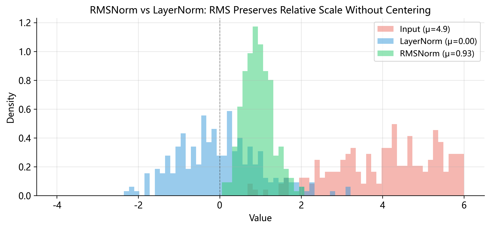

# RMS Normalization (均方根归一化)

> **一句话总结**: RMSNorm 是 LayerNorm 的简化版 — — 去掉均值中心化和 bias, 只保留按均方根缩放和可学习权重, 计算量减少约 40%, 效果几乎不变. 这正是 Qwen2-VL text decoder 所采用的归一化方式.

---

## 1. 从一个做菜的故事说起

假设你是一位厨师, 手上有一道经典菜谱, 需要 10 种香料, 每次做出来都很好吃. 但你是个工程师思维的厨师, 你开始想: **这 10 种香料真的都不可或缺吗? **

于是你做了一系列实验: 每次去掉一种香料, 让 10 个人盲品打分. 结果你发现, 其中 8 种香料去掉后没人能尝出区别. 真正决定风味的只有那 2 种核心香料.

这个故事恰好是深度学习中 **RMSNorm** 诞生的缩影. 在 Transformer 架构中, **LayerNorm** 长期以来是归一化的标准做法, 包含两个核心操作: **减去均值** (re-centering) 和**除以标准差** (re-scaling). 它们看起来缺一不可.

但 2019 年, 两位研究者做了那个"去掉香料"的实验, 发现: **减去均值这一步, 对模型效果的贡献微乎其微**. 真正起作用的是缩放操作. 于是他们提出了 RMSNorm: 只保留缩放, 去掉中心化. 更简单, 更快, 效果几乎一样.

---

## 2. 历史背景: 从 LayerNorm 到 RMSNorm

### 2.1 LayerNorm 的统治时代

2016 年, Ba, Kiros 和 Hinton 提出了 **Layer Normalization**. 它将归一化操作移到了特征维度, 对每个样本独立进行, 完美适配了序列模型的需求. 从 2017 年 Transformer 论文开始, LayerNorm 成了标配 — — GPT-2, BERT, T5 几乎都使用 LayerNorm.

### 2.2 质疑者的登场

2019 年, Biao Zhang 和 Rico Sennrich 发表了 _"Root Mean Square Layer Normalization"_ (arXiv: 1910.07467), 提出了一个大胆的问题: **LayerNorm 中的 re-centering 操作, 真的有用吗? **

他们在不同任务上分别测试去掉 re-centering 和去掉 re-scaling 的 LayerNorm, 关键发现是:

- **去掉 re-scaling (缩放) **: 模型性能显著下降, 训练变得不稳定
- **去掉 re-centering (中心化) **: 模型性能几乎不变

直觉上也说得通 — — 归一化的核心目的是控制数值的"尺度" (scale). 缩放操作直接控制尺度, 而中心化只是平移, 对尺度的影响是间接的. 基于此, 他们提出了 RMSNorm: **只做缩放, 不做中心化**.

---

## 3. 从 LayerNorm 到 RMSNorm: 一步步推导

### 3.1 出发点: LayerNorm 的完整公式

给定输入向量 $x = [x_1, x_2, \ldots, x_n]$, LayerNorm 的计算为:

$$
y = \frac{x - \mu}{\sqrt{\sigma^2 + \epsilon}} \cdot \gamma + \beta
$$

其中 $\mu = \frac{1}{n}\sum_{i=1}^n x_i$ (均值), $\sigma^2 = \frac{1}{n}\sum_{i=1}^n (x_i - \mu)^2$ (方差), $\gamma$ 是可学习的缩放参数, $\beta$ 是可学习的偏移参数, $\epsilon$ 是防止除零的极小常数.

### 3.2 第一步: 去掉均值中心化

实验告诉我们 $x - \mu$ 可以去掉, 令 $\mu = 0$, 公式变为:

$$
y = \frac{x}{\sqrt{\sigma^2 + \epsilon}} \cdot \gamma + \beta
$$

### 3.3 第二步: 方差公式的变化

这里有一个重要的数学细节. 方差可以展开为:

$$
\sigma^2 = E[(x - \mu)^2] = E[x^2] - \mu^2
$$

原始 LayerNorm 先减去均值使数据变成零均值, $\sigma^2$ 衡量"偏离均值的程度". 但现在我们不再减去均值, 需要一个不依赖均值的"尺度"度量, 最自然的选择是**均方值**:

$$
E[x^2] = \frac{1}{n}\sum_{i=1}^n x_i^2
$$

注意: 均方值不是方差. 方差是 $E[x^2] - \mu^2$, 当 $\mu \neq 0$ 时 $E[x^2] > \sigma^2$. 均方值同时包含了数据的散布程度和偏离原点的程度.

### 3.4 第三步: 引入 RMS

对均方值取平方根得到 **RMS (Root Mean Square, 均方根) **:

$$
\text{RMS}(x) = \sqrt{\frac{1}{n}\sum_{i=1}^n x_i^2}
$$

### 3.5 第四步: 去掉 bias

LayerNorm 中 $\beta$ 的作用是: 数据被中心化到零均值后, 通过 $\beta$ 平移到学习到的最优中心. RMSNorm 没有做中心化, 数据保留了原始均值, $\beta$ 的补偿作用不再必要. 实验也证实去掉 $\beta$ 不影响效果.

最终的 **RMSNorm 公式**:

$$
\boxed{y = \frac{x}{\text{RMS}(x)} \cdot \gamma = \frac{x}{\sqrt{\frac{1}{n}\sum_{i=1}^n x_i^2 + \epsilon}} \cdot \gamma}
$$

逐元素形式: $y_i = \frac{x_i}{\sqrt{\frac{1}{n}\sum_{j=1}^n x_j^2 + \epsilon}} \cdot \gamma_i$. 推导链条清晰:

$$
\text{LayerNorm} \xrightarrow{\text{去掉 } x-\mu} \xrightarrow{\sigma^2 \to E[x^2]} \xrightarrow{\text{去掉 } \beta} \text{RMSNorm}
$$



---

## 4. RMS (均方根): 定义与几何解释

RMS 是一个比深度学习古老得多的概念.

### 4.1 定义

$$
\text{RMS}(x) = \sqrt{\frac{1}{n}\sum_{i=1}^n x_i^2}
$$

RMS 也叫**二次平均数** (quadratic mean) — — 先平方再平均再开方, 大数值的影响被放大.

### 4.2 与 L2 范数的关系

L2 范数 $\|x\|_2 = \sqrt{\sum_{i=1}^n x_i^2}$, 因此:

$$
\text{RMS}(x) = \frac{\|x\|_2}{\sqrt{n}}
$$

这揭示了 RMSNorm 的几何本质: **本质上按向量的 L2 范数来归一化, 除了一个 $\sqrt{n}$ 的缩放因子**. 如果没有 $\gamma$, 归一化后向量的 L2 范数恒等于 $\sqrt{n}$ — — 所有向量被映射到半径为 $\sqrt{n}$ 的超球面上, 再由 $\gamma$ 做逐元素拉伸.

### 4.3 物理解释: 电气工程中的有效值

如果你学过电气工程, 对 RMS 一定不陌生. 交流电的"有效值"就是 RMS 值 — — 中国家用电的 220V 就是电压的 RMS 值 (峰值约 311V). RMS 之所以叫有效值, 是因为 RMS 为 $V$ 的交流电在电阻上产生的热量等于 $V$ 的直流电.

类比到深度学习: 对特征向量取 RMS 得到其"等效幅度", RMSNorm 用它来控制特征的"能量"不要太大或太小.

### 4.4 RMS 与算术均值的不等关系

$$
\text{RMS}(x) \geq |\bar{x}|
$$

等号成立当且仅当所有 $x_i$ 相等. 证明来自方差的非负性: $\text{Var}(x) = E[x^2] - (E[x])^2 \geq 0$, 即 $E[x^2] \geq (E[x])^2$, 两边开方得 $\text{RMS}(x) \geq |E[x]|$.

这说明 RMS 衡量的"尺度"比均值更稳健 — — 不会因正负相消而变小.

---

## 5. 为什么 RMSNorm 不需要 bias?

LayerNorm 的处理流程是: 减均值 → 除标准差 → 乘 $\gamma$ → 加 $\beta$. 第 1 步强行把数据拉到原点, 第 4 步 ($\beta$) 把它推到学习到的位置. $\beta$ 的作用是补偿第 1 步的信息丢失.

RMSNorm 没有第 1 步 — — 数据的均值被保留. 原始中心位置的信息还在, 不需要 $\beta$ 再推回去. Zhang & Sennrich 在论文中对比了带 bias 和不带 bias 的 RMSNorm, 结论是加 bias 没有可衡量的性能提升, 但增加了参数量.

---

## 6. 详细对比: LayerNorm vs RMSNorm

### 6.1 公式并排

|                | LayerNorm                                                             | RMSNorm                                               |
| :------------- | :-------------------------------------------------------------------- | :---------------------------------------------------- |
| **公式**       | $y = \frac{x - \mu}{\sqrt{\sigma^2 + \epsilon}} \cdot \gamma + \beta$ | $y = \frac{x}{\sqrt{E[x^2] + \epsilon}} \cdot \gamma$ |
| **统计量**     | 均值 $\mu$, 方差 $\sigma^2$                                           | 均方值 $E[x^2]$                                       |
| **中心化**     | ✅ 减去均值                                                           | ❌ 不做                                               |
| **缩放**       | ✅ 除以标准差                                                         | ✅ 除以 RMS                                           |
| **可学习参数** | $\gamma$ + $\beta$ (共 $2d$ 个)                                       | 仅 $\gamma$ (共 $d$ 个)                               |

### 6.2 计算量分析

设特征维度为 $d$ (Qwen2-VL text decoder 中 $d = 1536$):

**LayerNorm**: 计算 $\mu$ ($d+1$ ops) → 中心化 ($d$) → $(x-\mu)^2$ ($d$) → 方差 ($d+1$) → 开方 ($2$) → 除以 $\sigma$ ($d$) → 乘 $\gamma$ ($d$) → 加 $\beta$ ($d$) ≈ $\mathbf{7d + 4}$ ops

**RMSNorm**: $x^2$ ($d$) → 均方值 ($d+1$) → 开方 ($2$) → 除以 RMS ($d$) → 乘 $\gamma$ ($d$) ≈ $\mathbf{4d + 3}$ ops

**节省比例**: $(7d+4 - 4d-3)/(7d+4) = (3d+1)/(7d+4) \approx 3/7 \approx 43\%$

### 6.3 内存节省

LayerNorm 每层 $2d$ 个参数, RMSNorm 只有 $d$ 个. 参数量减半意味着显存, 模型文件和优化器状态都更小. 单层看似微不足道, 但几十层累积起来差异明显.

---

## 7. 手算示例 1: 基础示例

取 $x = [1.0, \ 2.0, \ 3.0, \ 4.0]$, $\gamma = [1,1,1,1]$, $\epsilon = 10^{-6}$.

### RMSNorm 计算

**平方: ** $x^2 = [1.0, \ 4.0, \ 9.0, \ 16.0]$

**均方值: ** $E[x^2] = (1+4+9+16)/4 = 7.5$

**RMS: ** $\sqrt{7.5 + 10^{-6}} \approx 2.73861$

**归一化: **
$y_1 = 1.0/2.73861 \approx 0.3651$, $y_2 = 2.0/2.73861 \approx 0.7303$
$y_3 = 3.0/2.73861 \approx 1.0954$, $y_4 = 4.0/2.73861 \approx 1.4606$

### LayerNorm 计算 (对比)

**均值: ** $\mu = (1+2+3+4)/4 = 2.5$

**中心化: ** $x - \mu = [-1.5, \ -0.5, \ 0.5, \ 1.5]$

**方差: ** $\sigma^2 = (2.25+0.25+0.25+2.25)/4 = 1.25$

**标准差: ** $\sqrt{1.25 + 10^{-6}} \approx 1.11803$

**归一化 ($\gamma=1, \beta=0$): ** $y \approx [-1.3416, \ -0.4472, \ 0.4472, \ 1.3416]$

### 对比

| 位置 | $x$ | RMSNorm | LayerNorm |
| :--: | :-: | :-----: | :-------: |
|  1   | 1.0 | 0.3651  |  −1.3416  |
|  2   | 2.0 | 0.7303  |  −0.4472  |
|  3   | 3.0 | 1.0954  |  0.4472   |
|  4   | 4.0 | 1.4606  |  1.3416   |

差异很大! 因为原始均值 $\mu = 2.5$ 远不为零. LayerNorm 把输出中心化到 0, 而 RMSNorm 保留了原始偏移.

---

## 8. 手算示例 2: 什么时候两者趋同?

取 $x = [-2.0, \ -1.0, \ 3.0, \ 4.0]$, $\gamma = [1,1,1,1]$, $\epsilon = 10^{-6}$.

### RMSNorm

$x^2 = [4, 1, 9, 16]$, $E[x^2] = 30/4 = 7.5$, $\text{RMS} \approx 2.73861$

$$
y_{\text{RMS}} \approx [-0.7303, \ -0.3651, \ 1.0954, \ 1.4606]
$$

### LayerNorm

$\mu = (-2-1+3+4)/4 = 1.0$, $x - \mu = [-3, -2, 2, 3]$

$\sigma^2 = (9+4+4+9)/4 = 6.5$, $\sqrt{6.5+\epsilon} \approx 2.54951$

$$
y_{\text{LN}} \approx [-1.1767, \ -0.7845, \ 0.7845, \ 1.1767]
$$

### 关键洞察

两者有差异但方向一致. 关键问题是: **什么时候两者近似相等? **

当 $\mu \approx 0$ 时: 中心化步骤 $x - \mu \approx x$ 几乎无操作; 方差 $\sigma^2 = E[x^2] - \mu^2 \approx E[x^2]$, 两者分母趋于一致.

**这正是 Zhang & Sennrich 论文的核心论点**: 在训练良好的深度网络中, 中间层激活值通常大致零均值 — — 梯度下降会自然地将参数调整到让激活值分布在零附近. 因此在实际 Transformer 中, $x - \mu \approx x$, 去掉均值中心化几乎不影响效果.

---

## 9. 现代大语言模型的趋势

### 9.1 从 LayerNorm 到 RMSNorm 的迁移

| 时代      | 代表模型                    | 归一化方式  |
| :-------- | :-------------------------- | :---------- |
| 2018–2022 | GPT-2, BERT, T5, PaLM       | LayerNorm   |
| 2023 至今 | LLaMA, Mistral, Qwen, Gemma | **RMSNorm** |

转折点是 **LLaMA** (Meta, 2023) — — 第一个广泛关注的使用 RMSNorm 的开源大模型. 此后几乎所有主流开源 LLM 都跟进采用.

虽然 RMSNorm 论文发表于 2019 年, 但直到 2023 年才大规模采用, 原因是: (1) 小模型上 43% 归一化节省不显著, 模型到 7B+ 规模后才明显; (2) 工业界需要反复验证; (3) LLaMA 的开源示范扫清了疑虑.

### 9.2 Pre-Norm vs Post-Norm

归一化层的**位置**也是重要的架构选择.

**原始 Transformer (Post-Norm, Vaswani et al. 2017) **:

$$
\text{output} = \text{Norm}(x + \text{SubLayer}(x))
$$

先做子层, 加残差, 再归一化.

**现代 Transformer (Pre-Norm) **:

$$
\text{output} = x + \text{SubLayer}(\text{Norm}(x))
$$

先归一化, 再做子层, 再加残差. Pre-Norm 让残差连接形成"梯度高速公路" — — 梯度直接沿残差路径流回早期层, 训练更稳定. 现代大模型几乎都采用 **Pre-Norm + RMSNorm**.

---

## 10. RMSNorm 在 Qwen2-VL-2B-Instruct 中的应用

### 10.1 两种归一化的分工

| 模块               | 归一化方式 | 规模                        | 原因                              |
| :----------------- | :--------- | :-------------------------- | :-------------------------------- |
| **Vision Encoder** | LayerNorm  | embed_dim=1280, 32 blocks   | 遵循 ViT 传统, 规模较小, 节省有限 |
| **Text Decoder**   | RMSNorm    | hidden_size=1536, 28 layers | 遵循 LLaMA 传统, 序列长, 节省显著 |

Vision Encoder 中 LayerNorm 出现在每个 block 的 norm1, norm2, 以及 merger 中的 ln_q. Text Decoder 中 RMSNorm 出现在每层的 `input_layernorm` 和 `post_attention_layernorm`.

### 10.2 Pre-Norm 数据流

Text decoder 第 $l$ 层的计算:

$$
h^{(l)} = x^{(l)} + \text{SelfAttention}\!\left(\text{RMSNorm}\!\left(x^{(l)}\right)\right)
$$

$$
x^{(l+1)} = h^{(l)} + \text{MLP}\!\left(\text{RMSNorm}\!\left(h^{(l)}\right)\right)
$$

文本图示:

```
输入 x ──────────────────────────┐ (残差)
  │                              │
  ▼                              │
 input_layernorm (RMSNorm)       │
  ▼                              │
 Self-Attention                  │
  ▼                              │
 (+) ◄───────────────────────────┘
  │──────────────────────────────┐ (残差)
  ▼                              │
 post_attention_layernorm        │
 (RMSNorm)                      │
  ▼                              │
 MLP                             │
  ▼                              │
 (+) ◄───────────────────────────┘
  ▼
 输出 → 下一层
```

### 10.3 权重与参数统计

每个 RMSNorm 的权重形状为 **(1536,)** — — 每个特征维度一个 $\gamma$, 无 bias.

权重 key 命名规则:

- `model.layers.{l}.input_layernorm.weight` ($l = 0, \ldots, 27$)
- `model.layers.{l}.post_attention_layernorm.weight` ($l = 0, \ldots, 27$)

**参数统计: **

$$
\text{RMSNorm 参数} = 28 \times 2 \times 1536 = 86{,}016
$$

若用带 bias 的 LayerNorm: $28 \times 2 \times 1536 \times 2 = 172{,}032$, 参数翻倍.

参数节省对 2B 模型而言仅 ~0.004%, 但**关键节省在计算量**: 生成长序列时每个 token 每层执行 2 次 RMSNorm, 43% 计算节省会直接反映在推理速度上.

### 10.4 输入形状

验证用的输入形状为 `(1, 3602, 1536)`:

- **1**: batch size
- **3602**: 序列长度 (文本 token + 图像 token)
- **1536**: hidden_size, RMSNorm 操作的维度

RMSNorm 在最后一维独立运算 — — 对 $1 \times 3602 = 3602$ 个 token 各自计算 RMS 并归一化.

---

## 11. NumPy 实现: 逐行解析

```python
def rms_norm(x: np.ndarray, weight: np.ndarray, eps: float = 1e-6) -> np.ndarray:
    mean_sq = np.mean(x ** 2, axis=-1, keepdims=True)
    rms = np.sqrt(mean_sq + eps)
    return (x / rms) * weight
```

### 第 1 行: 计算均方值

```python
mean_sq = np.mean(x ** 2, axis=-1, keepdims=True)
```

- `x ** 2`: 逐元素平方, 形状不变 `(1, 3602, 1536)`
- `axis=-1`: 沿最后一维 (特征维度 1536) 求均值
- `keepdims=True`: 结果形状 `(1, 3602, 1)` 而非 `(1, 3602)`

`keepdims=True` 至关重要 — — 没有它后续 `x / rms` 无法正确广播. 有了它, NumPy 自动将 `(1, 3602, 1)` 扩展为 `(1, 3602, 1536)`.

等价写法: `np.sum(x**2, axis=-1, keepdims=True) / x.shape[-1]`, 或 `(np.linalg.norm(x, axis=-1, keepdims=True)**2) / x.shape[-1]`. 三者数学上一致: $E[x^2] = \sum x_i^2 / n = \|x\|_2^2 / n$.

### 第 2 行: 计算 RMS

```python
rms = np.sqrt(mean_sq + eps)
```

加 $\epsilon = 10^{-6}$ 防止对零开方. $\epsilon$ 在根号**内部** ($\sqrt{E[x^2] + \epsilon}$), 这是标准做法. 结果形状 `(1, 3602, 1)`.

### 第 3 行: 归一化并缩放

```python
return (x / rms) * weight
```

- `x / rms`: 广播除法, `(1, 3602, 1536) / (1, 3602, 1)` → `(1, 3602, 1536)`
- `* weight`: `weight` 形状 `(1536,)`, 广播为 `(1, 3602, 1536)`

Broadcasting 示意:

```
x:       (1, 3602, 1536)
rms:     (1, 3602,    1)  → 沿最后一维广播
weight:  (         1536,) → 沿前两维广播
output:  (1, 3602, 1536)
```

---

## 12. 常见误解与陷阱

### 误解 1: "RMSNorm 就是去掉均值的 LayerNorm"

不够准确. RMSNorm 还有两个连带变化: (1) 分母从标准差 $\sigma = \sqrt{E[x^2] - \mu^2}$ 变成 RMS = $\sqrt{E[x^2]}$, 当 $\mu \neq 0$ 时 RMS > $\sigma$; (2) 去掉了 bias. 更准确的说法是: RMSNorm 将"中心化 + 方差归一化"替换为"均方根归一化", 并去掉了 bias.

### 误解 2: "RMS 就是标准差"

不是. 标准差衡量**偏离均值**的程度: $\sigma = \sqrt{E[x^2] - \mu^2}$. RMS 衡量**偏离原点**的程度: $\text{RMS} = \sqrt{E[x^2]}$. 只有 $\mu = 0$ 时两者相等, 一般 $\text{RMS} \geq \sigma$. 记忆法: 标准差是"减完均值再算 RMS".

### 误解 3: "RMSNorm 没有可学习参数"

有! 仍然有可学习权重 $\gamma$ (代码中叫 `weight`), 只是没有 bias. $\gamma$ 让模型学习每个特征的"重要性".

### 误解 4: "RMSNorm 一定比 LayerNorm 好"

不一定. 这是工程 tradeoff: 更快 (~43% 归一化节省), 参数更少, 但理论表达能力略低. 实践中效果差距极小, 但某些对精度要求极高的任务中 LayerNorm 可能仍有微弱优势.

### 陷阱: $\epsilon$ 的位置

$\sqrt{E[x^2] + \epsilon}$ (根号内部) vs $\sqrt{E[x^2]} + \epsilon$ (根号外部). 前者是标准做法, 数值稳定性更好 — — 当 $E[x^2]$ 极小时避免对接近零的数开方.

### 陷阱: 归一化维度

RMSNorm **只在最后一维** (特征维度) 操作. 对 `(batch, seq_len, hidden_size)` 的输入, 独立对每个 token 的 `hidden_size` 维归一化. **不要**在 batch 或 sequence 维度上计算 RMS.

---

## 13. 总结

**RMSNorm 的本质**: 用均方根代替标准差归一化, 省去均值中心化和 bias, 保留缩放的核心效果.

$$
y = \frac{x}{\sqrt{\frac{1}{n}\sum_{i=1}^n x_i^2 + \epsilon}} \cdot \gamma
$$

**为什么可行**: 训练良好的网络中, 中间层激活值通常近似零均值, 去掉中心化影响很小.

**工程收益**: 计算量减少 ~43%, 参数量减半, 推理更快.

**在 Qwen2-VL 中**:

| 属性         | 值                                       |
| :----------- | :--------------------------------------- |
| 使用位置     | Text Decoder (28 层 × 2 = 56 个 RMSNorm) |
| 权重形状     | $(1536,)$                                |
| Bias         | 无                                       |
| 输入形状示例 | $(1, 3602, 1536)$                        |
| 参数总量     | 86,016                                   |
| $\epsilon$   | $10^{-6}$                                |

从那道 10 种香料的菜谱开始, 我们看到了工程思维如何推动算法简化: 找到核心机制, 去掉冗余, 实验验证, 大规模推广. RMSNorm 就是这种思维的产物, 而在 Qwen2-VL 中, 它和 Pre-Norm 架构的结合, 为每个 token 的每一层处理保驾护航 — — 简单, 高效, 可靠.

---

## 参考文献

1. Ba, J. L., Kiros, J. R., & Hinton, G. E. (2016). _Layer Normalization_. arXiv:1607.06450
2. Zhang, B., & Sennrich, R. (2019). _Root Mean Square Layer Normalization_. arXiv:1910.07467
3. Vaswani, A., et al. (2017). _Attention Is All You Need_. NeurIPS 2017
4. Touvron, H., et al. (2023). _LLaMA: Open and Efficient Foundation Language Models_. arXiv:2302.13971
5. Dosovitskiy, A., et al. (2020). _An Image is Worth 16x16 Words_. arXiv:2010.11929
