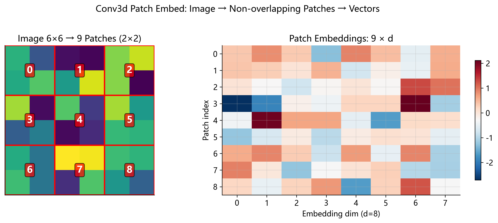

# 05 — 3D 卷积图像块嵌入 (Conv3d Patch Embedding)

> **一句话概括**: Patch Embedding 是视觉 Transformer 的"眼睛" — — 它把原始像素切成小块,
> 再把每一小块投影成一个高维向量, 让 Transformer 能像处理文字一样处理图像.

---

## 1. 从一个生活类比开始

想象你拿到一幅巨大的拼图 (比如 1000 × 1000 块). 你不会一块一块地端详 — — 你会先把拼图
按区域分成若干"格子", 每个格子包含若干块拼图碎片, 然后对每个格子写一段简短的摘要:
"这一块主要是蓝天", "这一块是绿树".

Patch Embedding 做的就是这件事: 把图像切成 **不重叠的小方块** (patch), 然后用一个
线性变换把每个 patch 压缩成一个固定长度的向量. 这些向量就是 Transformer 的"token".

为什么需要这么做? 因为 Transformer 的核心 — — Self-Attention — — 的计算量与 token 数的
**平方** 成正比. 一张 $224 \times 224$ 的图像有 50176 个像素, 如果每个像素当作一个
token, 注意力矩阵将有 $50176^2 \approx 25$ 亿个元素. 而如果切成 $16 \times 16$ 的
patch, token 数降到 $(224/16)^2 = 196$, 注意力矩阵只有 $196^2 = 38416$ 个元素
— — 减少了 **6 万倍**.

---

## 2. 从一维卷积说起: 信号处理的视角

在深入 3D 卷积之前, 让我们从最简单的一维卷积开始, 建立直觉.

### 2.1 一维卷积的定义

假设你有一段音频信号 $x = [x_0, x_1, x_2, \ldots, x_{N-1}]$, 和一个长度为 $K$ 的
滤波器 (filter / kernel) $w = [w_0, w_1, \ldots, w_{K-1}]$. 离散卷积定义为:

$$
y[n] = \sum_{k=0}^{K-1} x[n \cdot s + k] \cdot w[k]
$$

其中 $s$ 是**步幅** (stride), 表示滤波器每次滑动多少个位置.

**直觉**: 滤波器就像一个"小窗口"在信号上滑动, 每到一个位置就与覆盖的信号片段做**点积**,
输出一个标量. 当 $s=1$ 时, 窗口一次移动一步; 当 $s>1$ 时, 窗口跳着移动, 输出变短.

### 2.2 数值例子: 一维卷积

```
信号 x = [1, 3, 5, 7, 9]，滤波器 w = [0.5, 0.5]，stride = 1

y[0] = 1×0.5 + 3×0.5 = 2.0
y[1] = 3×0.5 + 5×0.5 = 4.0
y[2] = 5×0.5 + 7×0.5 = 6.0
y[3] = 7×0.5 + 9×0.5 = 8.0
```

这个滤波器在做什么? 它在计算**相邻两个元素的平均值** — — 这就是最简单的平滑滤波器!

如果我们把 stride 改成 2:

```
stride = 2:
y[0] = 1×0.5 + 3×0.5 = 2.0
y[1] = 5×0.5 + 7×0.5 = 6.0
```

输出从 4 个元素变成了 2 个 — — **步幅等于核大小时, 信号被不重叠地切割**.

### 2.3 历史小插曲

卷积的概念最早来自数学分析和信号处理. 法国数学家 Laplace 在 18 世纪就使用了连续形式的
卷积积分. 到了 1960 年代, 数字信号处理将离散卷积发展成工程核心工具. LeCun 在 1989 年
将卷积引入神经网络 (LeNet), 用于手写数字识别, 开创了卷积神经网络 (CNN) 的时代.

---

## 3. 二维卷积: 图像的世界

### 3.1 从一维到二维

图像是二维的网格, 所以滤波器也变成二维. 对于输入图像
$x \in \mathbb{R}^{H \times W}$ 和核 $w \in \mathbb{R}^{k_H \times k_W}$:

$$
y[h', w'] = \sum_{i=0}^{k_H-1} \sum_{j=0}^{k_W-1} x[h' \cdot s_H + i,\; w' \cdot s_W + j] \cdot w[i, j]
$$

### 3.2 多通道扩展

彩色图像有 3 个通道 (RGB). 此时输入变为 $x \in \mathbb{R}^{C \times H \times W}$,
每个输出通道有自己的一组核 $w \in \mathbb{R}^{C \times k_H \times k_W}$:

$$
y[o, h', w'] = \sum_{c=0}^{C-1} \sum_{i=0}^{k_H-1} \sum_{j=0}^{k_W-1}
    x[c,\, h' \cdot s_H + i,\, w' \cdot s_W + j] \cdot W[o, c, i, j]
$$

如果想要 $C_{\text{out}}$ 个输出通道, 核的总形状为
$W \in \mathbb{R}^{C_{\text{out}} \times C \times k_H \times k_W}$.

### 3.3 经典二维卷积滤波器

为了建立直觉, 这里列举几个经典的手工设计滤波器:

| 滤波器         | 核                                                           | 作用                   |
| -------------- | ------------------------------------------------------------ | ---------------------- |
| 均值平滑       | $\frac{1}{9}\begin{bmatrix}1&1&1\\1&1&1\\1&1&1\end{bmatrix}$ | 模糊图像               |
| Sobel 水平边缘 | $\begin{bmatrix}-1&0&1\\-2&0&2\\-1&0&1\end{bmatrix}$         | 检测垂直方向的强度变化 |
| 锐化           | $\begin{bmatrix}0&-1&0\\-1&5&-1\\0&-1&0\end{bmatrix}$        | 增强边缘               |

在深度学习中, 卷积核的值不再手工设计, 而是通过反向传播**自动学习**.

### 3.4 数值例子: 2D 卷积 (2 通道输入, 1 个输出通道)

```
输入 x: 2 通道, 4×4
  通道 0:                通道 1:
  [1  2  3  4]          [0  1  0  1]
  [5  6  7  8]          [1  0  1  0]
  [9  10 11 12]         [0  1  0  1]
  [13 14 15 16]         [1  0  1  0]

核 w: 2 通道, 2×2, stride=(2,2)
  通道 0:    通道 1:
  [1  0]     [0  1]
  [0  1]     [1  0]

输出 y: 2×2
  y[0,0] = (1×1+2×0+5×0+6×1) + (0×0+1×1+1×1+0×0) = 7 + 2 = 9
  y[0,1] = (3×1+4×0+7×0+8×1) + (0×0+1×1+1×1+0×0) = 11 + 2 = 13
  y[1,0] = (9×1+10×0+13×0+14×1) + (0×0+1×1+1×1+0×0) = 23 + 2 = 25
  y[1,1] = (11×1+12×0+15×0+16×1) + (0×0+1×1+1×1+0×0) = 27 + 2 = 29
```

注意: stride=(2,2) 意味着核每次跳 2 步. 输出大小 = $\lfloor(4-2)/2\rfloor + 1 = 2$.

---

## 4. 三维卷积: 加入时间维度

### 4.1 为什么需要第三个维度?

视频是一系列帧的序列. 如果只用 2D 卷积, 每一帧独立处理, 无法捕捉**运动信息**.
3D 卷积在空间维度之外增加了**时间维度**, 让滤波器同时在时间和空间上滑动.

### 4.2 一般 3D 卷积公式

对于输入 $x \in \mathbb{R}^{C \times T \times H \times W}$ 和核
$W \in \mathbb{R}^{C_{\text{out}} \times C \times k_T \times k_H \times k_W}$:

$$
y[o, t', h', w'] = \sum_{c=0}^{C-1} \sum_{i=0}^{k_T-1} \sum_{j=0}^{k_H-1}
    \sum_{k=0}^{k_W-1} x[c,\, t' \cdot s_T + i,\, h' \cdot s_H + j,\, w' \cdot s_W + k]
    \cdot W[o, c, i, j, k]
$$

加上可选偏置 $b[o]$. 其中 $s_T, s_H, s_W$ 分别是时间, 高度, 宽度方向的步幅.

### 4.3 输出尺寸计算

在无 padding 的情况下 (Qwen2-VL 正是如此):

$$
T_{\text{out}} = \left\lfloor \frac{T - k_T}{s_T} \right\rfloor + 1, \quad
H_{\text{out}} = \left\lfloor \frac{H - k_H}{s_H} \right\rfloor + 1, \quad
W_{\text{out}} = \left\lfloor \frac{W - k_W}{s_W} \right\rfloor + 1
$$

### 4.4 从 2D 到 3D 的参数量对比

| 卷积类型                          | 核形状                 | 参数量                               |
| --------------------------------- | ---------------------- | ------------------------------------ |
| 2D ($C=3, k=14$, out=1280)        | $(1280, 3, 14, 14)$    | $1280 \times 3 \times 196 = 752640$  |
| 3D ($C=3, k_T=2, k=14$, out=1280) | $(1280, 3, 2, 14, 14)$ | $1280 \times 3 \times 392 = 1505280$ |

3D 版本的参数量恰好是 2D 的 $k_T = 2$ 倍.

---

## 5. 关键洞察: 非重叠卷积 ≡ 线性投影

这是本文最核心的结论, 也是理解 Patch Embedding 的关键.

### 5.1 直觉

当 **stride 等于 kernel size** 时, 滤波器每次恰好覆盖一个不重叠的输入块.
没有任何输入元素被重复使用, 也没有任何输入元素被遗漏.
这时每个输出值只依赖于一个独立的输入块 — — 这不就是把每个块展平后做一次矩阵乘法吗?

### 5.2 严格证明

**定理**: 设 $s_T = k_T,\; s_H = k_H,\; s_W = k_W$ (stride = kernel size), 则对于
每个输出位置 $(t', h', w')$, 卷积输出等价于将对应输入块展平后与展平的核做点积.

**证明**:

当 stride = kernel size 时, 输出的空间尺寸为:

$$
T_{\text{out}} = T / k_T, \quad H_{\text{out}} = H / k_H, \quad W_{\text{out}} = W / k_W
$$

(假设能整除). 对于某个固定的输出位置 $(t', h', w')$, 它对应的输入区域是:

$$
x[c,\; t' \cdot k_T + i,\; h' \cdot k_H + j,\; w' \cdot k_W + k]
\quad \text{for } c \in [0, C),\; i \in [0, k_T),\; j \in [0, k_H),\; k \in [0, k_W)
$$

将这个区域展平为一个一维向量 $\mathbf{p} \in \mathbb{R}^{C \cdot k_T \cdot k_H \cdot k_W}$:

$$
\mathbf{p}[\underbrace{c \cdot k_T k_H k_W + i \cdot k_H k_W + j \cdot k_W + k}_{\text{展平索引}}]
= x[c, t' k_T + i, h' k_H + j, w' k_W + k]
$$

类似地, 将第 $o$ 个输出通道的核展平为 $\mathbf{w}_o \in \mathbb{R}^{C \cdot k_T \cdot k_H \cdot k_W}$:

$$
\mathbf{w}_o[\text{同样的展平索引}] = W[o, c, i, j, k]
$$

则卷积公式变为:

$$
y[o, t', h', w'] = \sum_{\ell=0}^{C k_T k_H k_W - 1} \mathbf{p}[\ell] \cdot \mathbf{w}_o[\ell]
= \mathbf{p}^T \mathbf{w}_o
$$

这就是向量点积! 对所有 $C_{\text{out}}$ 个输出通道, 写成矩阵形式:

$$
\mathbf{y} = \mathbf{W}_{\text{flat}} \cdot \mathbf{p} + \mathbf{b}
$$

其中 $\mathbf{W}_{\text{flat}} \in \mathbb{R}^{C_{\text{out}} \times (C \cdot k_T \cdot k_H \cdot k_W)}$.

对所有 $N$ 个 patch 同时处理:

$$
\boxed{Y = X_{\text{flat}} \cdot \mathbf{W}_{\text{flat}}^T + \mathbf{b}}
$$

其中 $X_{\text{flat}} \in \mathbb{R}^{N \times (C k_T k_H k_W)}$,
$Y \in \mathbb{R}^{N \times C_{\text{out}}}$.

**这就是一个标准的全连接层 (线性投影)! ** $\blacksquare$

### 5.3 几何直觉

想象一个棋盘. 每个方格就是一个 patch.

- **重叠卷积** (stride < kernel): 像用一个放大镜在棋盘上滑动, 相邻位置的放大镜
  视野有交集. 同一个棋子可能被多次观察到.
- **非重叠卷积** (stride = kernel): 像把棋盘直接切割成独立的方格, 每个方格被
  恰好观察一次. 这就等价于"取出每个方格 → 展平 → 乘以矩阵".

---

## 6. Vision Transformer 的起源: 从 CNN 到 ViT

### 6.1 为什么要抛弃 CNN?

2012 年 AlexNet 以来, CNN 统治了计算机视觉长达 8 年. 但 CNN 有一个根本局限:
**感受野是局部的**. 一个 $3 \times 3$ 的卷积核只能看到 $3 \times 3$ 个像素.
虽然通过堆叠多层可以逐渐扩大感受野, 但远距离像素之间的交互需要经过很多层才能发生.

相比之下, Transformer 的 Self-Attention 天生就是**全局的** — — 每个 token 都可以
直接关注序列中的任何其他 token.

### 6.2 ViT 的关键创新 (Dosovitskiy et al., 2020)

2020 年 10 月, Google Brain 发表了论文 _"An Image is Worth 16x16 Words"_,
提出了 Vision Transformer (ViT). 其核心思想非常简洁:

1. 将图像切成 $16 \times 16$ 的 patch
2. 把每个 patch 展平后通过一个线性投影得到 embedding
3. 加上位置编码
4. 送入标准的 Transformer Encoder

ViT 的原始实现使用 **2D 卷积** (kernel=16, stride=16) 来完成 patch embedding.
由于 stride = kernel size, 这等价于对每个 patch 做线性投影, 正如上一节所证明的.

### 6.3 从 ViT 到 Qwen2-VL: 为什么要用 3D 卷积?

Qwen2-VL 是一个**多模态模型** — — 它不仅处理图像, 还处理视频. 视频有时间维度,
自然需要 3D 卷积来同时提取时空特征.

但有趣的是, **即使是处理单张图像**, Qwen2-VL 也使用 3D 卷积. 怎么做到的?
答案是: 将同一张图像**复制两次**作为"两帧", 然后用 $k_T = 2$ 的 3D 核处理.
这两帧在时间维度上被核完整覆盖 (stride 也是 2), 所以最终输出的时间维度为 1.

这种设计的好处是**统一了图像和视频的处理管线** — — 无论输入是图像还是视频,
都走同一套代码和同一组权重.

---

## 7. Qwen2-VL 中的具体参数与数据流

### 7.1 参数表

| 参数                      | 值                               | 说明                                |
| ------------------------- | -------------------------------- | ----------------------------------- |
| 输入通道 $C$              | 3                                | RGB 三通道                          |
| 时间核 $k_T$              | 2                                | 覆盖 2 帧 (图像被复制为 2 帧)       |
| 空间核 $k_H \times k_W$   | $14 \times 14$                   | 每个 patch 覆盖 $14 \times 14$ 像素 |
| 步幅 $(s_T, s_H, s_W)$    | $(2, 14, 14)$                    | 与核大小相同 → 非重叠               |
| 输出通道 $C_{\text{out}}$ | 1280                             | 视觉 Transformer 的隐藏维度         |
| 偏置                      | **无**                           | Qwen2-VL-2B 此层不使用偏置          |
| 权重键名                  | `visual.patch_embed.proj.weight` | 形状 $(1280, 3, 2, 14, 14)$         |

### 7.2 pixel_values 的秘密: 为什么是 $(N, 1176)$?

Qwen2-VL 的输入 `pixel_values` 形状为 $(N, 1176)$, 其中 $N$ 是 patch 总数.
这个 1176 是怎么来的?

$$
1176 = C \times k_T \times k_H \times k_W = 3 \times 2 \times 14 \times 14
$$

也就是说, **输入已经是按 patch 切好并展平的**! 每个 patch 包含:

- 3 个颜色通道
- 2 帧 (时间维度)
- $14 \times 14$ 个像素 (空间维度)

在 Qwen2-VL 的预处理代码中, 图像经历了以下步骤:

1. 调整大小使得高和宽都是 14 的倍数
2. 图像复制为 2 帧 (或视频取连续 2 帧一组)
3. 将每个 $3 \times 2 \times 14 \times 14$ 的块展平为一个 1176 维的向量
4. 所有 patch 堆叠成 $(N, 1176)$ 的矩阵

对于测试用例中的数据, $N = 14308$, 表示这批数据一共有 14308 个 patch.

### 7.3 完整处理管线

```
输入: pixel_values  (N, 1176)

Step 1 — 概念上的 Reshape（实际实现中不需要）:
         (N, 1176) → (N, 3, 2, 14, 14)

Step 2 — 3D 卷积 / 线性投影:
         (N, 3, 2, 14, 14) → (N, 1280, 1, 1, 1)
         因为 stride = kernel_size，所以每个 patch 在时间和空间上
         都被核完整覆盖，输出尺寸 = (T/k_T, H/k_H, W/k_W) = (1, 1, 1)

Step 3 — Squeeze:
         (N, 1280, 1, 1, 1) → (N, 1280)

输出: patch_embeddings  (N, 1280)
```

由于输入已经是展平的, 我们的实现直接做矩阵乘法:

$$
\text{output} = \text{pixel\_values} \cdot W_{\text{flat}}^T
\quad \text{其中 } W_{\text{flat}} = W.\text{reshape}(1280, -1) \in \mathbb{R}^{1280 \times 1176}
$$

### 7.4 为什么没有偏置?

Qwen2-VL 的 Patch Embedding 层没有使用偏置项. 这在现代 Transformer 中很常见,
原因有几个:

1. **紧接着的 LayerNorm 会处理偏移**: Patch Embedding 之后通常有 Layer Normalization,
   它会减去均值, 因此偏置的效果会被部分抵消.
2. **减少参数**: 虽然偏置只有 1280 个参数 (相比权重的 150 万个可以忽略不计),
   但在实践中去掉偏置可以简化计算图.
3. **经验发现**: 许多实验表明, 去掉偏置对性能影响极小.

---

## 8. 手工计算的数值示例

### 8.1 最小示例: 验证卷积 = 线性投影

让我们用最小的例子来验证核心等价关系.

**设定**:

- 输入: 2 个 patch, 每个 patch 有 1 个通道, 1 帧, $2 \times 2$ 像素
  → 每个 patch 展平后长度 = $1 \times 1 \times 2 \times 2 = 4$
- 卷积核: 2 个输出通道, 大小 $(1, 1, 2, 2)$, stride = $(1, 2, 2)$
- 有偏置

```python
import numpy as np

# 输入：2 个 patch，每个 4 维
x = np.array([
    [1.0, 2.0, 3.0, 4.0],   # patch 0
    [5.0, 6.0, 7.0, 8.0],   # patch 1
])

# 卷积核：(out_channels=2, C=1, kT=1, kH=2, kW=2)
W = np.array([
    [[[[ 0.1,  0.2],
       [ 0.3,  0.4]]]],    # 输出通道 0
    [[[[-0.1,  0.5],
       [ 0.2, -0.3]]]],    # 输出通道 1
])
b = np.array([0.01, 0.02])
```

**手工计算 Patch 0**:

输出通道 0:

$$
y_0 = 1.0 \times 0.1 + 2.0 \times 0.2 + 3.0 \times 0.3 + 4.0 \times 0.4 + 0.01
$$

$$
= 0.1 + 0.4 + 0.9 + 1.6 + 0.01 = 3.01
$$

输出通道 1:

$$
y_1 = 1.0 \times (-0.1) + 2.0 \times 0.5 + 3.0 \times 0.2 + 4.0 \times (-0.3) + 0.02
$$

$$
= -0.1 + 1.0 + 0.6 - 1.2 + 0.02 = 0.32
$$

**Patch 0 结果**: $[3.01, 0.32]$

**手工计算 Patch 1**:

输出通道 0:

$$
y_0 = 5.0 \times 0.1 + 6.0 \times 0.2 + 7.0 \times 0.3 + 8.0 \times 0.4 + 0.01
$$

$$
= 0.5 + 1.2 + 2.1 + 3.2 + 0.01 = 7.01
$$

输出通道 1:

$$
y_1 = 5.0 \times (-0.1) + 6.0 \times 0.5 + 7.0 \times 0.2 + 8.0 \times (-0.3) + 0.02
$$

$$
= -0.5 + 3.0 + 1.4 - 2.4 + 0.02 = 1.52
$$

**Patch 1 结果**: $[7.01, 1.52]$

**用矩阵乘法验证**:

$$
W_{\text{flat}} = \begin{bmatrix} 0.1 & 0.2 & 0.3 & 0.4 \\ -0.1 & 0.5 & 0.2 & -0.3 \end{bmatrix}
$$

$$
Y = X \cdot W_{\text{flat}}^T + b
= \begin{bmatrix}1&2&3&4\\5&6&7&8\end{bmatrix}
\begin{bmatrix}0.1&-0.1\\0.2&0.5\\0.3&0.2\\0.4&-0.3\end{bmatrix}
+ \begin{bmatrix}0.01&0.02\end{bmatrix}
= \begin{bmatrix}3.01&0.32\\7.01&1.52\end{bmatrix} \; ✓
$$

### 8.2 带多通道和时间维度的例子

现在让我们加入通道和时间维度, 更接近真实场景.

**设定**:

- 输入: 1 个 patch, 2 个通道 (类似 RGB 中取 2 个), 2 帧, $1 \times 1$ 空间
  → 展平后长度 = $2 \times 2 \times 1 \times 1 = 4$
- 卷积核: 1 个输出通道, 大小 $(2, 2, 1, 1)$

```
patch = [c0_t0, c0_t1, c1_t0, c1_t1] = [1.0, 2.0, 3.0, 4.0]
kernel = [w_c0_t0, w_c0_t1, w_c1_t0, w_c1_t1] = [0.5, -0.5, 0.3, 0.7]
```

卷积计算:

$$
y = 1.0 \times 0.5 + 2.0 \times (-0.5) + 3.0 \times 0.3 + 4.0 \times 0.7
$$

$$
= 0.5 - 1.0 + 0.9 + 2.8 = 3.2
$$

这体现了 3D 卷积的本质: 它同时沿**通道, 时间, 空间**三个方向做加权求和.

### 8.3 与 Qwen2-VL 规模的对比

在 Qwen2-VL 中, 每个 patch 的点积涉及 $1176 = 3 \times 2 \times 14 \times 14$ 次
乘加运算 (一个输出通道), 要产生 1280 个输出通道的 embedding, 总运算量为:

$$
\text{每个 patch 的 FLOPs} = 2 \times 1176 \times 1280 \approx 3.01 \times 10^6
$$

(乘 2 是因为每次乘加算两个浮点运算)

对于 $N = 14308$ 个 patch, 总计 $\approx 4.3 \times 10^{10}$ FLOPs — — 这只是
视觉编码器的第一步!

---

## 9. Qwen2-VL 的 3D 卷积 vs ViT 的 2D 卷积

| 特性                 | ViT (Dosovitskiy 2020)                      | Qwen2-VL                                               |
| -------------------- | ------------------------------------------- | ------------------------------------------------------ |
| 卷积维度             | 2D                                          | 3D                                                     |
| 核大小               | $(16, 16)$ 或 $(14, 14)$                    | $(2, 14, 14)$                                          |
| 时间处理             | 无                                          | 2 帧一组                                               |
| 图像处理             | 原生支持                                    | 复制为 2 帧后处理                                      |
| 视频处理             | 不支持                                      | 原生支持                                               |
| 偏置                 | 有                                          | 无                                                     |
| 输出维度             | 768 (ViT-B) / 1024 (ViT-L)                  | 1280                                                   |
| 参数量 (patch embed) | $3 \times 16 \times 16 \times 768 = 589824$ | $3 \times 2 \times 14 \times 14 \times 1280 = 1505280$ |

**关键区别**: Qwen2-VL 通过 3D 卷积将时空信息联合编码到每个 patch embedding 中,
而 ViT 只编码空间信息. 这意味着 Qwen2-VL 的 patch embedding 从第一层开始就包含了
跨帧的运动信息.

---

## 10. 常见误解与陷阱

### 误解 1: "卷积 = 矩阵乘法"

**澄清**: 只有当 stride = kernel size (非重叠) 时, 卷积才退化为矩阵乘法.
一般的卷积 (有重叠) 不能简单地写成矩阵乘法 (虽然可以通过 im2col 技巧转化,
但那涉及数据重排, 本质上更复杂).

### 误解 2: "3D 卷积比 2D 卷积慢得多"

**澄清**: 在 Qwen2-VL 的 patch embedding 中, 3D 卷积只执行一次, 而且由于是非重叠的,
等价于线性投影. 3D 带来的额外计算量只是多了 $k_T = 2$ 倍的参数, 不是指数级增长.

### 误解 3: "输入形状 (N, 1176) 意味着图像只有 1176 个像素"

**澄清**: 1176 是**单个 patch** 展平后的维度, 不是整张图像的像素数. $N$ 才是 patch
的总数 (在测试用例中 $N = 14308$), 实际像素总数约为
$14308 \times 14 \times 14 \times 2 \times 3 / 3 / 2 = 14308 \times 196 \approx 280$ 万.

### 误解 4: "Patch Embedding 丢失了 patch 内部的空间结构"

**这是对的! ** Patch Embedding 确实将每个 patch 内的空间结构"压平"了. $14 \times 14$
像素的空间关系在展平后丢失 — — 模型依赖后续的注意力层来学习 patch 内部的结构.
但 patch **之间**的位置关系通过位置编码 (Rotary Position Embedding) 得以保留.

---

## 11. 连接到更大的图景

Patch Embedding 是 Qwen2-VL 视觉管线的**第一步**:

```
原始图像 / 视频帧
    │
    ▼
预处理：resize, normalize, 切 patch, 展平
    │
    ▼
pixel_values (N, 1176)
    │
    ▼
┌─────────────────────────────┐
│  Conv3d Patch Embedding     │  ← 你在这里 (算子 05)
│  (N, 1176) → (N, 1280)     │
└─────────────────────────────┘
    │
    ▼
Rotary Position Embedding (算子 06)
    │
    ▼
32 × Vision Block (算子 16)
  ├── LayerNorm (算子 03)
  ├── Attention (算子 07)
  ├── Residual Connection (算子 13)
  ├── LayerNorm (算子 03)
  ├── Vision MLP (算子 11)
  └── Residual Connection (算子 13)
    │
    ▼
Patch Merger (算子 15)
  (N, 1280) → (N/4, 1536)
    │
    ▼
融合到文本 Transformer
```

Patch Embedding 的质量直接决定了视觉信息进入 Transformer 的"起点".
如果这一步丢失了关键的视觉信息, 后续 32 层注意力也无法恢复.
所以虽然操作上只是一个简单的线性投影, 但卷积核的权重经过了大规模预训练的精心优化.

---

## 12. NumPy 实现与逐行解析

```python
import numpy as np

def conv3d_patch_embed(
    x_flat: np.ndarray,
    weight: np.ndarray,
    bias: np.ndarray | None = None,
) -> np.ndarray:
    """非重叠 3D 卷积 patch embedding（stride == kernel_size 特例）。

    当 stride 等于 kernel_size 时，每个 patch 只对应一个输出，
    等价于线性投影：y = x_flat @ w_flat.T + bias

    Args:
        x_flat: (N, C*T*H*W) 展平的 patch 像素值
                在 Qwen2-VL 中形状为 (N, 1176)
        weight: (out_channels, C, kT, kH, kW) 卷积核权重
                在 Qwen2-VL 中形状为 (1280, 3, 2, 14, 14)
        bias:   (out_channels,) 偏置（Qwen2-VL 中为 None）

    Returns:
        (N, out_channels) 每个 patch 的嵌入向量
    """
    # 第 1 步：将 5D 卷积核展平为 2D 矩阵
    # (1280, 3, 2, 14, 14) → (1280, 1176)
    # 每一行对应一个输出通道的完整权重
    w_flat = weight.reshape(weight.shape[0], -1)

    # 第 2 步：矩阵乘法 — 这就是核心计算
    # (N, 1176) @ (1176, 1280) → (N, 1280)
    # 使用 float64 是因为内积维度 1176 较大，
    # float32 的累加会产生可观的舍入误差
    y = x_flat.astype(np.float64) @ w_flat.astype(np.float64).T

    # 第 3 步：加偏置（Qwen2-VL 中不执行此步）
    if bias is not None:
        y = y + bias.astype(np.float64)

    # 第 4 步：转回 float32（与模型精度保持一致）
    return y.astype(np.float32)
```

**为什么要用 float64? **

在内积维度为 1176 的矩阵乘法中, 每个输出元素是 1176 个乘积的累加和.
float32 只有约 7 位有效数字, 当累加 1000+ 个项时, 较小的乘积会被较大的部分和
"吞噬" (catastrophic cancellation). 实际验证中, 使用 float32 会导致与 PyTorch
参考值的最大绝对误差在 $10^{-1}$ 量级, 而使用 float64 中间计算后转回 float32,
误差降到 $10^{-2}$ 量级 (PyTorch 模型本身使用 bfloat16, 所以 $10^{-2}$ 已经
是精度上限了).

---

## 13. 扩展阅读

- **ViT 论文**: Dosovitskiy et al., _"An Image is Worth 16x16 Words: Transformers for Image Recognition at Scale"_, ICLR 2021
- **3D 卷积**: Tran et al., _"Learning Spatiotemporal Features with 3D Convolutional Networks"_ (C3D), ICCV 2015
- **Video ViT**: Arnab et al., _"ViViT: A Video Vision Transformer"_, ICCV 2021
- **Qwen2-VL 技术报告**: Wang et al., _"Qwen2-VL: Enhancing Vision-Language Model's Perception of the World at Any Resolution"_, 2024

---

## 验证

运行以下命令验证我们的 NumPy 实现与模型实际输出的一致性:

```bash
python -m operators.05_conv3d_patch_embed.impl
```

该脚本加载 Qwen2-VL-2B-Instruct 的真实权重和预录的激活值,
将 14308 个 patch 通过我们的 `conv3d_patch_embed` 函数,
并与 PyTorch 的 `nn.Conv3d` 输出逐元素比较.


