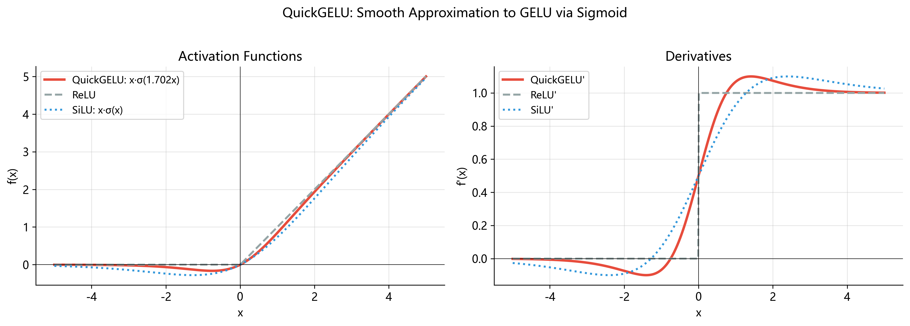

# QuickGELU 激活函数: 从线性的局限到自门控的优雅

> **算子编号**: 08. **位置**: Qwen2-VL 视觉编码器 (ViT) 每个 Transformer block 的 MLP 层
>
> **前置阅读**: 无 (本文自包含). **延伸阅读**: [09_gelu](../09_gelu/) (标准 GELU 完整推导)

---

## 一, 为什么神经网络需要"非线性"? — — 从调色板说起

想象你是一位画家, 面前只有一瓶蓝色颜料和一瓶黄色颜料. 如果你唯一允许的操作是"按比例混合",
那么你能得到的颜色永远在蓝色到黄色的**渐变带**上 — — 你永远调不出红色, 紫色, 橙色.
混合 (线性组合) 本质上只是在同一条直线上滑动, 无法突破到更高维度的色彩空间.

神经网络面临完全相同的困境.

### 1.1 线性函数的组合仍然是线性的 — — 数学证明

设两个仿射变换 (线性层):

$$
f(\mathbf{x}) = \mathbf{A}\mathbf{x} + \mathbf{b}, \quad g(\mathbf{x}) = \mathbf{C}\mathbf{x} + \mathbf{d}
$$

把 $g$ 的输出送入 $f$:

$$
f(g(\mathbf{x})) = \mathbf{A}(\mathbf{C}\mathbf{x} + \mathbf{d}) + \mathbf{b}
= \mathbf{A}\mathbf{C}\mathbf{x} + (\mathbf{A}\mathbf{d} + \mathbf{b})
$$

令 $\mathbf{W} = \mathbf{A}\mathbf{C}$, $\mathbf{c} = \mathbf{A}\mathbf{d} + \mathbf{b}$, 则:

$$
f(g(\mathbf{x})) = \mathbf{W}\mathbf{x} + \mathbf{c}
$$

结果还是一个仿射变换! 这个论证可以推广到任意多层 — — 用数学归纳法, $n$ 个仿射变换的复合
仍然是一个仿射变换. 这意味着:

> **没有非线性激活函数, 一个 100 层的网络在数学上等价于一个单层网络. **
>
> 所有那些参数, 所有那些层, 所有那些计算 — — 全部白费了.

这就像你有 100 瓶不同深浅的蓝色颜料, 但你仍然只能调出蓝色.
要打破这个局限, 我们需要在每一层之后施加一个**非线性变换** — — 这就是**激活函数**的使命.

---

## 二, 激活函数简史: 从 Sigmoid 到 QuickGELU 的进化之路

激活函数的历史, 是深度学习从"能用"走向"好用"的缩影. 让我们按时间线回顾.

### 2.1 Sigmoid (1990 年代主流)

$$
\sigma(x) = \frac{1}{1 + e^{-x}}
$$

Sigmoid 的灵感来自生物神经元的"激活-不激活"二元特性 — — 输出在 $(0, 1)$ 之间, 像一个概率.
它在早期反向传播时代大放异彩, 但有两个致命问题:

- **梯度消失**: 当 $|x|$ 较大时, $\sigma'(x) \approx 0$, 梯度在层间传递时指数级衰减.
- **输出非零中心**: $\sigma(x) \in (0, 1)$, 均值约 $0.5$, 导致下一层参数更新出现 zig-zag 效应.

### 2.2 Tanh (Sigmoid 的改良)

$$
\tanh(x) = \frac{e^x - e^{-x}}{e^x + e^{-x}} = 2\sigma(2x) - 1
$$

Tanh 解决了零中心问题 (输出在 $(-1, 1)$), 但梯度消失问题依然存在 — — 当 $|x| > 2$ 时梯度几乎为零.

### 2.3 ReLU (2012 年 AlexNet 时代的革命)

$$
\text{ReLU}(x) = \max(0, x)
$$

ReLU 的出现是一次范式转变:

- **正半轴梯度恒为 1** — — 彻底解决梯度消失.
- **计算极其简单** — — 只需一次比较操作.
- **稀疏激活** — — 约 50% 的神经元输出为零, 天然实现了稀疏表示.

但 ReLU 也埋下了一颗定时炸弹: **dying ReLU 问题**.

### 2.4 GELU (2016 年, Hendrycks & Gimpel)

$$
\text{GELU}(x) = x \cdot \Phi(x)
$$

其中 $\Phi(x)$ 是标准正态分布的累积分布函数. GELU 是第一个大规模成功的**平滑**激活函数,
被 BERT, GPT 等里程碑模型采用. (详见 [09_gelu](../09_gelu/).)

### 2.5 QuickGELU (2021 年, OpenAI CLIP)

$$
\text{QuickGELU}(x) = x \cdot \sigma(1.702x)
$$

用 sigmoid 函数近似 GELU 中的正态 CDF, 以**更快的速度**获得**几乎相同的效果**.
这就是本文的主角.

---

## 三, Dying ReLU: 平滑激活的催化剂

为什么不一直用简单的 ReLU? 让我们深入理解它的致命缺陷.

ReLU 的导数是一个阶跃函数:

$$
\text{ReLU}'(x) = \begin{cases} 1, & x > 0 \\ 0, & x < 0 \end{cases}
$$

当某个神经元的输入 $x$ 恰好落在负半轴时, 梯度为零. 这意味着:

1. 该神经元对当前样本不产生任何梯度信号.
2. 在梯度下降更新中, 与该神经元相连的权重**不会被更新**.
3. 如果权重更新后使得该神经元对**所有训练样本**的输入都为负 — — 它就**永久死亡**了.

这就像一条河流中的支流被淤泥堵塞. 一旦堵死, 水流不再经过, 也就不会冲刷淤泥 — —
支流永远不会重新疏通. 一个神经元一旦"死"了, 在 ReLU 的体系下它就永远无法复活.

在大型网络中, 这个问题会导致大量神经元失效. 研究表明, 学习率过高时,
一个网络中可能有高达 **40%** 的 ReLU 神经元处于死亡状态.

这就是为什么研究者们开始寻找**负半轴也有非零梯度**的替代方案.
GELU 和 QuickGELU 正是这样的方案 — — 它们在负半轴有微小但非零的输出和梯度,
让"受伤"的神经元始终有机会恢复.

---

## 四, Sigmoid 函数: 完整推导

Sigmoid 是 QuickGELU 的核心组件, 值得我们从根基讲起.

### 4.1 从 Logistic 增长模型说起

Sigmoid 函数并非凭空出现 — — 它最早来自人口增长模型. 设一个种群的数量为 $P(t)$,
环境的最大容纳量 (carrying capacity) 为 $K$. 最简单的增长模型是:

$$
\frac{dP}{dt} = rP\left(1 - \frac{P}{K}\right)
$$

这个方程说的是:

- 当 $P$ 远小于 $K$ 时, $1 - P/K \approx 1$, 增长近似指数级.
- 当 $P$ 接近 $K$ 时, $1 - P/K \approx 0$, 增长停滞.

求解这个常微分方程 (分离变量法), 在适当的初始条件下可以得到:

$$
P(t) = \frac{K}{1 + e^{-r(t - t_0)}}
$$

令 $K = 1$, $r = 1$, $t_0 = 0$, 我们就得到了标准 sigmoid 函数:

$$
\sigma(x) = \frac{1}{1 + e^{-x}}
$$

S 形曲线 (sigmoid curve) 描述的正是这种"起初缓慢, 中间急速, 最终饱和"的增长模式 — —
这与神经元从"未激活"到"完全激活"的过渡何其相似!

### 4.2 Sigmoid 的美妙导数

Sigmoid 有一个极其优雅的导数性质 — — **导数可以用函数自身来表示**:

$$
\sigma'(x) = \sigma(x)\bigl(1 - \sigma(x)\bigr)
$$

这不仅美观, 而且在实际计算中非常高效: 如果前向传播已经算好了 $\sigma(x)$,
反向传播只需做一次乘法和一次减法.

**完整证明** (使用链式法则/商法则):

设 $\sigma(x) = \frac{1}{1 + e^{-x}} = (1 + e^{-x})^{-1}$.

用链式法则:

$$
\sigma'(x) = -1 \cdot (1 + e^{-x})^{-2} \cdot \frac{d}{dx}(1 + e^{-x})
$$

其中:

$$
\frac{d}{dx}(1 + e^{-x}) = -e^{-x}
$$

所以:

$$
\sigma'(x) = -1 \cdot (1 + e^{-x})^{-2} \cdot (-e^{-x}) = \frac{e^{-x}}{(1 + e^{-x})^{2}}
$$

现在关键的一步 — — 把它改写成 $\sigma(x)(1 - \sigma(x))$:

$$
\sigma(x) = \frac{1}{1 + e^{-x}}, \quad 1 - \sigma(x) = 1 - \frac{1}{1 + e^{-x}} = \frac{e^{-x}}{1 + e^{-x}}
$$

相乘:

$$
\sigma(x)\bigl(1 - \sigma(x)\bigr) = \frac{1}{1 + e^{-x}} \cdot \frac{e^{-x}}{1 + e^{-x}} = \frac{e^{-x}}{(1 + e^{-x})^{2}}
$$

与上面求得的 $\sigma'(x)$ 完全一致. $\blacksquare$

### 4.3 Sigmoid 数值表

| $x$  | $e^{-x}$ | $1 + e^{-x}$ | $\sigma(x)$ | $\sigma'(x) = \sigma(1-\sigma)$ |
| ---- | -------- | ------------ | ----------- | ------------------------------- |
| $-2$ | $7.3891$ | $8.3891$     | $0.1192$    | $0.1050$                        |
| $-1$ | $2.7183$ | $3.7183$     | $0.2689$    | $0.1966$                        |
| $0$  | $1.0000$ | $2.0000$     | $0.5000$    | $0.2500$                        |
| $1$  | $0.3679$ | $1.3679$     | $0.7311$    | $0.1966$                        |
| $2$  | $0.1353$ | $1.1353$     | $0.8808$    | $0.1050$                        |

注意 $\sigma'(x)$ 的最大值出现在 $x = 0$ 处, 等于 $0.25$. 这意味着每经过一层 sigmoid,
梯度**至少衰减为原来的 1/4** — — 这正是梯度消失问题的数学根源.

---

## 五, GELU 简述

GELU (Gaussian Error Linear Unit) 的定义是:

$$
\text{GELU}(x) = x \cdot \Phi(x)
$$

其中 $\Phi(x)$ 是标准正态分布 $\mathcal{N}(0, 1)$ 的累积分布函数 (CDF):

$$
\Phi(x) = \frac{1}{2}\left[1 + \text{erf}\left(\frac{x}{\sqrt{2}}\right)\right]
$$

直觉上, GELU 的意思是: 用一个与输入值相关的概率来决定这个输入"有多大可能被保留".
输入越大, 被保留的概率越高 ($\Phi(x) \to 1$); 输入越负, 越可能被丢弃 ($\Phi(x) \to 0$).

GELU 在 BERT, GPT-2 等模型中被广泛使用, 效果优秀.
但它有一个实际问题: $\Phi(x)$ 的精确计算需要调用 `erf` 函数, 在某些硬件上不够高效.

这就引出了 QuickGELU 的核心思想 — — 能不能用更简单的函数来**近似** $\Phi(x)$?

> 📖 GELU 的完整推导见 [09_gelu](../09_gelu/).

---

## 六, QuickGELU: 用 Sigmoid 近似 GELU

### 6.1 核心思想

观察 $\Phi(x)$ 和 $\sigma(x)$ 的图像, 你会发现它们**形状极其相似** — —
都是从 0 单调递增到 1 的 S 形曲线. 区别在于"陡峭程度"不同.

如果我们对 sigmoid 的输入做一个缩放 $\sigma(\alpha x)$, 调整参数 $\alpha$,
就可以让 sigmoid 曲线的陡峭程度去匹配 $\Phi(x)$.

### 6.2 最优参数 $\alpha = 1.702$ 的由来

我们希望找到 $\alpha$ 使得 $\sigma(\alpha x)$ 尽可能接近 $\Phi(x)$. 用最小二乘法:

$$
\alpha^* = \arg\min_{\alpha} \int_{-\infty}^{+\infty} \bigl[\sigma(\alpha x) - \Phi(x)\bigr]^2 \, dx
$$

对这个积分求解 (数值优化), 得到:

$$
\alpha^* \approx 1.702
$$

这不是一个"拍脑袋"想出来的数字, 而是经过严格优化得到的最优拟合参数.

### 6.3 近似效果: $\sigma(1.702x)$ vs $\Phi(x)$

让我们用数值来验证这个近似有多好:

| $x$    | $\Phi(x)$ | $\sigma(1.702x)$ | 绝对误差 |
| ------ | --------- | ---------------- | -------- |
| $-2.0$ | $0.0228$  | $0.0322$         | $0.0094$ |
| $-1.0$ | $0.1587$  | $0.1542$         | $0.0045$ |
| $-0.5$ | $0.3085$  | $0.2984$         | $0.0101$ |
| $0.0$  | $0.5000$  | $0.5000$         | $0.0000$ |
| $0.5$  | $0.6915$  | $0.7016$         | $0.0101$ |
| $1.0$  | $0.8413$  | $0.8458$         | $0.0045$ |
| $2.0$  | $0.9772$  | $0.9678$         | $0.0094$ |

最大绝对误差仅约 **0.01**! 对于一个激活函数来说, 这个精度完全足够 — —
因为神经网络的权重会在训练过程中自动适应这个微小的偏差.

### 6.4 QuickGELU 的最终定义

既然 $\sigma(1.702x) \approx \Phi(x)$, 那么:

$$
\text{GELU}(x) = x \cdot \Phi(x) \approx x \cdot \sigma(1.702x) = \text{QuickGELU}(x)
$$

因此:

$$
\boxed{\text{QuickGELU}(x) = x \cdot \sigma(1.702x)}
$$

---

## 七, "自门控"机制: QuickGELU 的灵魂

### 7.1 什么是门控?

在信号处理和神经网络中, **门控** (gating) 是指用一个 $[0, 1]$ 范围的信号去控制另一个信号的通过量.
可以把它想象成一个**调光旋钮 (dimmer switch) **:

- 旋钮拧到 1 → 灯全亮 (信号完全通过)
- 旋钮拧到 0 → 灯全灭 (信号被完全阻断)
- 旋钮在中间 → 灯半亮 (信号被部分衰减)

在传统的 LSTM (Long Short-Term Memory) 网络中, 门控是**外部的** — —
一组专门的参数和计算来产生门控信号, 去控制另一路信号的通过.
输入信号和门控信号来自**不同的来源**.

### 7.2 QuickGELU 的"自门控"

QuickGELU 的巧妙之处在于 — — 输入 $x$ **同时扮演两个角色**:

1. **被门控的信号**: $x$ 本身就是要传递的信息.
2. **门控信号的来源**: $\sigma(1.702x)$ 从 $x$ 自身计算出门控值.

$$
\underbrace{x}_{\text{信号}} \cdot \underbrace{\sigma(1.702x)}_{\text{由信号自己生成的门控}}
$$

回到调光旋钮的比喻: 想象一盏"智能灯" — — 灯的亮度不由你手动控制,
而是根据灯**自身的电流强度**自动调节. 电流强 (正值大), 灯自动调亮;
电流弱甚至反向 (负值), 灯自动调暗.

这种设计的好处是:

- **零额外参数**: 不需要额外的门控网络.
- **自适应抑制**: 小的负值被轻微抑制, 大的负值被强烈抑制, 正值几乎不受影响.
- **平滑过渡**: 不像 ReLU 那样在 $x = 0$ 处有硬拐角.

### 7.3 自门控的行为分析

| $x$ 的取值范围          | $\sigma(1.702x)$ 的值 | 门控行为     | 直觉解释               |
| ----------------------- | --------------------- | ------------ | ---------------------- |
| $x \gg 0$ (如 $x = 3$)  | $\approx 1.0$         | 门全开       | 强信号直接通过         |
| $x = 0$                 | $= 0.5$               | 门半开       | 中性信号被减半         |
| $x = -0.5$              | $\approx 0.30$        | 门大部分关闭 | 弱负信号被大幅衰减     |
| $x \ll 0$ (如 $x = -3$) | $\approx 0.006$       | 门几乎关闭   | 强负信号几乎被完全阻断 |

---

## 八, QuickGELU 的导数: 梯度流分析

在训练神经网络时, 我们需要对每个操作求导 (反向传播). 让我们推导 QuickGELU 的导数.

### 8.1 推导

设 $q(x) = x \cdot \sigma(1.702x)$, 其中 $\sigma(z) = (1 + e^{-z})^{-1}$.

使用**乘法法则** (product rule):

$$
q'(x) = \frac{d}{dx}[x] \cdot \sigma(1.702x) + x \cdot \frac{d}{dx}[\sigma(1.702x)]
$$

第一项很简单:

$$
\frac{d}{dx}[x] \cdot \sigma(1.702x) = \sigma(1.702x)
$$

第二项, 使用链式法则和 $\sigma'(z) = \sigma(z)(1 - \sigma(z))$:

$$
\frac{d}{dx}[\sigma(1.702x)] = 1.702 \cdot \sigma(1.702x) \cdot \bigl(1 - \sigma(1.702x)\bigr)
$$

合起来:

$$
\boxed{q'(x) = \sigma(1.702x) + 1.702 \cdot x \cdot \sigma(1.702x) \cdot \bigl(1 - \sigma(1.702x)\bigr)}
$$

为了简洁, 令 $s = \sigma(1.702x)$, 则:

$$
q'(x) = s + 1.702 \, x \, s(1 - s) = s\bigl[1 + 1.702 \, x \, (1 - s)\bigr]
$$

### 8.2 导数的数值计算

| $x$    | $s = \sigma(1.702x)$ | $1 - s$  | $1.702 \cdot x \cdot s \cdot (1-s)$ | $q'(x)$   |
| ------ | -------------------- | -------- | ----------------------------------- | --------- |
| $-2.0$ | $0.0322$             | $0.9678$ | $-0.1063$                           | $-0.0741$ |
| $-1.0$ | $0.1542$             | $0.8458$ | $-0.2220$                           | $-0.0678$ |
| $-0.5$ | $0.2984$             | $0.7016$ | $-0.1783$                           | $0.1201$  |
| $0.0$  | $0.5000$             | $0.5000$ | $0.0000$                            | $0.5000$  |
| $0.5$  | $0.7016$             | $0.2984$ | $0.1783$                            | $0.8799$  |
| $1.0$  | $0.8458$             | $0.1542$ | $0.2220$                            | $1.0678$  |
| $2.0$  | $0.9678$             | $0.0322$ | $0.1063$                            | $1.0741$  |

### 8.3 导数告诉我们什么?

几个关键观察:

1. **$x = 0$ 处导数为 0.5** — — 不是 0, 也不是 1, 是一个温和的中间值. 对比 ReLU 在 $x = 0$ 处的不可导.
2. **正半轴导数接近 1** (如 $x = 2$ 时为 $1.074$) — — 信号几乎无损通过, 梯度流畅通.
3. **负半轴导数虽小但非零** (如 $x = -1$ 时为 $-0.068$) — — "垂死"的神经元仍有微弱梯度, 有机会恢复. 这正是解决 dying ReLU 问题的关键.
4. **导数可以略超过 1** — — 这意味着 QuickGELU 不是严格的 1-Lipschitz 函数, 但在实践中这不会引起问题.

---

## 九, 横向对比: QuickGELU vs GELU vs SiLU

三者都是"自门控"激活函数, 形式高度统一:

| 函数名           | 公式                     | 门控函数         | 在 Qwen2-VL 中的位置 |
| ---------------- | ------------------------ | ---------------- | -------------------- |
| **SiLU** (Swish) | $x \cdot \sigma(x)$      | $\sigma(x)$      | Text Decoder MLP     |
| **QuickGELU**    | $x \cdot \sigma(1.702x)$ | $\sigma(1.702x)$ | Vision Encoder MLP   |
| **GELU**         | $x \cdot \Phi(x)$        | $\Phi(x)$        | Patch Merger         |

### 数值对比表

| $x$    | SiLU $x \cdot \sigma(x)$ | QuickGELU $x \cdot \sigma(1.702x)$ | GELU $x \cdot \Phi(x)$ |
| ------ | ------------------------ | ---------------------------------- | ---------------------- |
| $-2.0$ | $-0.2384$                | $-0.0644$                          | $-0.0454$              |
| $-1.0$ | $-0.2689$                | $-0.1542$                          | $-0.1587$              |
| $-0.5$ | $-0.1888$                | $-0.1492$                          | $-0.1543$              |
| $0.0$  | $0.0000$                 | $0.0000$                           | $0.0000$               |
| $0.5$  | $0.3112$                 | $0.3508$                           | $0.3457$               |
| $1.0$  | $0.7311$                 | $0.8458$                           | $0.8413$               |
| $2.0$  | $1.7616$                 | $1.9355$                           | $1.9545$               |

关键观察:

- **QuickGELU 和 GELU 的值极其接近** — — 最大差距仅在 $x = -2$ 处约 0.019. 这验证了 $\sigma(1.702x) \approx \Phi(x)$ 的近似质量.
- **SiLU 更"宽容"** — — 它在负半轴的输出绝对值明显更大 (如 $x=-2$ 时 SiLU 为 $-0.238$ 而 QuickGELU 仅 $-0.064$), 因为 $\sigma(x)$ 比 $\sigma(1.702x)$ 下降得更慢.
- 在正半轴, 三者趋于一致, 都接近恒等函数 $y = x$.



---

## 十, 为什么 CLIP 选择了 QuickGELU?

### 10.1 CLIP 简介

CLIP (Contrastive Language-Image Pre-training) 是 OpenAI 在 2021 年发布的一个
多模态模型, 它学会了将图像和文本映射到同一个语义空间. CLIP 的视觉部分使用了
**Vision Transformer (ViT) ** 架构.

### 10.2 选择 QuickGELU 的原因

在 CLIP 的训练中, 视觉编码器需要处理海量图像数据. 激活函数被调用的次数是天文数字级的:

- 每张图像产生数百个 patch token
- 每个 token 通过 12-24 个 Transformer block
- 每个 block 的 MLP 调用一次激活函数

在这种规模下, 激活函数的**计算效率**变得至关重要.

GELU 需要调用 `erf` 函数 (或等价的 `tanh` 近似, 后者需要计算 $x^3$),
而 QuickGELU 只需要一次 `exp` 和几次乘法除法. 在 GPU 上, `exp` 有专门的硬件指令,
而 `erf` 通常需要多项式展开来近似, 速度更慢.

QuickGELU 这个名字中的 "Quick" 正是这个意思 — — **快速版的 GELU**.

### 10.3 从 CLIP 到 Qwen2-VL

Qwen2-VL 的视觉编码器继承了 CLIP 风格的 ViT 架构. 当阿里巴巴团队构建 Qwen2-VL 时,
他们沿用了 CLIP 系列模型中久经验证的设计选择, 包括使用 QuickGELU 作为视觉 MLP 的激活函数.

值得注意的是, QuickGELU 仅出现在 OpenAI 的 CLIP 代码库中,
**并没有专门的学术论文**来介绍它. 它是工程实践中的产物 — — 有效, 高效, 但没有被正式"发表".

---

## 十一, QuickGELU 在 Qwen2-VL 中的具体使用

### 11.1 视觉编码器架构回顾

Qwen2-VL 的视觉编码器参数如下:

| 参数                 | 值                |
| -------------------- | ----------------- |
| 嵌入维度 embed_dim   | 1280              |
| 注意力头数 num_heads | 16                |
| 每头维度 head_dim    | 80                |
| MLP 隐藏维度         | 5120 (= 1280 × 4) |
| Transformer block 数 | 32                |

### 11.2 MLP 层的结构

每个 Transformer block 中的 MLP 由三步组成:

```
输入 x: (14308, 1280)
    │
    ▼
fc1: Linear(1280 → 5120)     # 升维：将 1280 维投影到 5120 维
    │
    ▼
中间结果: (14308, 5120)
    │
    ▼
QuickGELU                     # 激活：对每个元素施加非线性变换
    │
    ▼
激活后: (14308, 5120)          # 形状不变，但值发生了非线性变化
    │
    ▼
fc2: Linear(5120 → 1280)     # 降维：投影回 1280 维
    │
    ▼
输出: (14308, 1280)
```

### 11.3 张量形状流转

让我们追踪一个具体的张量:

- **输入**: 形状 $(14308, 1280)$, 其中 $14308$ 是视觉 token 数量
- **fc1 之后**: 形状 $(14308, 5120)$
  - fc1 的权重矩阵为 $(1280, 5120)$, 偏置为 $(5120,)$
- **QuickGELU 之后**: 形状 $(14308, 5120)$ — — 形状不变!
  - 激活函数是逐元素 (element-wise) 操作, $14308 \times 5120 = 73{,}256{,}960$ 个元素
  - 每个元素独立地计算 $x \cdot \sigma(1.702x)$
- **fc2 之后**: 形状 $(14308, 1280)$, 回到原始维度

这个"升维 → 激活 → 降维"的结构 (也称为 inverted bottleneck) 让网络在高维空间中进行非线性变换,
然后将结果压缩回低维 — — 高维空间中有更多的"表达自由度"来学习复杂的特征变换.

### 11.4 整个模型中 QuickGELU 被调用了多少次?

视觉编码器有 **32 个 block**, 每个 block 调用一次 QuickGELU. 所以:

- 每次推理调用 QuickGELU **32 次**
- 每次调用处理 $14308 \times 5120 = 73{,}256{,}960$ 个元素
- 总计约 $32 \times 73{,}256{,}960 \approx 23.4$ **亿次** QuickGELU 运算

这解释了为什么选择计算高效的 QuickGELU 而非标准 GELU 是有意义的.

---

## 十二, 详细数值示例

让我们对 8 个代表性输入值进行完整的手算.

### $x = -2.0$

$$
1.702 \times (-2.0) = -3.404
$$

$$
e^{-(-3.404)} = e^{3.404} = 30.0866
$$

$$
\sigma(-3.404) = \frac{1}{1 + 30.0866} = \frac{1}{31.0866} = 0.0322
$$

$$
\text{QuickGELU}(-2.0) = (-2.0) \times 0.0322 = -0.0644
$$

### $x = -1.0$

$$
1.702 \times (-1.0) = -1.702
$$

$$
e^{1.702} = 5.4854
$$

$$
\sigma(-1.702) = \frac{1}{1 + 5.4854} = \frac{1}{6.4854} = 0.1542
$$

$$
\text{QuickGELU}(-1.0) = (-1.0) \times 0.1542 = -0.1542
$$

### $x = -0.5$

$$
1.702 \times (-0.5) = -0.851
$$

$$
e^{0.851} = 2.3421
$$

$$
\sigma(-0.851) = \frac{1}{1 + 2.3421} = \frac{1}{3.3421} = 0.2992
$$

$$
\text{QuickGELU}(-0.5) = (-0.5) \times 0.2992 = -0.1496
$$

### $x = 0.0$

$$
1.702 \times 0.0 = 0.0
$$

$$
\sigma(0.0) = \frac{1}{1 + 1} = 0.5
$$

$$
\text{QuickGELU}(0.0) = 0.0 \times 0.5 = 0.0
$$

### $x = 0.5$

$$
1.702 \times 0.5 = 0.851
$$

$$
e^{-0.851} = 0.4270
$$

$$
\sigma(0.851) = \frac{1}{1 + 0.4270} = \frac{1}{1.4270} = 0.7008
$$

$$
\text{QuickGELU}(0.5) = 0.5 \times 0.7008 = 0.3504
$$

### $x = 1.0$

$$
1.702 \times 1.0 = 1.702
$$

$$
e^{-1.702} = 0.1823
$$

$$
\sigma(1.702) = \frac{1}{1 + 0.1823} = \frac{1}{1.1823} = 0.8458
$$

$$
\text{QuickGELU}(1.0) = 1.0 \times 0.8458 = 0.8458
$$

### $x = 1.5$

$$
1.702 \times 1.5 = 2.553
$$

$$
e^{-2.553} = 0.0781
$$

$$
\sigma(2.553) = \frac{1}{1 + 0.0781} = \frac{1}{1.0781} = 0.9276
$$

$$
\text{QuickGELU}(1.5) = 1.5 \times 0.9276 = 1.3914
$$

### $x = 2.0$

$$
1.702 \times 2.0 = 3.404
$$

$$
e^{-3.404} = 0.0332
$$

$$
\sigma(3.404) = \frac{1}{1 + 0.0332} = \frac{1}{1.0332} = 0.9678
$$

$$
\text{QuickGELU}(2.0) = 2.0 \times 0.9678 = 1.9355
$$

### 汇总表

| $x$    | $1.702x$ | $e^{-1.702x}$ | $\sigma(1.702x)$ | $\text{QuickGELU}(x)$ |
| ------ | -------- | ------------- | ---------------- | --------------------- |
| $-2.0$ | $-3.404$ | $30.0866$     | $0.0322$         | $-0.0644$             |
| $-1.0$ | $-1.702$ | $5.4854$      | $0.1542$         | $-0.1542$             |
| $-0.5$ | $-0.851$ | $2.3421$      | $0.2992$         | $-0.1496$             |
| $0.0$  | $0.000$  | $1.0000$      | $0.5000$         | $0.0000$              |
| $0.5$  | $0.851$  | $0.4270$      | $0.7008$         | $0.3504$              |
| $1.0$  | $1.702$  | $0.1823$      | $0.8458$         | $0.8458$              |
| $1.5$  | $2.553$  | $0.0781$      | $0.9276$         | $1.3914$              |
| $2.0$  | $3.404$  | $0.0332$      | $0.9678$         | $1.9355$              |

---

## 十三, NumPy 实现

```python
import numpy as np

def sigmoid(x):
    """Sigmoid 函数：将任意实数映射到 (0, 1) 区间。

    公式：σ(x) = 1 / (1 + exp(-x))
    """
    # np.exp(-x) 对数组中的每个元素计算 e^(-x)
    # 分母 1.0 + ... 保证结果在 (0, 1) 之间
    # 返回与输入相同形状的数组
    return 1.0 / (1.0 + np.exp(-x))


def quick_gelu(x):
    """QuickGELU 激活函数：GELU 的快速 sigmoid 近似。

    公式：QuickGELU(x) = x * σ(1.702 * x)

    参数:
        x: 任意形状的 numpy 数组
    返回:
        与 x 相同形状的数组，每个元素施加了 QuickGELU 变换
    """
    # 第一步：计算缩放后的输入 1.702 * x
    # 1.702 是最优拟合参数，使 σ(1.702x) ≈ Φ(x)
    scaled = 1.702 * x

    # 第二步：计算门控信号 σ(1.702x)，值域 (0, 1)
    gate = sigmoid(scaled)

    # 第三步：输入与门控信号逐元素相乘（自门控）
    return x * gate
```

使用示例:

```python
# 标量计算
print(quick_gelu(1.0))   # 0.8458

# 向量计算——激活函数对每个元素独立作用
x = np.array([-2.0, -1.0, 0.0, 1.0, 2.0])
print(quick_gelu(x))     # [-0.0644, -0.1542, 0.0, 0.8458, 1.9355]

# 矩阵计算——模拟实际使用场景
x = np.random.randn(14308, 5120).astype(np.float32)
y = quick_gelu(x)        # 输出形状仍为 (14308, 5120)
```

---

## 十四, 常见误解澄清

### 误解 1: "QuickGELU 不就是 ReLU 加了点花样吗? "

**不是. ** 二者有根本性区别:

| 特性       | ReLU                        | QuickGELU                          |
| ---------- | --------------------------- | ---------------------------------- |
| 负半轴输出 | 恒为 0                      | 微小负值 (如 $x=-1$ 时为 $-0.154$) |
| $x = 0$ 处 | 不可导 (左导数 0, 右导数 1) | 可导 (导数为 0.5)                  |
| 梯度流     | 负半轴完全阻断              | 负半轴仍有微弱梯度                 |
| 数学形式   | 分段线性                    | 连续可微的光滑曲线                 |
| 计算方式   | 阈值比较                    | 自门控乘法                         |

ReLU 是一把"铡刀" — — 负值一律砍为零; QuickGELU 是一个"智能调节器" — — 平滑地衰减信号.

### 误解 2: "1.702 这个数字是随便选的吧? "

**不是. ** 如第六节所述, $1.702$ 是通过最小化 $\sigma(\alpha x)$ 与 $\Phi(x)$ 之间的
积分平方误差得到的**最优参数**. 换成 $1.5$ 或 $2.0$, 近似质量会明显下降.

### 误解 3: "QuickGELU 比 GELU 差, 只是为了省计算"

这种说法过于简化. 在实践中:

- QuickGELU 和 GELU 的数值差异极小 (最大约 0.02).
- 神经网络的权重会在训练中适应激活函数的特性.
- 在 CLIP 这样的大规模训练中, QuickGELU 和 GELU 的**最终性能几乎没有区别**.
- 但 QuickGELU 的计算确实更快, 尤其在不原生支持 `erf` 的硬件上.

### 误解 4: "激活函数不重要, 随便选一个就行"

事实上, 激活函数的选择会影响:

- **梯度流**: 是否存在梯度消失/爆炸.
- **训练稳定性**: 平滑性有助于优化稳定.
- **表达能力**: 非单调的激活函数 (如 GELU/QuickGELU 在负半轴的小凹陷) 可以增加模型的表达力.
- **计算效率**: 大规模训练中, 微小的效率差异会被放大到显著程度.

---

## 十五, 历史脉络与工程智慧

QuickGELU 的诞生有一段有趣的历史.

2020 年前后, GELU 已经成为 Transformer 模型的标配激活函数 — — BERT 用它, GPT-2 用它,
学术界几乎达成了共识. 但当 OpenAI 团队在 2021 年构建 CLIP 模型时, 他们面临一个实际问题:
CLIP 需要同时训练视觉和文本两个编码器, 训练数据是 4 亿个图文对, 计算量巨大.

在这种工业级规模的训练中, 每一个细微的效率提升都会累积成巨大的节省.
OpenAI 的工程师们发现, 用 $\sigma(1.702x)$ 来替代 $\Phi(x)$ 可以在几乎不损失精度的情况下
获得可观的速度提升. 于是 QuickGELU 就这样 — — 不是在一篇论文中, 而是在一个代码库中 — —
悄然诞生了.

这个故事提醒我们一个深度学习中常被忽视的事实: **很多重要的技术创新并非来自论文,
而是来自工程实践. ** QuickGELU 没有 arXiv 论文, 没有审稿流程, 只有 CLIP 代码仓库中
简简单单的几行代码:

```python
class QuickGELU(nn.Module):
    def forward(self, x: torch.Tensor):
        return x * torch.sigmoid(1.702 * x)
```

正是这几行代码, 后来被无数视觉模型继承 — — 包括 Qwen2-VL 的视觉编码器.

---

## 十六, 总结

| 维度            | 要点                                                               |
| --------------- | ------------------------------------------------------------------ |
| **定义**        | $\text{QuickGELU}(x) = x \cdot \sigma(1.702x)$                     |
| **本质**        | GELU 的 sigmoid 近似, 用 $\sigma(1.702x) \approx \Phi(x)$          |
| **1.702**       | 最小二乘法拟合的最优参数, 非任意选择                               |
| **机制**        | 自门控 — — 输入既是信号也是门控来源                                |
| **优势**        | 比 GELU 计算更快, 比 ReLU 更平滑, 无 dying 问题                    |
| **导数**        | $\sigma(1.702x) + 1.702x \cdot \sigma(1.702x)(1 - \sigma(1.702x))$ |
| **在 Qwen2-VL** | 视觉编码器 32 个 block 的 MLP, 处理 $(14308, 5120)$ 张量           |
| **来源**        | OpenAI CLIP 代码库 (2021), 无专门论文                              |

QuickGELU 的故事告诉我们: 好的工程不一定需要复杂的理论 — — 有时候,
一个精心选择的近似就能在效率和效果之间取得完美的平衡.

---

> 下一篇: [09_gelu](../09_gelu/) — 标准 GELU 的完整数学推导, 包括高斯分布 CDF, 误差函数 erf 及 tanh 近似
