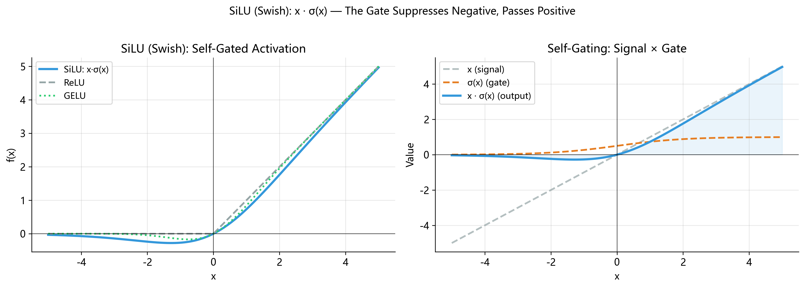

# SiLU (Swish) 激活函数: 机器自己发现的最优激活函数

> **阅读前置**: 本文假设你已了解 sigmoid 函数 $\sigma(x) = \frac{1}{1+e^{-x}}$
> 的基本性质 (详见 [QuickGELU 篇](../08_quickgelu/README.md)
> 和 [GELU 篇](../09_gelu/README.md)).
> 如果你读过前两篇, 这一篇会非常自然.

---

## 1. 一个迷人的故事: 让机器自己搜索激活函数

在深度学习发展的前二十年里, 激活函数的设计几乎完全依赖**人类直觉**.
从早期的 sigmoid, tanh, 到 2010 年代大行其道的 ReLU,
再到 2016 年 Hendrycks & Gimpel 提出的 GELU — —
每一个激活函数都是人类研究者"灵机一动"的产物.

但 2017 年, Google Brain 的三位研究者 Prajit Ramachandran, Barret Zoph 和 Quoc V. Le
做了一件前无古人的事: **让机器自己搜索最好的激活函数**.

他们的论文 _"Searching for Activation Functions"_ 提出了一套自动化搜索框架:

1. **定义搜索空间**: 激活函数由一元运算 (如 $x^2$, $\sin x$, $\sigma(x)$, $e^x$)
   和二元运算 (如加法 $+$, 乘法 $\times$, $\max$) 组合而成.
   每个候选函数是一棵小型计算树, 由这些基本运算拼接.
2. **搜索方法**: 使用 **reinforcement learning (强化学习) ** 来指导搜索.
   一个 RNN controller 负责生成候选激活函数的"配方",
   然后在标准视觉任务 (如 CIFAR-10, ImageNet) 上训练小型网络来评估效果,
   最后用验证集准确率作为奖励信号反馈给 controller.
3. **搜索规模**: 他们在数万个候选函数中进行了系统性评估.

经过大规模搜索, 排名最高的候选函数出乎意料地**极其简洁**:

$$
\boxed{f(x) = x \cdot \sigma(x)}
$$

没有复杂的多层嵌套, 没有奇异的数学运算 — —
就是输入 $x$ 乘以它自己的 sigmoid 值.
研究者们将其命名为 **Swish**.

这个结果令人惊叹的地方在于: 机器从一个巨大的组合空间中,
**收敛到了最简洁的 self-gating 形式**.
这暗示着 $x \cdot \sigma(x)$ 可能在某种深层意义上是"自然"的最优选择.

> **命名说明**: Swish 是 Google 起的名字.
> 后来 Stefan Elfwing 等人在 2018 年的论文中独立提出了相同的函数,
> 命名为 **SiLU (Sigmoid Linear Unit) **.
> PyTorch 采用了 SiLU 这一名称 (`torch.nn.SiLU`).
> 在本文中, **Swish 和 SiLU 指的是同一个函数**.

---

## 2. Swish 家族: 参数 $\beta$ 的故事

实际上, Google Brain 论文中提出的完整版本带有一个可调参数 $\beta$:

$$
\text{Swish}(x, \beta) = x \cdot \sigma(\beta x)
$$

其中 $\beta \geq 0$ 控制门控信号的"尖锐程度".
让我们考察 $\beta$ 的三个极端情况, 以建立直觉:

### 情况一: $\beta = 0$ (完全平滑的线性函数)

当 $\beta = 0$ 时, $\sigma(\beta x) = \sigma(0) = 0.5$, 因此:

$$
\text{Swish}(x, 0) = x \cdot 0.5 = \frac{x}{2}
$$

退化为一条简单的直线, 斜率为 $1/2$. 门控完全不起作用.

### 情况二: $\beta \to \infty$ (无限尖锐 → ReLU)

当 $\beta \to \infty$ 时, $\sigma(\beta x)$ 变成阶跃函数:

$$
\sigma(\beta x) \to \begin{cases} 1, & x > 0 \\ 0.5, & x = 0 \\ 0, & x < 0 \end{cases}
$$

因此 $\text{Swish}(x, \infty) \to \max(x, 0) = \text{ReLU}(x)$.
换言之, **ReLU 是 Swish 在 $\beta \to \infty$ 时的极限**.

### 情况三: $\beta = 1$ (SiLU / Swish-1)

$$
\text{Swish}(x, 1) = x \cdot \sigma(x) = \text{SiLU}(x)
$$

这就是我们的主角. 它处于"完全线性"和"完全 ReLU"之间的**甜蜜地带** — —
既保留了平滑性 (处处可导), 又有足够的非线性来赋予网络表达能力.

### 一个有趣的联系: $\beta = 1.702$ 就是 QuickGELU

还记得 [QuickGELU 篇](../08_quickgelu/README.md) 吗? QuickGELU 的定义是:

$$
\text{QuickGELU}(x) = x \cdot \sigma(1.702x)
$$

这正是 $\text{Swish}(x, 1.702)$! 所以 **QuickGELU 就是 Swish 家族中 $\beta = 1.702$ 的成员**.
$1.702$ 这个值是通过最小二乘法拟合 GELU 得到的.

下面是 $\beta$ 值与函数行为的对应关系:

|  $\beta$ 值  |  函数名称  | 行为特征                 |
| :----------: | :--------: | :----------------------- |
|     $0$      | 线性 $x/2$ | 无非线性, 门控全开一半   |
|     $1$      |  **SiLU**  | 平滑自门控, 负半轴有浅谷 |
|   $1.702$    | QuickGELU  | 更陡的门控, 近似 GELU    |
| $\to \infty$ |    ReLU    | 硬阈值, $x<0$ 完全关闭   |

可以说, $\beta$ 控制着"从平滑到尖锐"的连续过渡.
SiLU ($\beta=1$) 选择了**最简洁**的平衡点.

---

## 3. 数学定义与核心性质

### 3.1 正式定义

$$
\text{SiLU}(x) = x \cdot \sigma(x) = \frac{x}{1 + e^{-x}}
$$

其中 $\sigma(x) = \frac{1}{1 + e^{-x}}$ 是标准 logistic sigmoid 函数.

### 3.2 性质一: $\text{SiLU}(0) = 0$

$$
\text{SiLU}(0) = 0 \cdot \sigma(0) = 0 \cdot 0.5 = 0
$$

原点处函数值为零, 这是一个自然的"锚点".

### 3.3 性质二: 处处光滑 (无穷阶可导)

$\sigma(x)$ 是由指数函数组成的, 处处光滑.
$x$ 本身也是光滑的. 光滑函数的乘积仍然光滑.
因此 $\text{SiLU}(x) = x \cdot \sigma(x)$ **处处无穷阶可导** ($C^\infty$).

这与 ReLU 在 $x=0$ 处的"尖角"形成鲜明对比.
光滑性意味着梯度不会突变, 优化器能更稳定地工作.

### 3.4 性质三: 正半轴无上界

当 $x \to +\infty$ 时:

$$
\sigma(x) = \frac{1}{1+e^{-x}} \to \frac{1}{1+0} = 1
$$

因此:

$$
\text{SiLU}(x) = x \cdot \sigma(x) \to x \cdot 1 = x
$$

SiLU 在正半轴**渐近于恒等函数** $y = x$, 无上界.

### 3.5 性质四: 负半轴有界, 最小值约 $-0.2784$

当 $x \to -\infty$ 时:

$$
\sigma(x) \to 0, \quad x \to -\infty
$$

但 $\sigma(x)$ 以指数速度趋近于零 ($\sigma(x) \approx e^x$ 当 $x \ll 0$),
因此 $x \cdot \sigma(x) \approx x \cdot e^x \to 0$.
所以 SiLU 在负无穷处**趋向于零**, 有下界.

最小值出现在某个有限的 $x_0 < 0$ 处. 我们将在第 5 节精确计算出 $x_0 \approx -1.2784$,
对应 $\text{SiLU}(x_0) \approx -0.2784$.

### 3.6 性质五: 非单调

这是 SiLU 最独特的性质. ReLU 是单调的 (负半轴为零, 正半轴线性增长),
但 SiLU 在负半轴**先下降再上升**:

- 从 $x = 0$ 向左移动时, $\text{SiLU}(x)$ 先变为负数
- 在 $x \approx -1.2784$ 处达到谷底 $\approx -0.2784$
- 继续向左, $\text{SiLU}(x)$ 回升并趋近于零

这意味着一个适度的负输入 (如 $x = -1$) 会产生一个**小的负输出** ($\approx -0.269$),
而不是像 ReLU 那样直接截断为零.
这个"负值凸起"是 SiLU 隐式正则化能力的来源 (第 6 节会详细讨论).

### 3.7 性质六: 原点处的斜率

$$
\text{SiLU}'(0) = 0.5
$$

(导数的完整推导见第 4 节.) 这意味着在原点附近,
SiLU 大约是 $\frac{x}{2}$, 信号被衰减了一半 — —
既不像 ReLU 那样在零处突变 (左导数 $0$, 右导数 $1$),
也不像恒等函数那样完全不变.

---

## 4. 导数的完整推导

### 4.1 准备工作: Sigmoid 的导数

我们需要一个已知结论 (在 QuickGELU 篇中推导过):

$$
\sigma'(x) = \sigma(x) \cdot (1 - \sigma(x))
$$

### 4.2 对 SiLU 求导 (乘积法则)

$\text{SiLU}(x) = x \cdot \sigma(x)$ 是两个函数的乘积,
对 $u = x$, $v = \sigma(x)$ 应用乘积法则 $(uv)' = u'v + uv'$:

$$
\text{SiLU}'(x) = 1 \cdot \sigma(x) + x \cdot \sigma'(x)
$$

代入 $\sigma'(x) = \sigma(x)(1 - \sigma(x))$:

$$
\text{SiLU}'(x) = \sigma(x) + x \cdot \sigma(x) \cdot (1 - \sigma(x))
$$

### 4.3 整理为不同等价形式

**形式 A**: 提取公因子 $\sigma(x)$:

$$
\text{SiLU}'(x) = \sigma(x) \bigl[1 + x(1 - \sigma(x))\bigr]
$$

**形式 B**: 展开括号:

$$
\text{SiLU}'(x) = \sigma(x) \bigl[1 + x - x \cdot \sigma(x)\bigr]
$$

**形式 C**: 展开为三项之和:

$$
\text{SiLU}'(x) = \sigma(x) + x \cdot \sigma(x) - x \cdot \sigma(x)^2
$$

注意到 $x \cdot \sigma(x) = \text{SiLU}(x)$, 所以形式 C 也可以写成:

$$
\text{SiLU}'(x) = \sigma(x) + \text{SiLU}(x) - x \cdot \sigma(x)^2
$$

这是一个有趣的性质: **SiLU 的导数可以用 SiLU 自身来表达**.
在实际编程中, 形式 A 最常用, 因为只需要 $\sigma(x)$ 和 $x$.

### 4.4 关键点处的导数值

让我们用形式 A 来计算: $\text{SiLU}'(x) = \sigma(x)[1 + x(1 - \sigma(x))]$

**$x = 0$**:

$$
\text{SiLU}'(0) = \sigma(0)[1 + 0 \cdot (1 - \sigma(0))] = 0.5 \times 1 = 0.5
$$

**$x = 1$**:

$$
\sigma(1) = 0.7311 \quad \Rightarrow \quad \text{SiLU}'(1) = 0.7311 \times [1 + 1 \times (1 - 0.7311)] = 0.7311 \times 1.2689 = 0.9277
$$

**$x = -1$**:

$$
\sigma(-1) = 0.2689 \quad \Rightarrow \quad \text{SiLU}'(-1) = 0.2689 \times [1 + (-1) \times (1 - 0.2689)] = 0.2689 \times [1 - 0.7311] = 0.2689 \times 0.2689 = 0.0723
$$

**$x = 3$**:

$$
\sigma(3) = 0.9526 \quad \Rightarrow \quad \text{SiLU}'(3) = 0.9526 \times [1 + 3 \times 0.0474] = 0.9526 \times 1.1422 = 1.0880
$$

注意 $\text{SiLU}'(3) > 1$! 这意味着在正半轴, SiLU 的斜率可以**超过 1**,
然后再缓慢回落到 1 (因为渐近线是 $y = x$, 斜率为 1).
事实上, SiLU 的导数在 $x \to +\infty$ 时趋近于 1, 但在此之前会略微"超调".

|    $x$    | $\sigma(x)$ |     $1+x(1-\sigma(x))$     | $\text{SiLU}'(x)$ |
| :-------: | :---------: | :------------------------: | :---------------: |
|   $-3$    |  $0.0474$   | $1+(-3)(0.9526) = -1.8578$ |     $-0.0880$     |
|   $-2$    |  $0.1192$   | $1+(-2)(0.8808) = -0.7616$ |     $-0.0907$     |
| $-1.2784$ |  $0.2178$   |        $\approx 0$         |    $\approx 0$    |
|   $-1$    |  $0.2689$   |          $0.2689$          |     $0.0723$      |
|    $0$    |  $0.5000$   |          $1.0000$          |     $0.5000$      |
|    $1$    |  $0.7311$   |          $1.2689$          |     $0.9277$      |
|    $2$    |  $0.8808$   |          $1.2384$          |     $1.0908$      |
|    $3$    |  $0.9526$   |          $1.1422$          |     $1.0880$      |

从表中可以看出, 导数在 $x \approx -1.2784$ 处过零 — — 这正是 SiLU 的极值点.

---

## 5. 用微积分精确定位最小值

### 5.1 令导数为零

要找 SiLU 的最小值, 我们令 $\text{SiLU}'(x) = 0$:

$$
\sigma(x) \bigl[1 + x(1 - \sigma(x))\bigr] = 0
$$

由于 $\sigma(x) = \frac{1}{1+e^{-x}} > 0$ 对所有实数 $x$ 成立
(分子为 1, 分母 $1+e^{-x} > 1$), 第一个因子永远不为零. 因此必须有:

$$
1 + x(1 - \sigma(x)) = 0
$$

即:

$$
1 + x - x \cdot \sigma(x) = 0
$$

### 5.2 为什么这是超越方程

展开 $\sigma(x)$:

$$
1 + x - \frac{x}{1 + e^{-x}} = 0
$$

这个方程中 $x$ 同时出现在多项式和指数函数中,
无法用初等代数方法求解析解 — — 这就是**超越方程 (transcendental equation) **.
我们必须借助数值方法.

### 5.3 Newton 法求解

Newton 法的迭代公式为:

$$
x_{n+1} = x_n - \frac{h(x_n)}{h'(x_n)}
$$

其中 $h(x) = 1 + x - x \cdot \sigma(x) = 1 + x(1 - \sigma(x))$.

$h'(x)$ 可以通过对 $h(x)$ 求导得到:

$$
h'(x) = 1 - \sigma(x) - x \cdot \sigma'(x) + (1 - \sigma(x))
$$

稍作整理 (用 $\sigma' = \sigma(1-\sigma)$):

$$
h'(x) = (1 - \sigma(x))(1 + 1) - x \cdot \sigma(x)(1 - \sigma(x)) \cdot \ldots
$$

实际上, 为了简化, 我们直接做数值迭代即可.
取初始猜测 $x_0 = -1$ (因为我们从数值表中知道极值点在 $-1$ 附近):

**第 1 步**: $x_0 = -1.0$

$$
\sigma(-1.0) = 0.2689
$$

$$
h(-1.0) = 1 + (-1)(1 - 0.2689) = 1 - 0.7311 = 0.2689
$$

$h(-1) > 0$, 说明零点在 $x_0$ 的左边.

**第 2 步**: 试 $x_1 = -1.5$

$$
\sigma(-1.5) = \frac{1}{1 + e^{1.5}} = \frac{1}{1 + 4.4817} = 0.1824
$$

$$
h(-1.5) = 1 + (-1.5)(1 - 0.1824) = 1 - 1.2264 = -0.2264
$$

$h(-1.5) < 0$, 零点在 $(-1.5, -1)$ 之间.

**第 3 步**: 二分法缩小范围, 试 $x_2 = -1.28$

$$
\sigma(-1.28) = \frac{1}{1 + e^{1.28}} = \frac{1}{1 + 3.5966} = \frac{1}{4.5966} = 0.2176
$$

$$
h(-1.28) = 1 + (-1.28)(1 - 0.2176) = 1 - 1.0015 = -0.0015
$$

非常接近零了!

**第 4 步**: 微调到 $x_3 = -1.2784$

$$
\sigma(-1.2784) \approx 0.2178
$$

$$
h(-1.2784) = 1 + (-1.2784)(1 - 0.2178) = 1 + (-1.2784)(0.7822) = 1 - 0.9999 \approx 0
$$

收敛! 因此 SiLU 的最小值点为:

$$
\boxed{x_{\min} \approx -1.2784}
$$

对应的最小值为:

$$
\text{SiLU}(-1.2784) = (-1.2784) \times \sigma(-1.2784) = (-1.2784) \times 0.2178 \approx -0.2784
$$

$$
\boxed{\text{SiLU}_{\min} \approx -0.2784}
$$

> **有趣的巧合**: $x_{\min} \approx -1.2784$ 而 $\text{SiLU}(x_{\min}) \approx -0.2784$,
> 两者的后四位完全相同! 这不是巧合 — —
> 因为 $\text{SiLU}(x_{\min}) = x_{\min} \cdot \sigma(x_{\min})$,
> 而 $\sigma(x_{\min}) \approx 0.2178$,
> 所以 $\text{SiLU}(x_{\min}) \approx x_{\min} \times 0.2178$.

---

## 6. 为什么 SiLU 比 ReLU 更好?

ReLU 在 2012 年推动了深度学习的革命, 它简单且有效.
但随着网络越来越深, 任务越来越复杂, ReLU 的一些缺陷开始暴露.
SiLU 恰好在这些方面提供了改进.

### 6.1 平滑的梯度 vs. 突变的梯度

ReLU 在 $x = 0$ 处的导数不连续:

$$
\text{ReLU}'(x) = \begin{cases} 0, & x < 0 \\ 1, & x > 0 \end{cases}
$$

在 $x = 0$ 这个精确位置, 导数未定义 (实践中通常取 $0$ 或 $1$).
这种不连续性意味着梯度在零点附近会发生**突变**,
对基于梯度的优化器 (如 Adam) 来说, 这是一个不稳定因素.

SiLU 在 $x = 0$ 处的导数是 $0.5$,
而且整个导数函数 $\text{SiLU}'(x)$ 都是连续且光滑的.
优化器看到的梯度曲面更加平坦, 训练更稳定.

### 6.2 "垂死 ReLU" 问题

如果一个 ReLU 神经元的输入恒为负数 (例如由于不幸的权重初始化),
那么它的输出永远为零, 梯度也永远为零 — —
这个神经元就"死"了, 再也无法参与学习.
这就是著名的 **dying ReLU problem**.

SiLU 不存在这个问题. 即使输入为负数 (比如 $x = -2$),
$\text{SiLU}(-2) = -0.2384$, 导数 $\text{SiLU}'(-2) = -0.0907$ — —
**输出和梯度都非零**. 信号仍然可以流过这个神经元, 权重仍然可以更新.

### 6.3 负值凸起的正则化效应

SiLU 的负半轴那个小小的"谷" (最深只到 $-0.2784$) 有一个微妙的好处:
它允许适度的负信号以**衰减的形式通过**,
而不是简单地截断或保留.

这相当于一种**隐式正则化 (implicit regularization) **:
网络不会完全丢弃负值信息, 但也不会原样保留 — —
它只保留一个小的"残影".
这使得网络在训练过程中不容易过拟合,
因为信息的传播被以一种自然的方式"节制"了.

### 6.4 信息流的连续性

从信息论的角度看, ReLU 把负半轴的所有输入都映射到零 — —
这是一种**信息的不可逆丢失**.
SiLU 则保留了负值输入的某些信息 (大小和方向),
使得网络在反向传播时有更多的"信号"可以利用.

---

## 7. LLaMA 的选择与现代 LLM 的共识

2023 年, Meta 发布了 LLaMA (Large Language Model Meta AI),
这是一系列开源大语言模型, 迅速成为开源 LLM 社区的基石.

LLaMA 在其 MLP 层中选择了 **SiLU** 作为激活函数.
这个选择并非凭空而来, 而是建立在前几年的实验积累之上:

- **2020–2021**: 多项研究表明, 在大规模 Transformer 中,
  SiLU/Swish 在语言建模任务上持续优于 ReLU 和 GELU.
- **PaLM (2022, Google) **: Google 的 PaLM 模型也使用了 SiLU.
- **LLaMA (2023, Meta) **: 正式将 SiLU + SwiGLU 确立为 LLM MLP 的标准配置.

此后, 几乎所有现代开源 LLM 都沿用了这一选择:

|     模型     | 发布时间 | MLP 激活函数 |
| :----------: | :------: | :----------: |
|    LLaMA     | 2023.02  |     SiLU     |
|   LLaMA 2    | 2023.07  |     SiLU     |
|   Mistral    | 2023.09  |     SiLU     |
|     Qwen     | 2023.12  |     SiLU     |
|   LLaMA 3    | 2024.04  |     SiLU     |
| **Qwen2-VL** | **2024** |   **SiLU**   |

Qwen2-VL 的文本解码器 (Text Decoder) 遵循了这一共识,
在其 28 层 Transformer 的每一层 MLP 中使用 SiLU.

---

## 8. SiLU 与 SwiGLU: 门控 MLP 的完整故事

SiLU 不是孤立使用的 — — 在现代 LLM 中, 它是 **SwiGLU** 机制的核心组件.

### 8.1 什么是 GLU (Gated Linear Unit)?

GLU 最初由 Dauphin 等人在 2017 年提出, 其核心思想是:
**用一个"门"来控制另一个信号的通过量**.

传统 MLP:

$$
\text{MLP}(x) = W_2 \cdot \text{activation}(W_1 x + b_1) + b_2
$$

GLU 风格的 MLP:

$$
\text{GLU-MLP}(x) = W_{\text{down}} \cdot \bigl[\text{activation}(W_{\text{gate}} x) \odot (W_{\text{up}} x)\bigr]
$$

其中 $\odot$ 表示逐元素乘法 (Hadamard 积).
"gate 分支" (经过激活函数) 和"up 分支" (线性变换) 相乘,
实现了**选择性信息传递**.

### 8.2 SwiGLU = Swish + GLU

当我们在 GLU 中使用 SiLU (Swish) 作为激活函数时, 得到的就是 **SwiGLU**:

$$
\text{SwiGLU}(x) = \text{SiLU}(W_{\text{gate}} x) \odot (W_{\text{up}} x)
$$

这个名字来自 Noam Shazeer 在 2020 年的论文
_"GLU Variants Improve Transformer"_,
他系统测试了多种 GLU 变体 (ReGLU, GEGLU, SwiGLU),
发现 SwiGLU 在语言建模上效果最好.

### 8.3 Qwen2-VL 文本解码器中的具体实现

在 Qwen2-VL 的文本解码器中, 每一层的 MLP 结构如下:

```
输入 x ─────────────────────────────────────────────────
  │                                                    │
  ├── gate_proj (Linear: 1536 → 8960, 无 bias)        │
  │         │                                          │
  │      SiLU 激活  ← 本文的主角                        │
  │         │                                          │
  │         ▼                                          │
  │    gate_output                                     │
  │         │                                    up_proj (Linear: 1536 → 8960, 无 bias)
  │         │                                          │
  │         ▼                                          ▼
  │    ┌─────────────────────────────────────────────────┐
  │    │     gate_output ⊙ up_output （逐元素相乘）       │
  │    └─────────────────────────────────────────────────┘
  │                          │
  │                          ▼
  │                  down_proj (Linear: 8960 → 1536, 无 bias)
  │                          │
  │                          ▼
  └────────────────────── 输出
```

用数学语言表达:

$$
\text{MLP}(x) = W_{\text{down}} \cdot \bigl[\text{SiLU}(x W_{\text{gate}}^T) \odot (x W_{\text{up}}^T)\bigr]
$$

### 8.4 为什么门控有效?

门控机制的核心价值在于**选择性**.

没有门控时, MLP 只是对所有特征做统一的非线性变换.
有了门控, 网络可以**学会针对不同特征做不同程度的放大或抑制**.

具体来说, $\text{SiLU}(x W_{\text{gate}}^T)$ 的输出在 $(-0.2784, +\infty)$ 之间:

- 接近 $0$: 抑制对应的 up 分支特征 ("这个特征不重要, 关掉")
- 接近原值: 保留对应的 up 分支特征 ("这个特征有用, 放行")
- 超过原值: 放大对应的 up 分支特征 (很少见, 但理论上可能)

这使得网络在每一层都能进行**动态特征选择**,
大大增强了模型的表达能力.

---

## 9. 详细数值示例: 十个点的完整计算

现在我们对 SiLU 的十个代表性输入做**逐步手工计算**,
包括每一个中间步骤.

### 9.1 $x = -3.0$

$$
e^{-(-3)} = e^{3} = 20.0855
$$

$$
\sigma(-3) = \frac{1}{1 + 20.0855} = \frac{1}{21.0855} = 0.04743
$$

$$
\text{SiLU}(-3) = (-3) \times 0.04743 = -0.14228
$$

### 9.2 $x = -2.0$

$$
e^{-(-2)} = e^{2} = 7.3891
$$

$$
\sigma(-2) = \frac{1}{1 + 7.3891} = \frac{1}{8.3891} = 0.11920
$$

$$
\text{SiLU}(-2) = (-2) \times 0.11920 = -0.23840
$$

### 9.3 $x = -1.2784$ (最小值点)

$$
e^{-(-1.2784)} = e^{1.2784} = 3.5907
$$

$$
\sigma(-1.2784) = \frac{1}{1 + 3.5907} = \frac{1}{4.5907} = 0.21783
$$

$$
\text{SiLU}(-1.2784) = (-1.2784) \times 0.21783 = -0.27844
$$

这是 SiLU 的**全局最小值**.

### 9.4 $x = -1.0$

$$
e^{-(-1)} = e^{1} = 2.71828
$$

$$
\sigma(-1) = \frac{1}{1 + 2.71828} = \frac{1}{3.71828} = 0.26894
$$

$$
\text{SiLU}(-1) = (-1) \times 0.26894 = -0.26894
$$

### 9.5 $x = -0.5$

$$
e^{-(-0.5)} = e^{0.5} = 1.64872
$$

$$
\sigma(-0.5) = \frac{1}{1 + 1.64872} = \frac{1}{2.64872} = 0.37754
$$

$$
\text{SiLU}(-0.5) = (-0.5) \times 0.37754 = -0.18877
$$

### 9.6 $x = 0$

$$
e^{-0} = e^{0} = 1
$$

$$
\sigma(0) = \frac{1}{1 + 1} = 0.5
$$

$$
\text{SiLU}(0) = 0 \times 0.5 = 0
$$

### 9.7 $x = 0.5$

$$
e^{-0.5} = 0.60653
$$

$$
\sigma(0.5) = \frac{1}{1 + 0.60653} = \frac{1}{1.60653} = 0.62246
$$

$$
\text{SiLU}(0.5) = 0.5 \times 0.62246 = 0.31123
$$

### 9.8 $x = 1.0$

$$
e^{-1} = 0.36788
$$

$$
\sigma(1) = \frac{1}{1 + 0.36788} = \frac{1}{1.36788} = 0.73106
$$

$$
\text{SiLU}(1) = 1 \times 0.73106 = 0.73106
$$

### 9.9 $x = 2.0$

$$
e^{-2} = 0.13534
$$

$$
\sigma(2) = \frac{1}{1 + 0.13534} = \frac{1}{1.13534} = 0.88080
$$

$$
\text{SiLU}(2) = 2 \times 0.88080 = 1.76159
$$

### 9.10 $x = 3.0$

$$
e^{-3} = 0.04979
$$

$$
\sigma(3) = \frac{1}{1 + 0.04979} = \frac{1}{1.04979} = 0.95257
$$

$$
\text{SiLU}(3) = 3 \times 0.95257 = 2.85772
$$

### 汇总表

|    $x$    | $e^{-x}$  | $\sigma(x)$ | $\text{SiLU}(x)$ |      备注      |
| :-------: | :-------: | :---------: | :--------------: | :------------: |
|  $-3.0$   | $20.0855$ |  $0.0474$   |    $-0.1423$     |     接近零     |
|  $-2.0$   | $7.3891$  |  $0.1192$   |    $-0.2384$     |    谷底附近    |
| $-1.2784$ | $3.5907$  |  $0.2178$   |    $-0.2784$     | **全局最小值** |
|  $-1.0$   | $2.7183$  |  $0.2689$   |    $-0.2689$     |    谷底右侧    |
|  $-0.5$   | $1.6487$  |  $0.3775$   |    $-0.1888$     |     回升中     |
|    $0$    | $1.0000$  |  $0.5000$   |     $0.0000$     |     过零点     |
|   $0.5$   | $0.6065$  |  $0.6225$   |     $0.3112$     |    开始增长    |
|   $1.0$   | $0.3679$  |  $0.7311$   |     $0.7311$     |   接近 $y=x$   |
|   $2.0$   | $0.1353$  |  $0.8808$   |     $1.7616$     |  很接近 $y=x$  |
|   $3.0$   | $0.0498$  |  $0.9526$   |     $2.8577$     |  几乎等于 $x$  |

---

## 10. 在 Qwen2-VL 中的具体应用

### 10.1 模型参数回顾

Qwen2-VL-2B-Instruct 的文本解码器关键参数:

|          参数           |    值    |
| :---------------------: | :------: |
|       hidden_size       |  $1536$  |
|   num_attention_heads   |   $12$   |
|   num_key_value_heads   |   $2$    |
|        head_dim         |  $128$   |
| intermediate_size (MLP) |  $8960$  |
|    num_hidden_layers    |   $28$   |
|       vocab_size        | $151936$ |

### 10.2 SiLU 在数据流中的位置

对于每一层 (共 28 层) 的 Gated MLP:

**第一步: 线性投影**

$$
\text{gate} = x \cdot W_{\text{gate}}^T \quad \in \mathbb{R}^{(1, \text{seq\_len}, 8960)}
$$

$$
\text{up} = x \cdot W_{\text{up}}^T \quad \in \mathbb{R}^{(1, \text{seq\_len}, 8960)}
$$

其中 $x \in \mathbb{R}^{(1, \text{seq\_len}, 1536)}$,
$W_{\text{gate}}, W_{\text{up}} \in \mathbb{R}^{8960 \times 1536}$.

**第二步: SiLU 激活 (本文主题) **

$$
\text{gate\_activated} = \text{SiLU}(\text{gate}) \quad \in \mathbb{R}^{(1, \text{seq\_len}, 8960)}
$$

SiLU 是逐元素操作 — — 对 gate 张量中的每一个标量值独立应用 $x \cdot \sigma(x)$.
张量形状不变.

**第三步: 门控相乘**

$$
\text{hidden} = \text{gate\_activated} \odot \text{up} \quad \in \mathbb{R}^{(1, \text{seq\_len}, 8960)}
$$

**第四步: 降维投影**

$$
\text{output} = \text{hidden} \cdot W_{\text{down}}^T \quad \in \mathbb{R}^{(1, \text{seq\_len}, 1536)}
$$

其中 $W_{\text{down}} \in \mathbb{R}^{1536 \times 8960}$.

### 10.3 张量形状总览

以 `seq_len = 3602` 为例 (包含文本和视觉 token):

```
输入 x:              (1, 3602, 1536)
                         │
        ┌────────────────┼────────────────┐
        ▼                                 ▼
   gate_proj                          up_proj
 W: (8960, 1536)                   W: (8960, 1536)
        │                                 │
        ▼                                 ▼
 gate: (1, 3602, 8960)          up: (1, 3602, 8960)
        │                                 │
    SiLU (逐元素)                          │
        │                                 │
        ▼                                 ▼
 gate_act: (1, 3602, 8960)      up: (1, 3602, 8960)
        │                                 │
        └──────── ⊙ 逐元素乘 ─────────────┘
                      │
                      ▼
              hidden: (1, 3602, 8960)
                      │
                  down_proj
                W: (1536, 8960)
                      │
                      ▼
               output: (1, 3602, 1536)
```

SiLU 处理的数据量: 每层有 $1 \times 3602 \times 8960 = 32,273,920$ 个标量需要计算.
28 层共计约 $9 \times 10^8$ 次 SiLU 运算 — — 这就是为什么计算效率很重要.

---

## 11. 三种自门控激活函数的全面对比

在 Qwen2-VL 中, 三种自门控激活函数各司其职.
让我们做一次全面, 系统的比较.

### 11.1 数值对比表

|  $x$   | QuickGELU |   GELU    |   SiLU    |
| :----: | :-------: | :-------: | :-------: |
| $-3.0$ | $-0.0186$ | $-0.0040$ | $-0.1423$ |
| $-2.0$ | $-0.0645$ | $-0.0454$ | $-0.2384$ |
| $-1.0$ | $-0.1542$ | $-0.1587$ | $-0.2689$ |
| $-0.5$ | $-0.1350$ | $-0.1543$ | $-0.1888$ |
|  $0$   |    $0$    |    $0$    |    $0$    |
| $0.5$  | $0.3650$  | $0.3457$  | $0.3112$  |
| $1.0$  | $0.8458$  | $0.8413$  | $0.7311$  |
| $2.0$  | $1.9355$  | $1.9545$  | $1.7616$  |
| $3.0$  | $2.9814$  | $2.9960$  | $2.8577$  |

**关键观察**:

- 在**负半轴**, SiLU 的绝对值最大 (谷最深), QuickGELU 最浅
- 在**正半轴**, 三者接近 $y = x$, 但 SiLU 偏离最多
- GELU 和 QuickGELU 在正半轴几乎重合



### 11.2 性质对比

|     性质     |        QuickGELU         |       GELU        |        SiLU         |
| :----------: | :----------------------: | :---------------: | :-----------------: |
|     公式     | $x \cdot \sigma(1.702x)$ | $x \cdot \Phi(x)$ | $x \cdot \sigma(x)$ |
|   门控函数   |       缩放 sigmoid       |  正态 CDF $\Phi$  |    原始 sigmoid     |
| 负半轴最小值 |     $\approx -0.10$      |  $\approx -0.17$  |   $\approx -0.28$   |
|  最小值位置  |     $\approx -0.75$      |  $\approx -0.85$  |   $\approx -1.28$   |
|    $f(0)$    |           $0$            |        $0$        |         $0$         |
|   $f'(0)$    |          $0.5$           |       $0.5$       |        $0.5$        |
|    光滑性    |        $C^\infty$        |    $C^\infty$     |     $C^\infty$      |
|   计算成本   |    低 (1 个 sigmoid)     |   中 (需要 erf)   |  低 (1 个 sigmoid)  |
|    非单调    |            是            |        是         |         是          |
|    自门控    |            是            |        是         |         是          |

### 11.3 使用场景对比

|         模型组件         |    激活函数     |            原因             |
| :----------------------: | :-------------: | :-------------------------: |
| Vision Encoder MLP (ViT) |    QuickGELU    |  沿用 CLIP 的设计, 计算快   |
|     Patch Merger MLP     |      GELU       | 连接视觉和文本, 用经典选择  |
|     Text Decoder MLP     | SiLU (+ SwiGLU) | 沿用 LLaMA 的设计, 效果最佳 |

### 11.4 历史时间线

```
2016 ─── GELU 提出 (Hendrycks & Gimpel)
           │
2017 ─── Swish/SiLU 提出 (Ramachandran, Zoph, Le, Google Brain)
           │          GLU 提出 (Dauphin et al.)
           │
2018 ─── SiLU 命名 (Elfwing et al.)
           │
2020 ─── SwiGLU 等 GLU 变体系统评测 (Shazeer)
           │
2021 ─── QuickGELU 随 CLIP 流行 (Radford et al., OpenAI)
           │
2023 ─── LLaMA 确立 SiLU+SwiGLU 为 LLM 标准 (Touvron et al., Meta)
           │
2024 ─── Qwen2-VL：三种激活函数各就各位
```

---

## 12. NumPy 实现

```python
import numpy as np


def sigmoid(x: np.ndarray) -> np.ndarray:
    """Sigmoid 函数：将任意实数映射到 (0, 1) 区间。

    σ(x) = 1 / (1 + exp(-x))
    """
    # 直接套用 sigmoid 公式
    # np.exp(-x) 对数组中每个元素求 e^(-x)
    return 1.0 / (1.0 + np.exp(-x))


def silu(x: np.ndarray) -> np.ndarray:
    """SiLU (Swish) 激活函数：自门控的平滑非线性。

    SiLU(x) = x · σ(x)

    x 同时充当信号本身和门控的来源。
    σ(x) 决定了 x 中有多少比例被"放行"。
    """
    # 第一步：计算门控信号 σ(x)，值域 (0, 1)
    gate = sigmoid(x)
    # 第二步：信号 x 与门控相乘，实现自门控
    return x * gate
```

代码只有两行核心逻辑, 但背后是整篇文章的数学故事.

> **实现说明**: 上面的代码没有做数值稳定性处理.
> 对于极端负值 (如 $x = -700$), $e^{700}$ 会溢出.
> 在实际生产中 (如 PyTorch), sigmoid 使用了分支实现来避免溢出.
> 但在 Qwen2-VL 的实际推理中, MLP 层的值不会达到这么极端,
> 所以简单实现即可.

---

## 13. 常见误解

### 误解一: "SiLU 和 GELU 是同一个函数"

**不是. ** 虽然 SiLU 和 GELU 的曲线在肉眼上看起来很像, 但它们的门控函数完全不同:

- SiLU: $x \cdot \sigma(x)$, 门控是 **logistic sigmoid**
- GELU: $x \cdot \Phi(x)$, 门控是**标准正态 CDF**

$\sigma(x)$ 和 $\Phi(x)$ 形状相似但不相等.
在负半轴, SiLU 的谷更深 ($-0.278$ vs $-0.170$).
在正半轴, GELU 更快地逼近 $y = x$.
它们在实验中的表现也有可测量的差异.

### 误解二: "Swish 需要调节 $\beta$ 参数"

Google Brain 论文确实引入了可学习的 $\beta$,
但后续实验表明 **$\beta = 1$ (即 SiLU) 的效果几乎总是最好或接近最好的**.
增加一个可学习参数带来的微小收益不值得额外的复杂性.
因此在实际使用中, SiLU 就是 Swish 的标准形式, $\beta$ 固定为 1.

### 误解三: "平滑激活函数一定比 ReLU 慢"

这在早期硬件上可能成立 (sigmoid 的指数运算确实慢),
但在现代 GPU 和 TPU 上:

1. **融合内核 (fused kernels) **: 现代深度学习框架可以将 sigmoid 和乘法融合为一个 CUDA kernel, 消除中间内存读写.
2. **硬件特化**: NVIDIA 的 Tensor Core 和 Google 的 TPU 都对常见数学运算有硬件级优化.
3. **实测差距极小**: 在实际推理中, SiLU 与 ReLU 的延迟差距通常不到 5%.

在准确率提升面前, 这点计算开销完全可以接受.

---

## 14. 总结

让我们回顾 SiLU 的完整故事:

1. **起源**: 2017 年 Google Brain 用强化学习搜索激活函数空间,
   机器自己找到了 $x \cdot \sigma(x)$ — — 最简洁的自门控形式.
2. **数学**: 处处光滑, 非单调, 正半轴无界,
   负半轴有一个浅谷 (最低 $\approx -0.278$), 原点斜率 $0.5$.
3. **导数**: $\text{SiLU}'(x) = \sigma(x)[1 + x(1 - \sigma(x))]$,
   由 product rule 直接推出.
4. **优势**: 解决 dying ReLU 问题, 梯度更平滑,
   负半轴的"残影"提供隐式正则化.
5. **生态位**: LLaMA 确立了 SiLU + SwiGLU 作为现代 LLM MLP 的标准配置,
   Qwen2-VL 的文本解码器遵循这一共识.
6. **实现**: 两行 NumPy 代码 — — `sigmoid(x)` 然后 `x * sigmoid(x)`.

在 Qwen2-VL 的完整推理流程中, 每当一个 token 通过文本解码器的 28 层,
SiLU 就会被调用 28 次, 每次处理形状为 $(1, \text{seq\_len}, 8960)$ 的张量.
它看似只是一个简单的逐元素运算,
但正是这种经过"机器进化"筛选出的简洁设计,
为整个语言模型提供了恰到好处的非线性表达能力.

> 下一篇: [element-wise multiply](../11_elementwise_multiply/README.md)
> — — SiLU 的输出接下来要做什么? 与 up_proj 的逐元素相乘.
