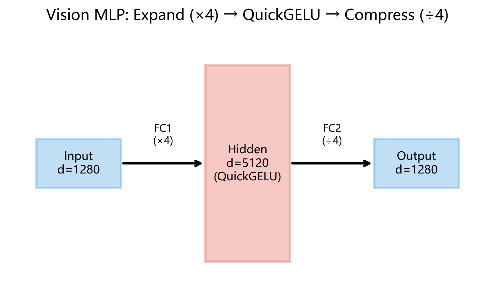

# Vision MLP (视觉编码器前馈网络)

## 前置知识

在阅读本节之前, 请确保理解:

- [线性变换](../01_linear/README.md): 矩阵乘法 $y = xW^T + b$
- [QuickGELU 激活函数](../08_quickgelu/README.md): $\text{QuickGELU}(x) = x \cdot \sigma(1.702x)$

---

## 引子: 神经网络在"想"什么?

当你把一张猫的照片输入 Qwen2-VL 时, 视觉编码器会把图像切成 14308 个小方块 (patch), 每个 patch 变成一个 1280 维的向量. 此刻, Attention 机制已经让每个 patch "看到"了所有其他 patch 的信息 — — 它知道自己左边是耳朵, 右边是胡须.

但"知道信息"和"理解信息"是两码事. Attention 做的是**信息汇聚**: 把散落各处的线索收集起来. 接下来需要一个独立作用于每个 token 的模块, 把汇聚来的原材料**加工**成更高层次的特征 — — 边缘组合成纹理, 纹理组合成器官, 器官组合成"猫".

这个"加工车间"就是 **MLP (Multi-Layer Perceptron, 多层感知机) **, 也叫前馈网络 (Feed-Forward Network, FFN).

它的结构极其简单: 两层线性变换, 中间夹一个非线性激活函数. 但正是这种简洁结构, 承载了 Transformer 中超过三分之二的参数. 让我们从头讲起 — — 为什么两层就够了? 为什么中间必须要有非线性?

---

## 历史回眸: 从感知机到多层感知机

### 感知机的诞生 (1958)

1958 年, 美国心理学家 Frank Rosenblatt 提出了 **Perceptron (感知机) ** — — 史上第一个可以"学习"的人工神经元. 它的数学形式很简单:

$$
y = \text{sign}(w_1 x_1 + w_2 x_2 + \cdots + w_n x_n + b)
$$

感知机能学会 AND 和 OR 这样的逻辑运算, 当时引起了巨大轰动. "纽约时报" 甚至报道说海军发明了一台"能思考的机器".

### XOR 问题与第一次寒冬 (1969)

好景不长. 1969 年, Marvin Minsky 和 Seymour Papert 在著作 _Perceptrons_ 中严格证明了: **单层感知机无法学习 XOR 函数**.

XOR 的真值表:

| $x_1$ | $x_2$ | $x_1 \oplus x_2$ |
| ----- | ----- | ---------------- |
| 0     | 0     | 0                |
| 0     | 1     | 1                |
| 1     | 0     | 1                |
| 1     | 1     | 0                |

在二维平面上, XOR 的两类点 (0 和 1) 无法被一条直线分开. 单层感知机只能画一条直线作为决策边界, 因此注定失败. 这一结果直接导致了神经网络研究的第一次"寒冬" — — 资金枯竭, 研究者纷纷转向其他领域.

### 反向传播与复兴 (1986)

沉寂了近二十年后, David Rumelhart, Geoffrey Hinton 和 Ronald Williams 在 1986 年的论文中系统地提出了 **Backpropagation (反向传播) ** 算法, 证明了多层网络可以通过梯度下降有效训练.

关键洞察: 如果我们把多个感知机**堆叠**起来, 中间加入非线性激活函数, 网络就能学到弯曲的决策边界 — — XOR 不再是问题. 这就是 **Multi-Layer Perceptron (多层感知机) ** 的诞生.

从 1958 到 1986, 再到 2017 年 Transformer 中的 FFN, MLP 的核心思想始终未变: **线性变换 + 非线性激活的交替组合**.

---

## 为什么非线性是必需的? — — 数学证明

这是理解 MLP 的关键问题: 如果去掉中间的激活函数会怎样?

### 定理: 两个线性变换的组合仍是线性变换

设第一层线性变换为:

$$
f(x) = xW_1^T + b_1
$$

第二层为:

$$
g(h) = hW_2^T + b_2
$$

将两层组合 (不加激活函数):

$$
g(f(x)) = (xW_1^T + b_1)W_2^T + b_2
$$

展开:

$$
= xW_1^T W_2^T + b_1 W_2^T + b_2
$$

$$
= x(W_2 W_1)^T + (b_1 W_2^T + b_2)
$$

令 $W' = W_2 W_1$, $b' = b_1 W_2^T + b_2$, 则:

$$
g(f(x)) = xW'^T + b'
$$

**这还是一个线性变换! ** 无论你堆叠多少层线性变换, 结果都可以用一个等价的单层线性变换来表示. 换句话说, 没有非线性激活函数, 深度就是一个幻觉 — — 100 层线性网络和 1 层线性网络的表达能力完全相同.

### 推论

这就是为什么 MLP 的两层线性变换之间**必须**插入非线性激活函数 (如 QuickGELU). 正是非线性打破了线性的"可折叠性", 赋予了网络逼近任意复杂函数的能力.

---

## 万能逼近定理

既然两层就够用, 那"够用"到什么程度? 答案令人惊讶地强大.

### Universal Approximation Theorem

**定理** (Cybenko, 1989; Hornik, 1991): 对于任意连续函数 $f: [0,1]^n \to \mathbb{R}$ 和任意 $\varepsilon > 0$, 存在一个带有足够多隐藏单元的两层 MLP $g(x)$, 使得:

$$
\sup_{x \in [0,1]^n} |f(x) - g(x)| < \varepsilon
$$

换言之, 一个只有一层隐藏层的 MLP 就能**任意精确地**逼近紧集上的任何连续函数.

### 直觉理解

以 ReLU 激活函数为例. 一个 ReLU 神经元的输出是一条折线 — — 在某个阈值以下输出 0, 以上输出线性增长. 多个 ReLU 神经元的加权组合就是多条折线的叠加, 形成**分段线性函数**.

只要折线段足够多 (即隐藏单元足够多), 分段线性函数就能逼近任何光滑曲线 — — 正如用足够多的直尺小段可以拼出任何曲线形状.

对 sigmoid 类激活 (包括 QuickGELU), 直觉类似: 每个神经元输出一个"软阶梯", 多个软阶梯的组合可以拟合任意连续函数.

> **注意**: 定理说的是"存在性" — — 保证了两层 MLP 理论上能力足够. 但它没有告诉我们需要多少隐藏单元, 也没有保证梯度下降能找到最优解. 实际工程中, 我们用更深的网络配合更少的参数来达到更好的效果.

---

## "展开 — 激活 — 压缩"模式

### 数学定义

Vision MLP 的完整公式:

$$
\text{MLP}(x) = \text{QuickGELU}(xW_1^T + b_1) \cdot W_2^T + b_2
$$

其中:

- $x \in \mathbb{R}^{n \times d}$: 输入, $n$ 个 token, 每个 $d$ 维
- $W_1 \in \mathbb{R}^{d_{\text{ff}} \times d}$: 第一层权重 (升维), 将 $d$ 维映射到 $d_{\text{ff}}$ 维
- $b_1 \in \mathbb{R}^{d_{\text{ff}}}$: 第一层偏置
- $W_2 \in \mathbb{R}^{d \times d_{\text{ff}}}$: 第二层权重 (降维), 将 $d_{\text{ff}}$ 维压回 $d$ 维
- $b_2 \in \mathbb{R}^{d}$: 第二层偏置

### 数据流

```
输入 x: (n, 1280)
    │
    ▼  ① 展开（Expand）
FC1: x @ W1.T + b1         →  (n, 5120)    升维 1280 → 5120
    │
    ▼  ② 激活（Activate）
QuickGELU: h * σ(1.702h)   →  (n, 5120)    非线性变换
    │
    ▼  ③ 压缩（Compress）
FC2: a @ W2.T + b2          →  (n, 1280)    降维 5120 → 1280
    │
    ▼
输出 y: (n, 1280)
```



### 为什么要先升维再降维?

想象你面前有一个压缩过的 ZIP 文件 (1280 维向量). 你无法直接在压缩文件上做编辑 — — 你需要:

1. **解压缩** (展开到 5120 维): 把信息铺开, 每个维度对应一个潜在的"特征探测器"
2. **编辑处理** (QuickGELU 激活): 在高维空间中, 激活函数可以选择性地放大或抑制某些特征
3. **重新压缩** (压回 1280 维): 保留有用的加工结果, 丢弃冗余信息

在低维空间里, 不同特征挤在一起, 很难被单独处理. 升维就像把纠缠的线团拉开 — — 在高维空间中, 特征更容易被**线性可分**地处理.

---

## 扩展比: 为什么是 4 倍?

在 Qwen2-VL 视觉编码器中:

$$
\text{expansion ratio} = \frac{d_{\text{ff}}}{d} = \frac{5120}{1280} = 4
$$

这个 4 倍的比例来自 2017 年 Vaswani 等人的开创性论文 _"Attention Is All You Need"_. 原始 Transformer 使用 $d = 512$, $d_{\text{ff}} = 2048$, 比值恰好是 4.

**为什么是 4 而不是 3 或 5? ** 坦率地说, 这主要是一个**经验性选择**, 而非严格的理论推导. 原论文并未给出数学证明. 后续研究表明:

- **太小** (如 2×): 隐藏层容量不足, 表达能力受限
- **太大** (如 8×): 参数量和计算量暴增, 收益递减
- **4×** 是一个工程上的甜蜜点, 在表达能力和计算效率之间取得了良好平衡

Qwen2-VL 的视觉编码器忠实地沿用了这一设计: $1280 \times 4 = 5120$.

---

## 详细数值推演

为了看清 MLP 内部的每一步运算, 我们用一个最小示例手算: $d = 3$, $d_{\text{ff}} = 4$, 单个 token.

### 定义输入和权重

$$
x = \begin{bmatrix} 1.0 & -0.5 & 2.0 \end{bmatrix}, \quad
W_1 = \begin{bmatrix} 0.3 & -0.1 & 0.2 \\ -0.2 & 0.5 & 0.1 \\ 0.4 & 0.1 & -0.3 \\ 0.1 & -0.4 & 0.6 \end{bmatrix}, \quad
b_1 = \begin{bmatrix} 0.1 \\ -0.1 \\ 0.05 \\ 0.2 \end{bmatrix}
$$

$$
W_2 = \begin{bmatrix} 0.2 & -0.3 & 0.1 & 0.4 \\ -0.1 & 0.2 & 0.3 & -0.2 \\ 0.5 & 0.1 & -0.2 & 0.3 \end{bmatrix}, \quad
b_2 = \begin{bmatrix} 0.05 \\ -0.02 \\ 0.03 \end{bmatrix}
$$

### 步骤 1: FC1 线性变换

计算 $h = xW_1^T + b_1$. 输出的第 $j$ 个分量 = $x$ 与 $W_1$ 第 $j$ 行的内积 + 偏置.

**$j=0$**: $1.0 \times 0.3 + (-0.5) \times (-0.1) + 2.0 \times 0.2 + 0.1 = 0.3 + 0.05 + 0.4 + 0.1 = 0.85$

**$j=1$**: $1.0 \times (-0.2) + (-0.5) \times 0.5 + 2.0 \times 0.1 + (-0.1) = -0.2 - 0.25 + 0.2 - 0.1 = -0.35$

**$j=2$**: $1.0 \times 0.4 + (-0.5) \times 0.1 + 2.0 \times (-0.3) + 0.05 = 0.4 - 0.05 - 0.6 + 0.05 = -0.20$

**$j=3$**: $1.0 \times 0.1 + (-0.5) \times (-0.4) + 2.0 \times 0.6 + 0.2 = 0.1 + 0.2 + 1.2 + 0.2 = 1.70$

$$
h = \begin{bmatrix} 0.85 & -0.35 & -0.20 & 1.70 \end{bmatrix}
$$

### 步骤 2: QuickGELU 激活

对 $h$ 的每个元素计算 $\text{QuickGELU}(z) = z \cdot \sigma(1.702z)$:

| $z$     | $1.702z$  | $e^{-1.702z}$ | $\sigma(1.702z)$ | $\text{QuickGELU}(z)$ |
| ------- | --------- | ------------- | ---------------- | --------------------- |
| $0.85$  | $1.4467$  | $0.2355$      | $0.8094$         | $0.6880$              |
| $-0.35$ | $-0.5957$ | $1.8141$      | $0.3554$         | $-0.1244$             |
| $-0.20$ | $-0.3404$ | $1.4057$      | $0.4155$         | $-0.0831$             |
| $1.70$  | $2.8934$  | $0.0554$      | $0.9474$         | $1.6106$              |

以 $z = 0.85$ 为例展示详细过程:

$$
1.702 \times 0.85 = 1.4467 \quad\implies\quad e^{-1.4467} = 0.2355
$$

$$
\sigma(1.4467) = \frac{1}{1 + 0.2355} = \frac{1}{1.2355} = 0.8094
$$

$$
\text{QuickGELU}(0.85) = 0.85 \times 0.8094 = 0.6880
$$

激活后: $a = [0.6880,\ -0.1244,\ -0.0831,\ 1.6106]$

> 观察: 正值被温和地缩小 ($0.85 \to 0.688$), 大正值几乎不变 ($1.70 \to 1.611$), 而负值被大幅压制趋近于零 ($-0.35 \to -0.124$).

### 步骤 3: FC2 线性变换

计算 $y = aW_2^T + b_2$:

**$y_0$**: $0.688 \times 0.2 + (-0.124) \times (-0.3) + (-0.083) \times 0.1 + 1.611 \times 0.4 + 0.05$

$$
= 0.1376 + 0.0373 - 0.0083 + 0.6444 + 0.05 = 0.8610
$$

**$y_1$**: $0.688 \times (-0.1) + (-0.124) \times 0.2 + (-0.083) \times 0.3 + 1.611 \times (-0.2) + (-0.02)$

$$
= -0.0688 - 0.0249 - 0.0249 - 0.3222 - 0.02 = -0.4608
$$

**$y_2$**: $0.688 \times 0.5 + (-0.124) \times 0.1 + (-0.083) \times (-0.2) + 1.611 \times 0.3 + 0.03$

$$
= 0.3440 - 0.0124 + 0.0166 + 0.4833 + 0.03 = 0.8615
$$

最终输出:

$$
y = \begin{bmatrix} 0.861 & -0.461 & 0.862 \end{bmatrix}
$$

输入 3 维 → 升维到 4 维 → 激活 → 压缩回 3 维, 整个 MLP 完成了一次非线性变换.

---

## FLOPs 分析

**FLOPs** (Floating Point Operations) 衡量计算量. 对于矩阵乘法 $A \in \mathbb{R}^{m \times k}$ 乘以 $B \in \mathbb{R}^{k \times n}$, 需要 $2mkn$ 次浮点运算 (每个输出元素需要 $k$ 次乘法和 $k-1$ 次加法, 近似为 $2k$).

### 单个 token 的 FLOPs ($d = 1280$, $d_{\text{ff}} = 5120$)

| 操作              | 计算                                                                | FLOPs                                        |
| ----------------- | ------------------------------------------------------------------- | -------------------------------------------- |
| FC1 矩阵乘        | $2 \times d \times d_{\text{ff}}$                                   | $2 \times 1280 \times 5120 = 13{,}107{,}200$ |
| FC1 加偏置        | $d_{\text{ff}}$                                                     | $5{,}120$                                    |
| QuickGELU         | ~$5 \times d_{\text{ff}}$ (乘 1.702, 取负, exp, 加 1, 除法, 乘 $x$) | $\approx 30{,}720$                           |
| FC2 矩阵乘        | $2 \times d_{\text{ff}} \times d$                                   | $2 \times 5120 \times 1280 = 13{,}107{,}200$ |
| FC2 加偏置        | $d$                                                                 | $1{,}280$                                    |
| **单 token 合计** |                                                                     | **$\approx 26.25 \text{M}$**                 |

> QuickGELU 的 ~5 ops/元素分解为: ① 乘以 1.702 ② 取负 ③ 计算 exp ④ 加 1 ⑤ 取倒数 ⑥ 乘以 $x$. 约 6 ops, 此处取保守值 5.

### 全模型 MLP 计算量

| 粒度                         | 计算                                   | FLOPs                             |
| ---------------------------- | -------------------------------------- | --------------------------------- |
| 单 token / 单 block          | $26.25 \text{M}$                       | $2.625 \times 10^7$               |
| 单 token / 32 blocks         | $26.25\text{M} \times 32$              | $\approx 8.4 \times 10^8$         |
| 14308 tokens / 单 block      | $26.25\text{M} \times 14308$           | $\approx 3.76 \times 10^{11}$     |
| **14308 tokens / 32 blocks** | $26.25\text{M} \times 14308 \times 32$ | **$\approx 1.20 \times 10^{13}$** |

也就是说, 仅视觉编码器的 MLP 部分就需要约 **12 TFLOPs**. 这解释了为什么 MLP 通常是 Transformer 中计算量最大的模块.

---

## 内存分析

在前向传播中 (以推理为例, 训练时还需存储梯度), MLP 需要在内存中保持以下张量:

### 激活值内存

| 张量                  | 形状            | 元素数           | FP32 字节             | FP16 字节             |
| --------------------- | --------------- | ---------------- | --------------------- | --------------------- |
| 输入 $x$              | $(14308, 1280)$ | $18{,}314{,}240$ | $73.3\text{ MB}$      | $36.6\text{ MB}$      |
| FC1 输出 $h$ (激活前) | $(14308, 5120)$ | $73{,}256{,}960$ | $293.0\text{ MB}$     | $146.5\text{ MB}$     |
| QuickGELU 输出 $a$    | $(14308, 5120)$ | $73{,}256{,}960$ | $293.0\text{ MB}$     | $146.5\text{ MB}$     |
| 输出 $y$              | $(14308, 1280)$ | $18{,}314{,}240$ | $73.3\text{ MB}$      | $36.6\text{ MB}$      |
| **单 block 合计**     |                 |                  | **$732.6\text{ MB}$** | **$366.3\text{ MB}$** |

> 训练时, 反向传播需要 $x$, $h$ (激活前) 和 $a$ (激活后) 来计算梯度. 推理时可以流水线处理, 理论上只需保留当前步骤的张量.

### 参数内存

| 参数               | 形状           | 元素数            | FP16 字节                    |
| ------------------ | -------------- | ----------------- | ---------------------------- |
| $W_1$              | $(5120, 1280)$ | $6{,}553{,}600$   | $12.5\text{ MB}$             |
| $b_1$              | $(5120,)$      | $5{,}120$         | $10\text{ KB}$               |
| $W_2$              | $(1280, 5120)$ | $6{,}553{,}600$   | $12.5\text{ MB}$             |
| $b_2$              | $(1280,)$      | $1{,}280$         | $2.5\text{ KB}$              |
| **单 block 合计**  |                | $13{,}113{,}600$  | **$\approx 25.0\text{ MB}$** |
| **32 blocks 合计** |                | $419{,}635{,}200$ | **$\approx 800\text{ MB}$**  |

---

## Vision MLP vs Gated MLP (SwiGLU) 对比

Qwen2-VL 在视觉编码器和文本解码器中分别使用了两种不同的 MLP 结构:

| 特性            | Vision MLP (本节)      | Gated MLP / SwiGLU                         |
| --------------- | ---------------------- | ------------------------------------------ |
| **结构**        | FC1 → 激活 → FC2       | gate_proj / up_proj → 门控相乘 → down_proj |
| **投影数量**    | 2 个 (fc1, fc2)        | 3 个 (gate, up, down)                      |
| **激活函数**    | QuickGELU              | SiLU                                       |
| **门控机制**    | ❌ 无                  | ✅ $\text{SiLU}(xW_g^T) \odot xW_u^T$      |
| **偏置**        | ✅ 有 $b_1, b_2$       | ❌ 无偏置                                  |
| **模型维度**    | $d = 1280$             | $d = 1536$                                 |
| **隐藏维度**    | $d_{\text{ff}} = 5120$ | $d_{\text{ff}} = 8960$                     |
| **扩展比**      | $4\times$              | $\approx 5.83\times$                       |
| **参数量 / 层** | $\approx 13.1\text{M}$ | $\approx 41.3\text{M}$                     |
| **使用位置**    | 视觉编码器 (32 blocks) | 文本解码器 (28 layers)                     |

### 关键区别解读

1. **门控 vs 无门控**: Gated MLP 多了一路投影用作"门", 可以选择性地让信息通过. Vision MLP 更简单 — — 直接激活所有维度.

2. **偏置的有无**: 视觉编码器的 MLP **有偏置**, 文本解码器的 MLP **没有偏置**. 这是一个常见的设计差异 — — 移除偏置可以略微减少参数量并简化训练, 在大模型中已成为常见做法 (如 LLaMA, GPT-NeoX 等都移除了偏置).

3. **扩展比差异**: Vision MLP 用经典的 $4\times$, Gated MLP 用了更大的 $\approx 5.83\times$. 这是因为 Gated MLP 的三路投影中, gate 和 up 共享了隐藏维度, 为保持同等参数预算下的表达能力, 通常需要更高的扩展比.

详见 [Gated MLP](../12_gated_mlp/README.md).

---

## 在 Qwen2-VL 中的具体参数

### 权重键名与形状

```
visual.blocks.{i}.mlp.fc1.weight   →  (5120, 1280)
visual.blocks.{i}.mlp.fc1.bias     →  (5120,)
visual.blocks.{i}.mlp.fc2.weight   →  (1280, 5120)
visual.blocks.{i}.mlp.fc2.bias     →  (1280,)
```

其中 $i = 0, 1, \ldots, 31$, 共 32 个 block.

### 参数量计算

单个 block 的 MLP 参数量:

$$
\underbrace{5120 \times 1280}_{W_1} + \underbrace{5120}_{b_1} + \underbrace{1280 \times 5120}_{W_2} + \underbrace{1280}_{b_2}
$$

$$
= 6{,}553{,}600 + 5{,}120 + 6{,}553{,}600 + 1{,}280 = 13{,}113{,}600 \approx 13.1\text{M}
$$

32 个 block 的 MLP 总参数量: $13{,}113{,}600 \times 32 = 419{,}635{,}200 \approx 419.6\text{M}$

### 在视觉 block 中的位置

```
Vision Block (× 32)
│
├── 1. LayerNorm
├── 2. Self-Attention（多头注意力）
├── 3. 残差连接
├── 4. LayerNorm
├── 5. MLP（FC1 → QuickGELU → FC2）   ← 我们在这里
└── 6. 残差连接
```

每个 block 重复上述结构. 输入依次经过 32 个 block 后, 视觉特征被逐层精炼.

---

## NumPy 实现详解

```python
import numpy as np


def sigmoid(x):
    """标准 sigmoid 函数: σ(x) = 1 / (1 + e^(-x))"""
    return 1.0 / (1.0 + np.exp(-x))


def quick_gelu(x):
    """QuickGELU 激活: x * σ(1.702 * x)"""
    return x * sigmoid(1.702 * x)


def vision_mlp(x, fc1_weight, fc1_bias, fc2_weight, fc2_bias):
    """
    Vision MLP 前馈网络。

    参数:
        x          : (n, d)      输入张量，n 个 token，每个 d 维
        fc1_weight : (d_ff, d)   第一层权重矩阵
        fc1_bias   : (d_ff,)     第一层偏置向量
        fc2_weight : (d, d_ff)   第二层权重矩阵
        fc2_bias   : (d,)        第二层偏置向量

    返回:
        y          : (n, d)      输出张量
    """
    h = x @ fc1_weight.T + fc1_bias   # (n, d) @ (d, d_ff) + (d_ff,) → (n, d_ff)
    h = quick_gelu(h)                  # (n, d_ff) → (n, d_ff) 逐元素激活
    y = h @ fc2_weight.T + fc2_bias    # (n, d_ff) @ (d_ff, d) + (d,) → (n, d)
    return y
```

### 逐行解读

**`sigmoid(x)`**

- `np.exp(-x)`: 对输入数组的每个元素取负再求指数, NumPy 自动逐元素运算 (broadcasting)
- `1.0 + ...`: 标量与数组相加, 广播为同形状数组
- `1.0 / ...`: 标量除以数组, 逐元素取倒数
- 整体实现了 $\sigma(x) = \frac{1}{1 + e^{-x}}$

**`quick_gelu(x)`**

- `1.702 * x`: 标量与数组逐元素相乘
- `sigmoid(1.702 * x)`: 将缩放后的值传入 sigmoid, 得到 $(0, 1)$ 范围的"门控系数"
- `x * ...`: 原始值乘以门控系数. 正的大值几乎不变 ($\sigma \approx 1$), 负值被压制 ($\sigma \approx 0$)

**`vision_mlp(x, ...)`**

- `x @ fc1_weight.T`: 矩阵乘法. `fc1_weight` 的存储形状是 `(d_ff, d)` (PyTorch 约定), 转置后变为 `(d, d_ff)`, 与 `x` 的 `(n, d)` 相乘得到 `(n, d_ff)`
- `+ fc1_bias`: 偏置向量 `(d_ff,)` 通过 NumPy 广播机制自动扩展为 `(n, d_ff)`, 加到每个 token 上
- `quick_gelu(h)`: 逐元素激活, 形状不变
- `h @ fc2_weight.T + fc2_bias`: 同理, `(n, d_ff) @ (d_ff, d) → (n, d)`, 再加偏置 `(d,)` → `(n, d)`

### 关于 `.T` (转置) 的约定

PyTorch 的 `nn.Linear(in_features, out_features)` 将权重存储为 `(out_features, in_features)` 的矩阵. 数学上写作 $y = xW^T + b$. 这就是为什么代码中总是 `weight.T` — — 将 PyTorch 存储格式转换为标准矩阵乘法格式.

### 形状变化全流程

```
x:             (n, 1280)
fc1_weight.T:  (1280, 5120)    ← 转置 (5120,1280) → (1280,5120)
x @ fc1_weight.T:  (n, 5120)
+ fc1_bias:    (n, 5120)       ← 广播 (5120,) → (n, 5120)
quick_gelu:    (n, 5120)       ← 逐元素，形状不变
fc2_weight.T:  (5120, 1280)    ← 转置 (1280,5120) → (5120,1280)
h @ fc2_weight.T:  (n, 1280)
+ fc2_bias:    (n, 1280)       ← 广播 (1280,) → (n, 1280)
```

---

## 常见误解与陷阱

### 误解一: "层数越多越好"

万能逼近定理告诉我们两层就能逼近任意函数, 为什么 Transformer 还要堆叠 32 个 block?

理论上两层可以逼近任何函数, 但可能需要天文数字的隐藏单元. 更深的网络可以用**更少的参数**实现同等的逼近精度 — — 这是深度网络的核心优势.

然而, 盲目增加深度会引入梯度消失/爆炸, 训练不稳定等问题. 现代 Transformer 依赖残差连接 (Residual Connection) 和 LayerNorm 来驯服深层网络. 没有这些技巧, 32 层网络几乎无法训练.

### 误解二: 混淆"扩展比"与"模型深度"

MLP 的扩展比 ($d_{\text{ff}} / d = 4$) 描述的是单个 block 内部的**宽度**扩张. 而 32 个 block 的堆叠描述的是模型的**深度**. 两者是正交的概念:

- 扩展比 ↑ → 单个 block 更"胖", 参数更多, 表达更丰富
- 深度 ↑ → 更多层级的特征抽象

### 误解三: "Vision MLP 有偏置而文本 MLP 没有, 是因为视觉任务更复杂"

实际原因更多是历史和工程上的:

- 视觉编码器 (ViT 系列) 沿袭了早期 Transformer 的设计, 保留了偏置
- 文本解码器 (LLaMA 系列架构) 发现去掉偏置后训练更稳定, 效果几乎不变, 同时减少了参数
- 这不是任务复杂度的反映, 而是不同研究社区的设计惯例差异

### 陷阱: sigmoid 数值溢出

当 $x$ 很大的负值时, `np.exp(-x)` 中 `-x` 变为很大的正值, `exp` 可能溢出为 `inf`, 导致 `sigmoid` 返回 0 而非 NaN (因为 $1/(1+\infty) = 0$), 这一点在 float32 下通常是安全的. 但对于超大正值的 $x$, `np.exp(-x)` 趋近于 0, $\sigma(x) \to 1$, 同样安全. 真正需要注意的是中间计算的精度: 在 float16 下, $1.702 \times x$ 对大 $|x|$ 可能溢出, 需谨慎处理.

---

## 小结

Vision MLP 是 Transformer 架构中最经典, 最基础的前馈网络组件. 它的"展开 — 激活 — 压缩"三步曲, 从 1986 年的多层感知机到 2024 年的 Qwen2-VL, 核心思想一脉相承.

| 要点     | 内容                                                               |
| -------- | ------------------------------------------------------------------ |
| 公式     | $\text{MLP}(x) = \text{QuickGELU}(xW_1^T + b_1) W_2^T + b_2$       |
| 维度变化 | $1280 \to 5120 \to 1280$ (扩展比 $4\times$)                        |
| 激活函数 | QuickGELU: $x \cdot \sigma(1.702x)$                                |
| 参数量   | 单 block $\approx 13.1\text{M}$, 32 blocks $\approx 419.6\text{M}$ |
| 计算量   | 单 token $\approx 26.25\text{M}$ FLOPs                             |
| 核心洞察 | 没有非线性, 再多层线性变换也等价于一层                             |
