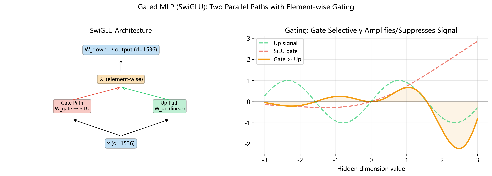

# Gated MLP (门控前馈网络 / SwiGLU)

## 前置知识

在阅读本节之前, 请确保理解:

- [线性变换](../01_linear/README.md): 矩阵乘法 $y = xW^T$
- [SiLU 激活函数](../10_silu/README.md): $\text{SiLU}(x) = x \cdot \sigma(x)$
- [Vision MLP](../11_vision_mlp/README.md): 经典两层前馈网络

---

## 1. 为什么需要"门控"? 一个关于选择性注意的类比

想象你走进一间嘈杂的咖啡厅. 周围有键盘敲击声, 咖啡机嗡鸣, 邻桌的闲聊, 背景音乐 — — 数十种声音同时涌入你的耳膜. 然而你依然能清晰地听到对面朋友说的每一个字. 这并非因为你的听觉系统有多灵敏, 而是因为你的大脑在做一件了不起的事情: **选择性过滤**. 它不断评估每一路信号的重要性, 放大值得关注的, 压制无关紧要的.

神经网络中的标准 MLP (多层感知机) 缺少这种能力. 它对所有维度施加相同的激活函数, 像一个"全开"或"全关"的开关 — — 没有灰度, 没有选择.

**门控 MLP** (Gated MLP) 正是为了解决这个问题而生的. 它额外学习一个"门控信号", 为每个维度独立决定"放多少信息通过". 就像咖啡厅里你的大脑为每一路声源分配了一个 0 到 1 之间的音量旋钮 — — 重要的调高, 干扰的调低.

这一简单而优雅的思想, 让 Gated MLP 成为当今几乎所有主流大语言模型的标配组件.

---

## 2. GLU 家族的起源: Dauphin et al. 2017

### 原始 GLU (Gated Linear Unit)

门控思想首次在前馈网络中系统化应用, 来自 Dauphin 等人 2017 年的论文 _"Language Modeling with Gated Convolutional Networks"_. 他们提出了 **GLU (Gated Linear Unit) **:

$$
\text{GLU}(x, W, V) = (xW) \odot \sigma(xV)
$$

其中:

- $xW \in \mathbb{R}^{d_{\text{ff}}}$: **值路径** (value path), 产生候选特征
- $xV \in \mathbb{R}^{d_{\text{ff}}}$: **门路径** (gate path), 经过 sigmoid 产生 0~1 之间的门控信号
- $\sigma(\cdot)$ 是 sigmoid 函数: $\sigma(z) = \frac{1}{1 + e^{-z}}$
- $\odot$ 是逐元素乘法 (Hadamard 积)

### 核心思想拆解

GLU 的精妙之处在于**两路并行投影 + 逐元素相乘**:

1. **值路径** $xW$: 对输入做线性变换, 产生"原始信号"
2. **门路径** $\sigma(xV)$: 对输入做另一个线性变换, 再过 sigmoid 压缩到 $[0, 1]$, 产生"通行证"
3. **逐元素相乘**: 每个维度的值被其对应的门独立缩放

用数学语言说, 对于隐藏层的第 $j$ 个维度:

$$
\text{output}_j = \underbrace{(xW)_j}_{\text{值}} \times \underbrace{\sigma((xV)_j)}_{\text{门: 0 到 1 之间}}
$$

当 $\sigma((xV)_j) \approx 1$ 时, 第 $j$ 维的信号完整通过; 当 $\sigma((xV)_j) \approx 0$ 时, 信号被抑制. 网络通过学习 $V$ 的参数来决定"关注哪些维度".

---

## 3. 为什么门控更好? 信息瓶颈的视角

### 标准 MLP 的问题

标准两层 MLP 的隐藏层表示为:

$$
h = \text{activation}(xW_1^T)
$$

激活函数 (无论是 ReLU, GELU 还是 SiLU) **均匀地**作用于所有 $d_{\text{ff}}$ 个维度. 每个维度经历的是相同的非线性变换规则 — — 网络无法让某些维度"大声说话"而其他维度"保持沉默".

### 门控的表达能力优势

门控 MLP 将隐藏层表示改为:

$$
h = \text{activation}(xW_g^T) \odot (xW_u^T)
$$

这引入了**乘性交互** (multiplicative interaction). 从信息论角度看:

- **加性交互** (如标准 MLP 中的 $Wx + b$): 信息被线性叠加, 表达能力有限
- **乘性交互** (如门控中的 $\text{gate} \odot \text{value}$): 信息被非线性调制, 表达能力更强

直觉上, 门控让网络学会了一个**输入依赖的 (input-dependent) 滤波器**. 同一个网络对不同输入可以选择性地激活不同的特征子集. 这比"所有输入经过相同处理管道"要灵活得多.

### 梯度流动的改善

门控还有一个重要好处: 改善梯度流动. 在逐元素乘法 $h = g \odot v$ 中, 对 $v$ 的梯度为:

$$
\frac{\partial h}{\partial v} = g
$$

这意味着门控值 $g$ 直接作为梯度的"调制器". 当某些维度的门控值较大时, 对应的梯度也更强, 训练信号更清晰. 相比之下, 标准 MLP 中的梯度完全依赖激活函数的导数形状, 缺乏这种自适应性.

---

## 4. GLU 变体 — — Shazeer 2020

### Noam Shazeer 的系统化研究

2020 年, Google 的 Noam Shazeer (Transformer 原始论文的共同作者) 发表了一篇简短但极具影响力的论文: _"GLU Variants Improve Transformer"_. 他系统性地测试了将不同激活函数嵌入 GLU 框架后的效果.

### 变体一览表

所有变体共享相同的框架: $(\text{act}(xW) \odot xV) W_2$, 区别仅在于激活函数的选择:

| 变体       | 激活函数 $\text{act}(\cdot)$         | 公式                             |
| ---------- | ------------------------------------ | -------------------------------- |
| **GLU**    | $\sigma(z) = \frac{1}{1+e^{-z}}$     | $(\sigma(xW) \odot xV) W_2$      |
| **ReGLU**  | $\text{ReLU}(z) = \max(0, z)$        | $(\text{ReLU}(xW) \odot xV) W_2$ |
| **GEGLU**  | $\text{GELU}(z) = z \cdot \Phi(z)$   | $(\text{GELU}(xW) \odot xV) W_2$ |
| **SwiGLU** | $\text{SiLU}(z) = z \cdot \sigma(z)$ | $(\text{SiLU}(xW) \odot xV) W_2$ |

其中 $\Phi(z)$ 是标准正态分布的累积分布函数.

### 为什么 SwiGLU 胜出?

Shazeer 的实验结果表明, 在相同的参数预算和计算预算下:

1. **所有 GLU 变体都优于对应的非门控版本** — — 这证明门控机制本身的价值
2. **SwiGLU 和 GEGLU 效果最好**, 在多数任务上 SwiGLU 略有优势
3. SwiGLU 相比原始 GLU 的优势来源于 SiLU 激活函数比 sigmoid 更平滑的梯度特性

SiLU 的独特之处在于它既不像 ReLU 那样在零点有硬拐点 (导致"死神经元"), 也不像 sigmoid 那样在两端饱和 (导致梯度消失). 它是一条平滑的, 非单调的曲线, 在负半轴有轻微的"鼓包", 这为优化提供了更丰富的梯度信息.

---

## 5. SwiGLU 的完整数学推导

### 第一步: SiLU / Swish 激活函数

SiLU (Sigmoid Linear Unit), 也叫 Swish, 定义为:

$$
\text{SiLU}(x) = x \cdot \sigma(x) = \frac{x}{1 + e^{-x}}
$$

其中 $\sigma(x) = \frac{1}{1 + e^{-x}}$ 是 sigmoid 函数.

### 第二步: 将 SiLU 嵌入 GLU 框架

GLU 框架的一般形式:

$$
\text{GLU}_{\text{act}}(x, W_g, W_u) = \text{act}(xW_g^T) \odot (xW_u^T)
$$

将 $\text{act} = \text{SiLU}$ 代入, 得到 SwiGLU 的门控表达:

$$
\text{SwiGLU}(x, W_g, W_u) = \text{SiLU}(xW_g^T) \odot (xW_u^T)
$$

展开 SiLU 的定义:

$$
= \Big[(xW_g^T) \cdot \sigma(xW_g^T) \Big] \odot (xW_u^T)
$$

### 第三步: 加上下投影得到完整 Gated MLP

完整的 SwiGLU Gated MLP 还需要一个下投影矩阵 $W_d$ 将高维隐藏层映射回原始维度:

$$
\text{GatedMLP}(x) = \text{SwiGLU}(x, W_g, W_u) \cdot W_d^T
$$

$$
= \Big[\text{SiLU}(xW_g^T) \odot (xW_u^T) \Big] W_d^T
$$

### 逐步展开每个阶段的维度

设输入 $x \in \mathbb{R}^{n \times d}$, 则:

| 步骤      | 运算                                                                            | 输出形状             |
| --------- | ------------------------------------------------------------------------------- | -------------------- |
| Gate 投影 | $g_{\text{raw}} = xW_g^T$                                                       | $(n, d_{\text{ff}})$ |
| Gate 激活 | $g = \text{SiLU}(g_{\text{raw}}) = g_{\text{raw}} \odot \sigma(g_{\text{raw}})$ | $(n, d_{\text{ff}})$ |
| Up 投影   | $u = xW_u^T$                                                                    | $(n, d_{\text{ff}})$ |
| 门控相乘  | $h = g \odot u$                                                                 | $(n, d_{\text{ff}})$ |
| Down 投影 | $y = hW_d^T$                                                                    | $(n, d)$             |

注意 gate 和 up 投影之间**没有数据依赖**, 可以并行计算.

---

## 6. Hadamard 积 (逐元素乘法) 的深入理解

### 形式定义

给定两个同形状的矩阵 $A, B \in \mathbb{R}^{m \times n}$, 它们的 **Hadamard 积** (Hadamard product) 定义为:

$$
(A \odot B)_{ij} = A_{ij} \cdot B_{ij}
$$

也就是说, 对应位置的元素直接相乘.

### 三维向量示例

设 $\mathbf{a} = [3, -2, 5]^T$, $\mathbf{b} = [0.8, 0.1, 0.9]^T$ (假设 $\mathbf{b}$ 是门控信号), 则:

$$
\mathbf{a} \odot \mathbf{b} = \begin{bmatrix} 3 \times 0.8 \\ -2 \times 0.1 \\ 5 \times 0.9 \end{bmatrix} = \begin{bmatrix} 2.4 \\ -0.2 \\ 4.5 \end{bmatrix}
$$

几何解读:

- 第 1 维: 门控值 0.8, 保留了 80% 的信号强度 ($3 \to 2.4$)
- 第 2 维: 门控值 0.1, 信号被压制到仅剩 10% ($-2 \to -0.2$)
- 第 3 维: 门控值 0.9, 信号几乎完整保留 ($5 \to 4.5$)

### 与矩阵乘法的本质区别

| 特性                | Hadamard 积 $A \odot B$     | 矩阵乘法 $AB$           |
| ------------------- | --------------------------- | ----------------------- |
| 要求                | $A, B$ 形状完全相同         | $A$ 的列数 = $B$ 的行数 |
| 操作                | 对应元素相乘                | 行与列做内积            |
| 维度交互            | **无** — — 每个维度独立缩放 | **有** — — 所有维度混合 |
| 输出形状            | 与输入相同                  | 可以不同                |
| 在门控 MLP 中的角色 | 用于门控 (逐维度过滤)       | 用于投影 (维度变换)     |

这正是门控的精髓: Hadamard 积让每个维度被**独立**地放大或抑制, 而不会像矩阵乘法那样把所有维度混在一起.

---

## 7. 为什么 gate_proj 和 up_proj 可以并行计算?

回顾 Gated MLP 的计算步骤:

```
gate_raw = x @ W_gate.T    ← 仅依赖 x
up       = x @ W_up.T      ← 仅依赖 x
gate     = SiLU(gate_raw)  ← 仅依赖 gate_raw
hidden   = gate ⊙ up       ← 依赖 gate 和 up
output   = hidden @ W_down.T ← 依赖 hidden
```

观察数据依赖关系: `gate_raw` 和 `up` **都只依赖输入 $x$**, 彼此之间没有依赖. 这意味着:

1. **在 GPU 上**: 两个矩阵乘法可以融合为一个更大的矩阵乘法. 将 $W_g$ 和 $W_u$ 沿行拼接为 $W_{gu} \in \mathbb{R}^{2d_{\text{ff}} \times d}$, 则:

$$
[g_{\text{raw}};\; u] = x W_{gu}^T \in \mathbb{R}^{n \times 2d_{\text{ff}}}
$$

然后将结果沿最后一维拆分为两半. 这比分别计算两个矩阵乘法**效率更高**, 因为 GPU 上大矩阵乘法的利用率更高 (更好地摊销了内存访问开销).

2. **在 NumPy 中**: 虽然我们分开写了两行代码, 但这只是为了清晰. 在实际推理框架 (如 vLLM, TGI) 中, gate 和 up 的投影通常是融合的.

---

## 8. 参数量的 8/3 缩放规则

### 标准 MLP 的参数量

经典 Transformer 中, 标准两层 MLP 的扩展比为 4:

$$
\text{标准 MLP}: \quad W_1 \in \mathbb{R}^{4d \times d}, \quad W_2 \in \mathbb{R}^{d \times 4d}
$$

总参数量 (忽略偏置):

$$
P_{\text{standard}} = 4d \times d + d \times 4d = 8d^2
$$

### 门控 MLP 的参数量

门控 MLP 有三个投影矩阵:

$$
W_g \in \mathbb{R}^{d_{\text{ff}} \times d}, \quad W_u \in \mathbb{R}^{d_{\text{ff}} \times d}, \quad W_d \in \mathbb{R}^{d \times d_{\text{ff}}}
$$

总参数量:

$$
P_{\text{gated}} = 3 \times d_{\text{ff}} \times d
$$

### 参数等价条件

若要求 $P_{\text{gated}} = P_{\text{standard}}$:

$$
3 \times d_{\text{ff}} \times d = 8d^2
$$

$$
d_{\text{ff}} = \frac{8d}{3} \approx 2.67d
$$

这就是著名的 **8/3 缩放规则**: 当使用门控 MLP 时, 隐藏层宽度应设为 $\frac{8}{3}d$, 以保持与标准 MLP 相同的参数预算.

### Qwen2-VL 的实际选择

对于 Qwen2-VL 的文本解码器 ($d = 1536$):

- 按 8/3 规则的理论值: $d_{\text{ff}} = \frac{8 \times 1536}{3} = 4096$
- 实际值: $d_{\text{ff}} = 8960$

实际隐藏维度远大于理论等价值! 让我们详细分析这一差距:

**扩展比分析: **

$$
\frac{d_{\text{ff}}}{d} = \frac{8960}{1536} \approx 5.83
$$

对比 $\frac{8}{3} \approx 2.67$, 实际扩展比是理论最小值的 $\frac{5.83}{2.67} \approx 2.19$ 倍.

**参数量对比: **

| 方案                      | 矩阵维度                    | 参数量                                  |
| ------------------------- | --------------------------- | --------------------------------------- |
| 标准 MLP ($4\times$ 扩展) | $2 \times 1536 \times 6144$ | $= 18{,}874{,}368 \approx 18.9\text{M}$ |
| 门控 MLP (8/3 等价)       | $3 \times 1536 \times 4096$ | $= 18{,}874{,}368 \approx 18.9\text{M}$ |
| **Qwen2-VL 实际**         | $3 \times 1536 \times 8960$ | $= 41{,}287{,}680 \approx 41.3\text{M}$ |

Qwen2-VL 的 Gated MLP **每层参数量是"参数等价"标准 MLP 的约 2.19 倍**. 这是一个有意的设计选择 — — 模型将更多的参数预算分配给了 MLP, 以获得更强的特征变换能力. 这在现代 LLM 中很常见: MLP 层的参数通常占模型总参数量的大部分.

---

## 9. 详尽的数值追踪

现在让我们用一个具体的小例子, 逐步计算 Gated MLP 的每一个中间结果.

### 设定

- 输入维度 $d = 4$, 隐藏维度 $d_{\text{ff}} = 6$
- 输入向量 (单个 token): $x = [1.0,\; 0.5,\; -0.3,\; 0.8]$

权重矩阵 (为方便展示, 使用简单数值):

$$
W_g = \begin{bmatrix}
 0.2 & -0.1 & 0.3 & 0.1 \\
-0.3 & 0.4 & 0.1 & -0.2 \\
 0.1 & 0.2 & -0.4 & 0.3 \\
 0.5 & -0.3 & 0.2 & 0.1 \\
-0.2 & 0.1 & 0.3 & -0.1 \\
 0.3 & 0.2 & -0.1 & 0.4
\end{bmatrix}
\quad (6 \times 4)
$$

$$
W_u = \begin{bmatrix}
 0.1 & 0.3 & -0.2 & 0.4 \\
 0.4 & -0.1 & 0.2 & -0.3 \\
-0.2 & 0.5 & 0.1 & 0.2 \\
 0.3 & 0.1 & -0.3 & 0.2 \\
-0.1 & 0.4 & 0.2 & -0.2 \\
 0.2 & -0.2 & 0.3 & 0.1
\end{bmatrix}
\quad (6 \times 4)
$$

$W_d$ 为 $(4 \times 6)$ 矩阵 (稍后给出).

### 步骤 1: Gate 投影 — $g_{\text{raw}} = x \cdot W_g^T$

$x = [1.0,\; 0.5,\; -0.3,\; 0.8]$ 与 $W_g^T$ 的每列做内积 (等价于与 $W_g$ 的每行做内积):

$$
g_{\text{raw},1} = 1.0 \times 0.2 + 0.5 \times (-0.1) + (-0.3) \times 0.3 + 0.8 \times 0.1 = 0.2 - 0.05 - 0.09 + 0.08 = 0.14
$$

$$
g_{\text{raw},2} = 1.0 \times (-0.3) + 0.5 \times 0.4 + (-0.3) \times 0.1 + 0.8 \times (-0.2) = -0.3 + 0.2 - 0.03 - 0.16 = -0.29
$$

$$
g_{\text{raw},3} = 1.0 \times 0.1 + 0.5 \times 0.2 + (-0.3) \times (-0.4) + 0.8 \times 0.3 = 0.1 + 0.1 + 0.12 + 0.24 = 0.56
$$

$$
g_{\text{raw},4} = 1.0 \times 0.5 + 0.5 \times (-0.3) + (-0.3) \times 0.2 + 0.8 \times 0.1 = 0.5 - 0.15 - 0.06 + 0.08 = 0.37
$$

$$
g_{\text{raw},5} = 1.0 \times (-0.2) + 0.5 \times 0.1 + (-0.3) \times 0.3 + 0.8 \times (-0.1) = -0.2 + 0.05 - 0.09 - 0.08 = -0.32
$$

$$
g_{\text{raw},6} = 1.0 \times 0.3 + 0.5 \times 0.2 + (-0.3) \times (-0.1) + 0.8 \times 0.4 = 0.3 + 0.1 + 0.03 + 0.32 = 0.75
$$

$$
g_{\text{raw}} = [0.14,\; -0.29,\; 0.56,\; 0.37,\; -0.32,\; 0.75]
$$

### 步骤 2: SiLU 激活 — $g = \text{SiLU}(g_{\text{raw}})$

对每个元素分别计算 $\text{SiLU}(z) = z \cdot \sigma(z) = \frac{z}{1 + e^{-z}}$:

| $z$     | $e^{-z}$ | $\sigma(z) = \frac{1}{1+e^{-z}}$ | $\text{SiLU}(z) = z \cdot \sigma(z)$ |
| ------- | -------- | -------------------------------- | ------------------------------------ |
| $0.14$  | $0.8694$ | $0.5350$                         | $0.14 \times 0.5350 = 0.0749$        |
| $-0.29$ | $1.3365$ | $0.4280$                         | $-0.29 \times 0.4280 = -0.1241$      |
| $0.56$  | $0.5712$ | $0.6364$                         | $0.56 \times 0.6364 = 0.3564$        |
| $0.37$  | $0.6907$ | $0.5914$                         | $0.37 \times 0.5914 = 0.2188$        |
| $-0.32$ | $1.3771$ | $0.4207$                         | $-0.32 \times 0.4207 = -0.1346$      |
| $0.75$  | $0.4724$ | $0.6792$                         | $0.75 \times 0.6792 = 0.5094$        |

$$
g = [0.0749,\; -0.1241,\; 0.3564,\; 0.2188,\; -0.1346,\; 0.5094]
$$



### 步骤 3: Up 投影 — $u = x \cdot W_u^T$

$$
u_1 = 1.0 \times 0.1 + 0.5 \times 0.3 + (-0.3) \times (-0.2) + 0.8 \times 0.4 = 0.1 + 0.15 + 0.06 + 0.32 = 0.63
$$

$$
u_2 = 1.0 \times 0.4 + 0.5 \times (-0.1) + (-0.3) \times 0.2 + 0.8 \times (-0.3) = 0.4 - 0.05 - 0.06 - 0.24 = 0.05
$$

$$
u_3 = 1.0 \times (-0.2) + 0.5 \times 0.5 + (-0.3) \times 0.1 + 0.8 \times 0.2 = -0.2 + 0.25 - 0.03 + 0.16 = 0.18
$$

$$
u_4 = 1.0 \times 0.3 + 0.5 \times 0.1 + (-0.3) \times (-0.3) + 0.8 \times 0.2 = 0.3 + 0.05 + 0.09 + 0.16 = 0.60
$$

$$
u_5 = 1.0 \times (-0.1) + 0.5 \times 0.4 + (-0.3) \times 0.2 + 0.8 \times (-0.2) = -0.1 + 0.2 - 0.06 - 0.16 = -0.12
$$

$$
u_6 = 1.0 \times 0.2 + 0.5 \times (-0.2) + (-0.3) \times 0.3 + 0.8 \times 0.1 = 0.2 - 0.1 - 0.09 + 0.08 = 0.09
$$

$$
u = [0.63,\; 0.05,\; 0.18,\; 0.60,\; -0.12,\; 0.09]
$$

### 步骤 4: 门控相乘 — $h = g \odot u$

逐元素相乘:

| 维度 | $g_i$     | $u_i$   | $h_i = g_i \times u_i$ | 解读                       |
| ---- | --------- | ------- | ---------------------- | -------------------------- |
| 1    | $0.0749$  | $0.63$  | $0.0472$               | 门控值小, 信号被大幅压缩   |
| 2    | $-0.1241$ | $0.05$  | $-0.0062$              | 门控为负, 信号被反转并压缩 |
| 3    | $0.3564$  | $0.18$  | $0.0642$               | 适度门控                   |
| 4    | $0.2188$  | $0.60$  | $0.1313$               | 门控和值都为正, 信号通过   |
| 5    | $-0.1346$ | $-0.12$ | $0.0162$               | 双负为正, 微弱信号         |
| 6    | $0.5094$  | $0.09$  | $0.0458$               | 门控大但值小               |

$$
h = [0.0472,\; -0.0062,\; 0.0642,\; 0.1313,\; 0.0162,\; 0.0458]
$$

### 步骤 5: Down 投影 — $y = h \cdot W_d^T$

设 $W_d$ 为:

$$
W_d = \begin{bmatrix}
 0.2 & -0.3 & 0.1 & 0.4 & -0.2 & 0.1 \\
-0.1 & 0.2 & 0.3 & -0.1 & 0.5 & -0.2 \\
 0.3 & 0.1 & -0.2 & 0.2 & 0.1 & 0.3 \\
 0.1 & -0.4 & 0.2 & 0.3 & -0.1 & 0.2
\end{bmatrix}
\quad (4 \times 6)
$$

$$
y_1 = 0.0472(0.2) + (-0.0062)(-0.3) + 0.0642(0.1) + 0.1313(0.4) + 0.0162(-0.2) + 0.0458(0.1) = 0.0716
$$

$$
y_2 = 0.0472(-0.1) + (-0.0062)(0.2) + 0.0642(0.3) + 0.1313(-0.1) + 0.0162(0.5) + 0.0458(-0.2) = -0.0008
$$

$$
y_3 = 0.0472(0.3) + (-0.0062)(0.1) + 0.0642(-0.2) + 0.1313(0.2) + 0.0162(0.1) + 0.0458(0.3) = 0.0424
$$

$$
y_4 = 0.0472(0.1) + (-0.0062)(-0.4) + 0.0642(0.2) + 0.1313(0.3) + 0.0162(-0.1) + 0.0458(0.2) = 0.0670
$$

$$
\boxed{y = [0.0716,\; -0.0008,\; 0.0424,\; 0.0670]}
$$

我们从一个 4 维输入出发, 经过"升维 → 门控 → 降维"的完整旅程, 又回到了 4 维空间.

---

## 10. 计算量 (FLOPs) 分析

### 单次矩阵乘法的 FLOPs

对于矩阵乘法 $A \in \mathbb{R}^{m \times k}$ 与 $B \in \mathbb{R}^{k \times n}$: 每个输出元素需要 $k$ 次乘法和 $k-1$ 次加法, 近似 $2k$ 次浮点运算. 共 $m \times n$ 个输出元素.

$$
\text{FLOPs} = 2 \times m \times k \times n
$$

### Qwen2-VL 文本解码器的 Gated MLP FLOPs (单 token)

设 $d = 1536$, $d_{\text{ff}} = 8960$, 单 token 输入即 $m = 1$:

| 操作                 | 计算                                                 | FLOPs                        |
| -------------------- | ---------------------------------------------------- | ---------------------------- |
| gate_proj: $x W_g^T$ | $2 \times 1 \times 1536 \times 8960$                 | $27{,}525{,}120$             |
| up_proj: $x W_u^T$   | $2 \times 1 \times 1536 \times 8960$                 | $27{,}525{,}120$             |
| SiLU 激活            | sigmoid ($\sim 4$ ops) + 乘法 ($1$ op) $\times 8960$ | $\sim 44{,}800$              |
| Hadamard 积          | $8960$ 次乘法                                        | $8{,}960$                    |
| down_proj: $h W_d^T$ | $2 \times 1 \times 8960 \times 1536$                 | $27{,}525{,}120$             |
| **合计**             |                                                      | **$\approx 82{,}629{,}120$** |

三个矩阵乘法主导了计算量, SiLU 和 Hadamard 积几乎可以忽略.

### 标准 MLP 的 FLOPs (参数等价条件下)

若标准 MLP 使用 $d_{\text{ff}} = 4d = 6144$:

| 操作                                  | FLOPs                        |
| ------------------------------------- | ---------------------------- |
| $xW_1^T$: $2 \times 1536 \times 6144$ | $18{,}874{,}368$             |
| 激活函数                              | $\sim 24{,}576$              |
| $hW_2^T$: $2 \times 6144 \times 1536$ | $18{,}874{,}368$             |
| **合计**                              | **$\approx 37{,}773{,}312$** |

### Qwen2-VL 实际规模的完整计算

对于完整的前向传播 (3602 个 token, 28 层):

$$
\text{总 FLOPs} = 82{,}629{,}120 \times 3{,}602 \times 28 \approx 8.33 \times 10^{12} \approx 8.33 \text{ TFLOPs}
$$

这意味着仅 MLP 部分就贡献了约 8.33 万亿次浮点运算. MLP 通常占 Transformer 层总计算量的约 2/3 (另外 1/3 是注意力机制).

---

## 11. 为什么现代 LLM 全部采用 SwiGLU?

### 行业共识

自 2023 年以来, 几乎所有主流开源 LLM 都采用了 SwiGLU 作为 MLP 结构:

| 模型            | 发布时间          | MLP 类型 | 隐藏层扩展比                     |
| --------------- | ----------------- | -------- | -------------------------------- |
| LLaMA / LLaMA 2 | 2023.02 / 2023.07 | SwiGLU   | $\approx 2.69 \times$ (接近 8/3) |
| Mistral 7B      | 2023.09           | SwiGLU   | $\approx 3.59 \times$            |
| Qwen / Qwen2    | 2023.08 / 2024.06 | SwiGLU   | $\approx 5.83 \times$            |
| Gemma           | 2024.02           | GEGLU    | $\approx 4.0 \times$             |
| Phi-3           | 2024.04           | SwiGLU   | 依模型而异                       |

### Shazeer 论文的关键实验结果

Shazeer 在论文中比较了多种 MLP 变体在 T5 架构上的 perplexity:

- **SwiGLU 和 GEGLU 在几乎所有评估中都优于标准 FFN**
- 在相同参数预算下, SwiGLU 的 loss 曲线收敛更快, 最终值更低
- 这一优势在不同模型规模 (从 small 到 XXL) 上一致成立

### 为什么是 SwiGLU 而非其他变体?

1. **比 GLU 好**: SiLU 比 sigmoid 有更好的梯度流动
2. **比 ReGLU 好**: SiLU 没有 ReLU 的"死区"问题
3. **与 GEGLU 接近**: 两者效果非常接近, 但 SiLU 计算更简单 (不涉及误差函数 $\text{erf}$)
4. **实现简单**: $\text{SiLU}(x) = x \cdot \sigma(x)$ 只需 sigmoid 和一次乘法

正是这种"效果好 + 实现简单"的组合, 让 SwiGLU 成为了事实标准.

---

## 12. 参数量与显存分析

### 单层参数量

每个文本解码器层的 Gated MLP 包含三个权重矩阵:

| 权重               | 形状           | 参数量                                    |
| ------------------ | -------------- | ----------------------------------------- |
| `gate_proj.weight` | $(8960, 1536)$ | $13{,}762{,}560$                          |
| `up_proj.weight`   | $(8960, 1536)$ | $13{,}762{,}560$                          |
| `down_proj.weight` | $(1536, 8960)$ | $13{,}762{,}560$                          |
| **每层合计**       |                | **$41{,}287{,}680 \approx 41.3\text{M}$** |

### 28 层总参数量

$$
41{,}287{,}680 \times 28 = 1{,}156{,}054{,}940 \approx 1.156\text{B}
$$

这意味着 **Gated MLP 占了 Qwen2-VL-2B 模型约 57.8% 的参数量** ($1.156\text{B} / 2\text{B} \approx 57.8\%$)! 这是整个模型参数量的大头.

### 存储 (显存) 需求

权重存储 (以不同精度):

| 精度        | 每参数字节 | 单层 MLP          | 28 层 MLP        |
| ----------- | ---------- | ----------------- | ---------------- |
| FP32        | 4 bytes    | $165.2\text{ MB}$ | $4.63\text{ GB}$ |
| FP16 / BF16 | 2 bytes    | $82.6\text{ MB}$  | $2.31\text{ GB}$ |
| INT8        | 1 byte     | $41.3\text{ MB}$  | $1.16\text{ GB}$ |
| INT4        | 0.5 byte   | $20.6\text{ MB}$  | $0.58\text{ GB}$ |

### 前向传播中的激活值显存

以 batch=1, seq_len=3602 为例:

| 激活值                            | 形状              | 大小 (FP16)                |
| --------------------------------- | ----------------- | -------------------------- |
| $g_{\text{raw}} = xW_g^T$         | $(1, 3602, 8960)$ | $61.6\text{ MB}$           |
| $g = \text{SiLU}(g_{\text{raw}})$ | $(1, 3602, 8960)$ | $61.6\text{ MB}$           |
| $u = xW_u^T$                      | $(1, 3602, 8960)$ | $61.6\text{ MB}$           |
| $h = g \odot u$                   | $(1, 3602, 8960)$ | $61.6\text{ MB}$           |
| **单层激活合计**                  |                   | **$\sim 246.4\text{ MB}$** |

注意: 推理时不需要保存所有中间激活值 (可以用完即弃), 但训练时需要保存以计算梯度, 显存开销会显著增加.

---

## 13. NumPy 实现: 逐行详解

```python
import numpy as np


def sigmoid(x):
    """Sigmoid 函数: σ(x) = 1 / (1 + exp(-x))

    将任意实数映射到 (0, 1) 区间。
    在 Gated MLP 中，sigmoid 是 SiLU 激活函数的组成部分。
    """
    return 1.0 / (1.0 + np.exp(-x))
```

**第 1 行**: `np.exp(-x)` 对输入取负后计算指数. NumPy 的广播机制保证这对标量, 向量, 任意形状张量都适用.

**第 2 行**: `1.0 + ...` 中的 `1.0` 确保运算在浮点数域内进行 (避免整数溢出问题). 最终取倒数得到 $\sigma(x)$.

```python
def silu(x):
    """SiLU (Swish) 激活函数: SiLU(x) = x · σ(x)

    也称为 Swish-1。结合了线性和非线性特性：
    - 当 x >> 0 时：σ(x) → 1，SiLU(x) → x（近似恒等）
    - 当 x << 0 时：σ(x) → 0，SiLU(x) → 0（抑制）
    - 在 x ≈ 0 附近：平滑的非线性过渡
    """
    return x * sigmoid(x)
```

**关键洞察**: `x * sigmoid(x)` 就是 SiLU 的全部. 这里的 `*` 是 NumPy 的逐元素乘法, 等价于 Hadamard 积. SiLU 的输出范围是 $[\approx -0.278, +\infty)$ — — 注意它可以输出小幅负值, 这是它优于 ReLU 的特性之一.

```python
def gated_mlp(x, gate_weight, up_weight, down_weight):
    """Gated MLP (SwiGLU): 完整的门控前馈网络

    参数:
        x:           输入张量，形状 (..., d)
        gate_weight: 门控投影权重，形状 (d_ff, d)
        up_weight:   上投影权重，形状 (d_ff, d)
        down_weight: 下投影权重，形状 (d, d_ff)

    返回:
        输出张量，形状 (..., d)
    """
    gate = silu(x @ gate_weight.T)   # (..., d_ff) — 门控信号
    up = x @ up_weight.T              # (..., d_ff) — 值信号
    hidden = gate * up                 # (..., d_ff) — 逐元素门控
    output = hidden @ down_weight.T    # (..., d)   — 降维回原空间
    return output
```

**逐行解读: **

- **`x @ gate_weight.T`**: `@` 是矩阵乘法运算符. `gate_weight` 为 $(d_{\text{ff}}, d)$, 转置后 $(d, d_{\text{ff}})$, 结果为 $(..., d_{\text{ff}})$. 外层 `silu()` 对结果应用激活.
- **`x @ up_weight.T`**: 与 gate 投影完全并行 — — 两行之间没有数据依赖.
- **`gate * up`**: NumPy `*` 执行逐元素乘法 (Hadamard 积), 两张量形状 $(..., d_{\text{ff}})$ 完美对齐.
- **`hidden @ down_weight.T`**: 将 $d_{\text{ff}}$ 维隐藏表示投影回 $d$ 维.

**关于 `...` (Ellipsis) 的说明**: 形状注释中的 `...` 表示任意数量的批次维度. 例如输入可以是 $(d,)$ (单 token), $(n, d)$ (一个序列) 或 $(b, n, d)$ (一个 batch). NumPy 的 `@` 自动处理批次维度 — — 只对最后两个维度执行矩阵乘法, 前面的维度通过广播保持不变.

**关于无偏置的说明**: 所有投影都是纯矩阵乘法, 没有 `+ bias`. 这遵循 LLaMA 的设计惯例 — — 去除偏置略微减少参数量, 且实验表明对效果几乎无影响.

---

## 14. Vision MLP vs Gated MLP 全面对比

| 特性                         | Vision MLP (视觉编码器)              | Gated MLP / SwiGLU (文本解码器)            |
| ---------------------------- | ------------------------------------ | ------------------------------------------ |
| **数学公式**                 | $W_2(\text{act}(W_1 x + b_1)) + b_2$ | $(\text{SiLU}(xW_g^T) \odot xW_u^T) W_d^T$ |
| **投影矩阵数**               | 2 个 (fc1, fc2)                      | 3 个 (gate, up, down)                      |
| **激活函数**                 | QuickGELU                            | SiLU (Swish)                               |
| **门控机制**                 | ❌ 无                                | ✅ 有 (gate ⊙ up)                          |
| **偏置项**                   | ✅ 有                                | ❌ 无                                      |
| **输入维度 $d$**             | 1280                                 | 1536                                       |
| **隐藏维度 $d_{\text{ff}}$** | 5120                                 | 8960                                       |
| **扩展比**                   | $4.0\times$                          | $\approx 5.83\times$                       |
| **每层参数量**               | $\sim 13.1\text{M}$                  | $\sim 41.3\text{M}$                        |
| **层数**                     | 32                                   | 28                                         |
| **总 MLP 参数量**            | $\sim 419\text{M}$                   | $\sim 1{,}156\text{M}$                     |
| **信息流**                   | 直通: 升维 → 激活 → 降维             | 分叉: 升维(×2) → 门控 → 降维               |
| **表达能力**                 | 较弱 (统一激活)                      | 更强 (选择性过滤)                          |
| **GPU 优化潜力**             | 标准                                 | gate+up 可融合为单次大 matmul              |
| **典型应用**                 | ViT 编码器                           | 现代 LLM 解码器                            |

**为什么视觉编码器用标准 MLP 而文本解码器用 Gated MLP? ** 视觉编码器通常基于较早期的 ViT 架构设计, 沿用了经典的 Transformer FFN 结构. 文本解码器则采用了更新的设计 (如 LLaMA 开创的范式), 融合了 SwiGLU 等在语言建模任务中经实验验证更优的改进.

---

## 15. 常见误解与陷阱

### 误解 1: "门控和注意力是一回事"

**不是. ** 虽然两者都涉及"选择性", 但机制完全不同:

|              | 门控 (Gating)           | 注意力 (Attention)          |
| ------------ | ----------------------- | --------------------------- |
| **作用对象** | 单个 token 的各维度     | 序列中不同 token 之间       |
| **操作类型** | 逐元素乘法              | 加权求和 (softmax + matmul) |
| **交互范围** | 维度内 (dimension-wise) | 序列内 (token-wise)         |
| **复杂度**   | $O(d_{\text{ff}})$      | $O(n^2 \cdot d)$            |
| **可学习性** | 通过投影矩阵学习        | 通过 Q/K/V 投影学习         |

简单说: 注意力决定"关注哪些 token", 门控决定"关注哪些特征维度". 两者是互补的, 不是替代的.

### 误解 2: "多一个投影矩阵意味着参数量一定更大"

**不一定. ** 这就是 8/3 缩放规则的意义:

- 标准 MLP (2 个矩阵, $4\times$ 扩展): $2 \times d \times 4d = 8d^2$
- 门控 MLP (3 个矩阵, $\frac{8}{3}\times$ 扩展): $3 \times d \times \frac{8d}{3} = 8d^2$

**参数量完全相同! ** 只是 Qwen2-VL 选择了比 $\frac{8}{3}$ 更大的扩展比 (5.83), 才导致参数量更多. 这是为了更强的表达能力而做出的有意的设计决策.

### 误解 3: "文本解码器没有偏置是疏忽"

**不是. ** 这是一个有意的设计选择, 由 LLaMA 系列模型推广:

1. **参数效率**: 偏置参数量虽小 (每层仅 $3 \times d_{\text{ff}} + d \approx 28K$ 参数), 但在数十亿参数的模型中, 去掉它们能略微减少显存占用
2. **训练稳定性**: 配合 RMSNorm (而非 LayerNorm), 去掉偏置可以简化归一化的数学性质
3. **实验验证**: 多项消融实验表明, 有无偏置对最终模型质量的影响微乎其微
4. **推理优化**: 没有偏置使得矩阵乘法融合 (kernel fusion) 更简单

### 陷阱: 数值溢出

在 `sigmoid(x)` 中, 当 $x$ 是很大的负数时, $e^{-x}$ 会溢出到 `inf`. 不过 `1.0 / (1.0 + inf)` 在 NumPy 中正确返回 `0.0`, 所以我们的实现是安全的. 若需更鲁棒版本, 可使用 `np.where(x >= 0, 1/(1+exp(-x)), exp(x)/(1+exp(x)))` 的分段形式.

---

## 在 Qwen2-VL 中的位置

文本解码器的每个层中:

```
Decoder Layer
├── RMSNorm → Self-Attention → 残差连接
└── RMSNorm → Gated MLP (SwiGLU) → 残差连接  ← 本节内容
```

权重键名:

- `model.layers.{i}.mlp.gate_proj.weight` — 形状 $(8960, 1536)$
- `model.layers.{i}.mlp.up_proj.weight` — 形状 $(8960, 1536)$
- `model.layers.{i}.mlp.down_proj.weight` — 形状 $(1536, 8960)$

共 28 层, 每层 3 个矩阵, 总计 84 个权重张量.

---

## 参考文献

1. Dauphin, Y. N., et al. (2017). _Language Modeling with Gated Convolutional Networks._ ICML.
2. Shazeer, N. (2020). _GLU Variants Improve Transformer._ arXiv:2002.05202.
3. Ramachandran, P., Zoph, B., & Le, Q. V. (2017). _Searching for Activation Functions._ arXiv:1710.05941. (SiLU/Swish 的原始论文)
4. Touvron, H., et al. (2023). _LLaMA: Open and Efficient Foundation Language Models._ arXiv:2302.13971. (首个大规模采用 SwiGLU 的开源 LLM)
