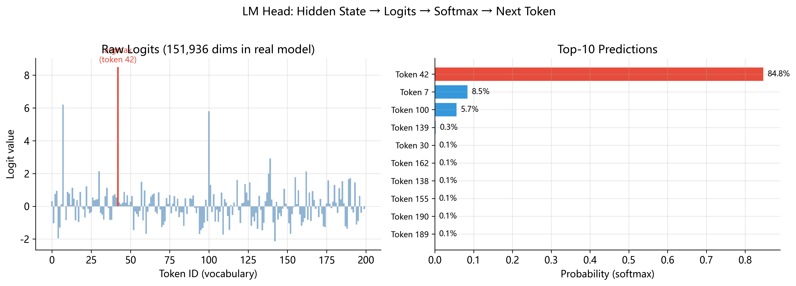

# LM Head (语言模型输出头)

> **一句话总结**: LM Head 将 1536 维的隐藏状态投影到 151,936 维的词表空间, 完成从"理解"到"预测"的最后一跃.

---

## 1536 个数字如何变成一个词?

想象你正在读一本悬疑小说. 经过层层推理 — — 分析每个证人的证词 (Self-Attention), 在脑中反复权衡 (Feed-Forward Network), 经过 28 轮深思熟虑 (28 层 Decoder Layer) — — 你终于形成了一个完整的判断. 这个判断浓缩在你大脑的某种状态里.

现在, 你需要开口说话, 把内心的判断变成一个具体的词.

这就是 LM Head 所做的事情.

模型处理了整个输入序列后, 每个位置都凝练出一个 **1536 维的向量** — — 这是模型全部"理解"的数学表达. 但 1536 个浮点数对人类毫无意义; 模型必须从 **151,936 个候选 token** 中选出最合适的那一个, 作为它的"发言".

这是整个推理流程的 **高潮时刻** — — 就像陪审团经过漫长的闭门讨论, 终于走出来宣布裁决. 而 LM Head, 就是那个把内心判断转化为明确裁决的机制.

让我们看看它是如何做到的.

---

## 前置知识

在深入 LM Head 之前, 请确保你已经理解以下算子:

| 前置知识          | 核心概念                                                                   | 链接                                              |
| ----------------- | -------------------------------------------------------------------------- | ------------------------------------------------- |
| RMS Normalization | $\text{RMSNorm}(x) = \frac{x}{\text{RMS}(x)} \cdot \gamma$, 按均方根归一化 | [04_rms_norm](../04_rms_norm/README.md)           |
| 线性变换          | 矩阵乘法 $y = xW^T + b$, 仿射映射                                          | [01_linear](../01_linear/README.md)               |
| Decoder Layer     | Transformer 解码器的完整一层, 含 Attention + FFN                           | [17_decoder_layer](../17_decoder_layer/README.md) |

如果你对这些还不太熟悉, 建议先阅读对应的章节再回来. LM Head 本身的数学非常简单 — — 它的深度在于"为什么要这样做".

---

## 词表空间的挑战

让我们先感受一下 LM Head 面对的任务有多庞大.

在经典机器学习中, 分类问题的类别数通常是这样的:

| 任务               | 类别数 |
| ------------------ | ------ |
| 猫 vs. 狗          | 2      |
| MNIST 手写数字     | 10     |
| CIFAR-100 图像分类 | 100    |
| ImageNet 图像分类  | 1,000  |
| 典型情感分类       | 2–5    |

而 Qwen2-VL 的词表大小是:

$$
V = 151{,}936
$$

**这是一个 151,936 路分类问题! ** 比 ImageNet 大 **152 倍**.

更令人震撼的是, 这个分类不是只做一次 — — 它在序列的 **每一个位置** 都要做一次. 我们的例子中序列长度 $T = 3602$, 这意味着模型需要同时做 3602 个独立的 151,936 路分类.

用数字来感受:

- 总共需要输出 $3602 \times 151936 = 547{,}277{,}472$ 个 logit 值
- 以 float32 存储, 这是 $547{,}277{,}472 \times 4 \approx 2.05 \text{ GB}$ 的数据

而 LM Head 完成这一切, 只用了一次矩阵乘法和一次归一化. 让我们来看看它是怎么做到的.

---

## Final RMSNorm — 最后的归一化

### 为什么还要归一化?

经过 28 层 Decoder Layer 的处理后, 隐藏状态 $x \in \mathbb{R}^{B \times T \times 1536}$ 已经携带了丰富的语义信息. 但有一个问题: 经过这么多层的变换, 不同位置, 不同维度的数值范围可能已经 **漂移得很严重**.

打个比方: 如果你用温度计测量 28 个房间的温度, 每个房间的温度计可能都有一点零点漂移. 经过 28 次传递后, 累积的误差可能让读数变得不可靠. RMSNorm 就像是在最后一步重新校准温度计.

### 公式回顾

$$
\hat{x}_i = \frac{x_i}{\text{RMS}(x)} \cdot \gamma_i
$$

其中:

$$
\text{RMS}(x) = \sqrt{\frac{1}{d}\sum_{j=1}^{d} x_j^2 + \epsilon}
$$

这里 $d = 1536$ 是隐藏维度, $\epsilon = 10^{-6}$ 防止除零, $\gamma \in \mathbb{R}^{1536}$ 是可学习的缩放参数.

### 直觉

RMSNorm 做了两件事:

1. **缩放归一**: 除以 $\text{RMS}(x)$, 让向量的"平均能量"回到 1 附近. 这确保了无论前面 28 层把数值放大到多少, 到了 LM Head 的输入都是一个"合理"的范围.

2. **逐维调整**: 乘以可学习的 $\gamma$, 让模型可以控制每个维度的相对重要性.

### 如果不做归一化会怎样?

假设某个隐藏状态的数值特别大, 比如所有分量都是 $10^3$ 量级. 那么后续的矩阵乘法 ($\hat{x} \cdot W_{\text{lm}}^T$) 会产生 $10^3 \times \text{正常值}$ 量级的 logits, 这会导致:

- Softmax 数值溢出 ($e^{10^6}$ 会变成 `inf`)
- 概率分布过度集中 (一个 token 的概率接近 1, 其他全部接近 0)
- 生成行为变得不稳定, 模型失去"犹豫"的能力

所以, Final RMSNorm 不是可选的装饰 — — 它是数值稳定性的 **最后一道防线**.

### 权重参数

在 Qwen2-VL 中, 这个 RMSNorm 的权重存储在:

```
model.norm.weight — 形状 (1536,)
```

---

## 线性投影的几何意义

### 计算过程

归一化之后, LM Head 执行一个简单的矩阵乘法:

$$
\text{logits} = \hat{x} \cdot W_{\text{lm}}^T
$$

其中 $W_{\text{lm}} \in \mathbb{R}^{V \times d} = \mathbb{R}^{151936 \times 1536}$.

从维度上看:

$$
(B, T, 1536) \times (1536, 151936) \to (B, T, 151936)
$$

每个位置的 1536 维向量被投影成 151,936 维的 logits 向量. 但这个"投影"的本质是什么?

### 核心洞察: 每一行都是一个"理想嵌入"

$W_{\text{lm}}$ 有 151,936 行, 每一行 $w_i \in \mathbb{R}^{1536}$ 对应词表中第 $i$ 个 token. 你可以把 $w_i$ 理解为 token $i$ 在模型心目中的 **"理想状态"** — — 当隐藏状态 $\hat{x}$ 看起来像 $w_i$ 时, 模型就倾向于预测 token $i$.

logit 的计算就是 $\hat{x}$ 与每个 $w_i$ 的 **点积** (dot product):

$$
l_i = \hat{x} \cdot w_i = \sum_{j=1}^{d} \hat{x}_j \cdot w_{i,j}
$$

### 几何图景

点积有一个优美的几何解释:

$$
l_i = \hat{x} \cdot w_i = \|\hat{x}\| \cdot \|w_i\| \cdot \cos\theta_i
$$

其中 $\theta_i$ 是 $\hat{x}$ 和 $w_i$ 之间的夹角.

这告诉我们三件事:

1. **方向对齐** ($\cos\theta_i$): $\hat{x}$ 和 $w_i$ 方向越接近, logit 越大. 这是最重要的因素 — — **模型预测的是与当前隐藏状态方向最一致的 token**.

2. **隐藏状态的模长** ($\|\hat{x}\|$): 隐藏状态的"能量"越大, logit 的绝对值越大, 概率分布越尖锐. (这就是为什么 RMSNorm 很重要 — — 它控制了这个模长.)

3. **词嵌入的模长** ($\|w_i\|$): 某些 token 的嵌入向量天然更长, 它们在竞争中有"先天优势".

### 想象 1536 维空间

虽然我们无法直观地想象 1536 维空间, 但可以用三维类比来理解. 想象你站在一个球心, 周围漂浮着 151,936 个标签, 每个标签代表一个 token. 你手里拿着一根箭矢 ($\hat{x}$), 指向某个方向. LM Head 所做的, 就是找出哪个标签与你的箭矢方向最一致:

```
                    w_"猫" ★
                   ↗
                  /
       w_"狗" ★ /
              \ /
    ─────────→ x̂ (隐藏状态)
              / \
             /   \
  w_"桌" ★ /     \ w_"的" ★
                    \
                     w_"是" ★

  在 1536 维空间中，151,936 个 token 嵌入
  围绕着隐藏状态，模型选择最"对齐"的那个
```

在这个例子里, "猫"的嵌入方向与 $\hat{x}$ 最接近, 所以 $l_{\text{猫}}$ 最大, 模型倾向于预测"猫".

---

## Weight Tying 深度解析

### 什么是 Weight Tying?

在 Qwen2-VL 中, LM Head 的权重矩阵 $W_{\text{lm}}$ 和 Token Embedding 的权重矩阵 $W_{\text{embed}}$ 是 **同一个矩阵**:

$$
W_{\text{lm}} = W_{\text{embed}} \in \mathbb{R}^{151936 \times 1536}
$$

这意味着:

- **Token Embedding** (输入端): 给定 token ID $i$, 取 $W_{\text{embed}}$ 的第 $i$ 行作为该 token 的嵌入向量. 这是 $W$ 的"正向"用法 — — 做 **查表**.
- **LM Head** (输出端): 给定隐藏状态 $\hat{x}$, 计算 $\hat{x} \cdot W_{\text{embed}}^T$ 得到 logits. 这是 $W$ 的"反向"用法 — — 做 **投影**.

同一个矩阵, 两种用法, 首尾呼应.

### 数学上为什么合理?

让我们从语义一致性的角度理解.

假设 token A ("猫") 和 token B ("喵") 在语义上相关. 在嵌入空间中, 它们的嵌入向量应该很接近:

$$
w_A \approx w_B \quad \Rightarrow \quad \|w_A - w_B\| \text{ 很小}
$$

现在, 如果 LM Head 使用同一个矩阵做投影, 那么对于任何隐藏状态 $\hat{x}$:

$$
l_A = \hat{x} \cdot w_A \approx \hat{x} \cdot w_B = l_B
$$

即 **语义相近的 token, 它们的 logit 也相近**. 这完全符合直觉: 当上下文暗示下一个词应该是"猫科动物"时, "猫"和"喵"都应该有较高的概率.

如果 Embedding 和 LM Head 使用不同的矩阵呢? 那就没有这种保证. 两个矩阵可能学到互不兼容的空间, "猫"在嵌入空间里靠近"喵", 但在输出空间里可能天差地别.

Weight Tying 强制输入和输出生活在 **同一个语义空间** 里, 让模型的"理解"和"表达"使用同一套语言.

### 参数节省

$W_{\text{lm}}$ 的参数量为:

$$
V \times d = 151{,}936 \times 1536 = 233{,}373{,}696 \approx 233\text{M}
$$

Qwen2-VL-2B 的总参数量约为 2B (20 亿). 如果不做 weight tying, 嵌入矩阵和 LM Head 各存一份, 就需要 $233\text{M} \times 2 = 466\text{M}$ 参数. 通过 weight tying, 我们省下了 233M 参数 — — 这大约是整个模型的 **11%**!

$$
\text{节省比例} = \frac{233\text{M}}{2000\text{M}} \approx 11.7\%
$$

这不是一个小数目. 以 float16 存储, 这 233M 参数占据约 $233 \times 10^6 \times 2 = 466 \text{ MB}$ 的显存.

### 在 safetensors 文件中的体现

由于 weight tying, 在模型的存储文件中, `lm_head.weight` 这个键可能 **不存在**. 加载权重时的逻辑是:

```
尝试加载 "lm_head.weight"
  ├── 找到 → 直接使用
  └── 未找到 → 回退到 "model.embed_tokens.weight"（weight tying）
```

这就是为什么验证代码中会有 try/except 的 fallback 逻辑.

### 历史背景

Weight Tying 的想法由 **Press & Wolf (2017)** 在论文 "Using the Output Embedding to Improve Language Models" 中系统提出并验证. 他们的实验表明, weight tying 不仅节省参数, 还能 **提升模型性能** — — 因为共享权重提供了一种隐式的正则化, 迫使嵌入矩阵同时满足输入和输出的需求, 从而学到更通用, 更鲁棒的表示.

自此之后, weight tying 成为语言模型的 **标准做法**, 几乎所有现代大模型 (GPT, LLaMA, Qwen 等) 都采用了这一技术.

---

## 从 logits 到概率 — Softmax 与 Temperature

LM Head 输出的 logits 是 **未归一化的原始分数**, 它们可以是任意实数 — — 正数, 负数, 大的, 小的. 要把它们转化为概率分布, 需要 Softmax 函数:

$$
P(\text{token}_i) = \frac{e^{l_i / \tau}}{\sum_{j=1}^{V} e^{l_j / \tau}}
$$

其中 $\tau > 0$ 是 **温度参数** (temperature).

### 温度的直觉

温度这个名字借自统计物理 — — 在玻尔兹曼分布中, 温度控制着粒子在不同能级之间的分布. 同样地, 在语言模型中, 温度控制着概率在不同 token 之间的分布:

- **$\tau \to 0$ (极低温度) **: 概率全部集中在 logit 最大的那个 token 上. 这就是 **greedy decoding** — — 模型永远选择最可能的词, 输出完全确定. 就像 0°K 时所有粒子都在最低能态.

- **$\tau = 1$ (标准温度) **: 标准 Softmax, 概率分布忠实反映 logits 的相对大小.

- **$\tau \to \infty$ (极高温度) **: 所有 token 的概率趋于均匀分布 $\frac{1}{V}$. 模型变得完全随机, 每个词被选中的概率几乎一样. 就像极高温度时粒子在所有能级上均匀分布.

### 数值示例

假设有 6 个 token, 它们的 logits 为:

$$
l = [2.0, \; 1.0, \; 0.5, \; 0.1, \; -0.5, \; -1.0]
$$

在不同温度下的概率分布:

| Token | logit | $\tau=0.5$ | $\tau=1.0$ | $\tau=2.0$ | $\tau=5.0$ |
| ----- | ----- | ---------- | ---------- | ---------- | ---------- |
| 0     | 2.0   | **0.776**  | **0.416**  | 0.260      | 0.205      |
| 1     | 1.0   | 0.156      | 0.153      | 0.157      | 0.175      |
| 2     | 0.5   | 0.047      | 0.093      | 0.120      | 0.161      |
| 3     | 0.1   | 0.017      | 0.062      | 0.098      | 0.150      |
| 4     | -0.5  | 0.003      | 0.034      | 0.072      | 0.134      |
| 5     | -1.0  | 0.001      | 0.021      | 0.055      | 0.122      |

**计算过程** (以 $\tau = 1.0$, token 0 为例):

$$
P_0 = \frac{e^{2.0/1.0}}{e^{2.0} + e^{1.0} + e^{0.5} + e^{0.1} + e^{-0.5} + e^{-1.0}} = \frac{7.389}{7.389 + 2.718 + 1.649 + 1.105 + 0.607 + 0.368} = \frac{7.389}{13.836} \approx 0.534
$$

观察规律:

- $\tau = 0.5$ 时, token 0 获得 77.6% 的概率, 分布非常"尖锐"
- $\tau = 5.0$ 时, 最高概率只有 20.5%, 分布接近均匀
- 随着 $\tau$ 增大, 分布从"确定性"逐渐过渡到"随机性"

> **重要**: Softmax 和温度参数 **不是 LM Head 的一部分**. LM Head 只负责输出原始 logits. 概率化和采样是后续步骤.

---

## Top-k 与 Top-p 采样

有了 logits (或概率), 接下来就是 **采样策略** — — 模型如何从候选 token 中选出最终的输出. 这里简要介绍几种常见策略:

### Greedy Decoding (贪心解码)

最简单的策略: 直接取 logit 最大的 token.

$$
\hat{y} = \arg\max_i \; l_i
$$

优点: 输出确定性强, 速度快. 缺点: 容易陷入重复 (因为模型总是选"最安全"的词).

### Top-k 采样

只保留 logit 最高的 $k$ 个 token, 将其余 token 的概率设为 0, 然后在这 $k$ 个候选中重新归一化后采样.

$$
P'(\text{token}_i) = \begin{cases} \frac{P(\text{token}_i)}{\sum_{j \in \text{top-}k} P(\text{token}_j)} & \text{if } i \in \text{top-}k \\ 0 & \text{otherwise} \end{cases}
$$

例如 $k = 50$ 时, 模型只在最可能的 50 个词中选择. 这避免了选到极不可能的词 (如在正式文章中突然蹦出一个表情符号), 同时保留了一定的多样性.

### Top-p 采样 (Nucleus Sampling)

不固定候选数量, 而是找到最小的 token 集合, 使得它们的累积概率 $\geq p$:

$$
\text{top-}p \text{ set} = \text{最小的集合 } S \text{ 使得 } \sum_{i \in S} P(\text{token}_i) \geq p
$$

例如 $p = 0.9$ 时, 如果前 3 个 token 的概率之和就达到 0.9, 那就只在这 3 个中采样. 如果概率很分散, 可能需要 100 个 token 才能凑到 0.9.

这种方法的优点是 **自适应** — — 当模型很确定时, 候选集很小; 当模型不确定时, 候选集自动扩大.

### 重要提醒

所有这些采样策略都发生在 **LM Head 之后**. LM Head 的职责纯粹而明确:

$$
\text{LM Head}: \mathbb{R}^{1536} \to \mathbb{R}^{151936} \quad (\text{隐藏状态} \to \text{原始 logits})
$$

至于如何利用这些 logits 来生成文本, 那是推理引擎 (inference engine) 的工作.

---

## 计算量分析

LM Head 看似简单 — — 只有一次归一化和一次矩阵乘法 — — 但它的计算量却不容小觑.

### 矩阵乘法的规模

核心运算是:

$$
(B, T, d) \times (d, V) \to (B, T, V)
$$

代入实际数值 $B=1, T=3602, d=1536, V=151936$:

$$
(1, 3602, 1536) \times (1536, 151936) \to (1, 3602, 151936)
$$

### FLOPs 计算

矩阵乘法 $(M \times K) \times (K \times N)$ 的浮点运算数为 $2 \times M \times K \times N$ (每个输出元素需要 $K$ 次乘法和 $K-1$ 次加法, 约 $2K$ 次运算):

$$
\text{FLOPs} = 2 \times B \times T \times d \times V = 2 \times 1 \times 3602 \times 1536 \times 151936
$$

$$
\approx 2 \times 8.41 \times 10^{11} \approx 1.68 \times 10^{12} \approx 1.68 \text{ TFLOPs}
$$

作为参考, 一块 NVIDIA A100 GPU 的 float32 算力约为 19.5 TFLOPS, 所以理论上这次矩阵乘法需要约 $\frac{1.68}{19.5} \approx 86 \text{ ms}$.

### 输出张量大小

$$
1 \times 3602 \times 151936 \times 4 \text{ bytes (float32)} = 2{,}189{,}109{,}248 \text{ bytes} \approx 2.04 \text{ GB}
$$

**这就是为什么验证代码只检查最后一个 token. ** 如果我们验证完整的 logits 张量, 需要在内存中同时持有 2GB 的 NumPy 数组 (实际输出) 和 2GB 的参考数组 (期望输出), 加上中间变量, 轻轻松松突破 8GB — — 很多笔记本电脑的物理内存都不够.

### 生成时的优化

在实际推理 (生成文本) 时, 有一个重要的优化: **只需要计算最后一个 token 位置的 logits**.

为什么? 因为自回归生成是逐个 token 产出的 — — 每一步只需要预测"下一个"token, 也就是序列最后一个位置的输出. 前面位置的 logits 对生成没有用处.

$$
\text{生成时}: (1, 1, 1536) \times (1536, 151936) \to (1, 1, 151936)
$$

$$
\text{内存}: 1 \times 151936 \times 4 = 607{,}744 \text{ bytes} \approx 0.58 \text{ MB}
$$

从 2GB 降到 0.58MB, 减少了约 **3500 倍**! 这就是为什么在推理框架中, 你会经常看到类似 `logits = logits[:, -1:, :]` 这样的代码.

---

## 数值示例

让我们用一个微型例子走一遍 LM Head 的全部计算. 设 $d = 4$ (隐藏维度), $V = 6$ (词表大小, 6 个 token).

### 初始数据

假设最后一个 token 的隐藏状态为:

$$
x = [0.8, \; -1.2, \; 0.5, \; 0.3]
$$

RMSNorm 权重 (全 1, 即不做逐维缩放):

$$
\gamma = [1, \; 1, \; 1, \; 1]
$$

词表/LM Head 权重矩阵 $W_{\text{lm}} \in \mathbb{R}^{6 \times 4}$ (每行是一个 token 的嵌入向量):

$$
W_{\text{lm}} = \begin{bmatrix}
 0.5 & 0.3 & -0.1 & 0.4 \\
-0.2 & 0.8 & 0.6 & -0.3 \\
 0.9 & -0.5 & 0.2 & 0.1 \\
 0.1 & 0.1 & 0.1 & 0.1 \\
-0.4 & 0.7 & -0.2 & 0.5 \\
 0.3 & -0.9 & 0.4 & 0.2
\end{bmatrix}
$$

六行分别对应 token 0 到 token 5 的嵌入.

### Step 1: RMSNorm

首先计算均方根:

$$
\text{RMS}(x) = \sqrt{\frac{x_0^2 + x_1^2 + x_2^2 + x_3^2}{d}} = \sqrt{\frac{0.8^2 + (-1.2)^2 + 0.5^2 + 0.3^2}{4}}
$$

$$
= \sqrt{\frac{0.64 + 1.44 + 0.25 + 0.09}{4}} = \sqrt{\frac{2.42}{4}} = \sqrt{0.605} \approx 0.7778
$$

归一化 ($\gamma = [1,1,1,1]$, 所以乘 $\gamma$ 不改变数值):

$$
\hat{x} = \frac{x}{\text{RMS}(x)} = \frac{[0.8, \; -1.2, \; 0.5, \; 0.3]}{0.7778}
$$

$$
\hat{x} \approx [1.029, \; -1.543, \; 0.643, \; 0.386]
$$

验算一下归一化后的 RMS 值:

$$
\text{RMS}(\hat{x}) = \sqrt{\frac{1.029^2 + 1.543^2 + 0.643^2 + 0.386^2}{4}} = \sqrt{\frac{1.059 + 2.381 + 0.413 + 0.149}{4}} = \sqrt{\frac{4.002}{4}} \approx 1.000 \; ✓
$$

RMS 回到了 1, 正是我们想要的.

### Step 2: 计算 logits (矩阵乘法)

现在计算 $\text{logits} = \hat{x} \cdot W_{\text{lm}}^T$. 这等价于 $\hat{x}$ 分别与 $W_{\text{lm}}$ 的每一行做点积:

**Token 0**: $w_0 = [0.5, 0.3, -0.1, 0.4]$

$$
l_0 = 1.029 \times 0.5 + (-1.543) \times 0.3 + 0.643 \times (-0.1) + 0.386 \times 0.4
$$

$$
= 0.515 - 0.463 - 0.064 + 0.154 = 0.142
$$

**Token 1**: $w_1 = [-0.2, 0.8, 0.6, -0.3]$

$$
l_1 = 1.029 \times (-0.2) + (-1.543) \times 0.8 + 0.643 \times 0.6 + 0.386 \times (-0.3)
$$

$$
= -0.206 - 1.234 + 0.386 - 0.116 = -1.170
$$

**Token 2**: $w_2 = [0.9, -0.5, 0.2, 0.1]$

$$
l_2 = 1.029 \times 0.9 + (-1.543) \times (-0.5) + 0.643 \times 0.2 + 0.386 \times 0.1
$$

$$
= 0.926 + 0.772 + 0.129 + 0.039 = 1.866
$$

**Token 3**: $w_3 = [0.1, 0.1, 0.1, 0.1]$

$$
l_3 = 1.029 \times 0.1 + (-1.543) \times 0.1 + 0.643 \times 0.1 + 0.386 \times 0.1
$$

$$
= 0.103 - 0.154 + 0.064 + 0.039 = 0.052
$$

**Token 4**: $w_4 = [-0.4, 0.7, -0.2, 0.5]$

$$
l_4 = 1.029 \times (-0.4) + (-1.543) \times 0.7 + 0.643 \times (-0.2) + 0.386 \times 0.5
$$

$$
= -0.412 - 1.080 - 0.129 + 0.193 = -1.428
$$

**Token 5**: $w_5 = [0.3, -0.9, 0.4, 0.2]$

$$
l_5 = 1.029 \times 0.3 + (-1.543) \times (-0.9) + 0.643 \times 0.4 + 0.386 \times 0.2
$$

$$
= 0.309 + 1.389 + 0.257 + 0.077 = 2.032
$$

汇总 logits:

$$
\text{logits} = [0.142, \; -1.170, \; 1.866, \; 0.052, \; -1.428, \; 2.032]
$$

### Step 3: Argmax 预测

$$
\hat{y} = \arg\max_i \; l_i = \arg\max \{0.142, -1.170, 1.866, 0.052, -1.428, \mathbf{2.032}\} = 5
$$

模型预测 **token 5**.



为什么? 因为 $\hat{x}$ 与 $w_5 = [0.3, -0.9, 0.4, 0.2]$ 的方向最为一致. 注意 $\hat{x}$ 的第二个分量是 $-1.543$ (强负值), 而 $w_5$ 的第二个分量也是 $-0.9$ (负值), 两者"同向". 相比之下, $w_1$ 的第二个分量是 $+0.8$, 方向相反, 导致 $l_1$ 为负数.

### Step 4: 不同温度下的 Softmax

以上述 logits 为例, 计算不同温度下的概率分布:

**$\tau = 0.5$ (低温): **

$$
P = \text{softmax}(\text{logits} / 0.5) = \text{softmax}([0.284, -2.340, 3.732, 0.104, -2.856, 4.064])
$$

$$
P \approx [0.022, \; 0.002, \; 0.417, \; 0.018, \; 0.001, \; \mathbf{0.540}]
$$

Token 5 获得 54.0% 的概率, Token 2 获得 41.7%.

**$\tau = 1.0$ (标准温度): **

$$
P = \text{softmax}([0.142, -1.170, 1.866, 0.052, -1.428, 2.032])
$$

$$
P \approx [0.089, \; 0.024, \; 0.499, \; 0.081, \; 0.018, \; \mathbf{0.588}]
$$

$$
\text{ (注: 此处 token 2 和 5 的 logit 接近, 分布较温和.) }
$$

**$\tau = 3.0$ (高温): **

$$
P = \text{softmax}(\text{logits} / 3.0) = \text{softmax}([0.047, -0.390, 0.622, 0.017, -0.476, 0.677])
$$

$$
P \approx [0.145, \; 0.094, \; 0.258, \; 0.141, \; 0.086, \; \mathbf{0.273}]
$$

分布变得非常平坦, 六个 token 的概率差距不大.

从低温到高温, 概率分布从"确定"逐渐走向"均匀" — — 温度越高, 模型越"随性".

---

## 完整管线回顾 — 从输入到预测

现在让我们把 LM Head 放回整个 Qwen2-VL 的推理管线中, 看看它处于什么位置:

```
输入（图像 + 文本）
    │
    ▼
┌──────────────────────────────────────────────────────────┐
│  图像分支                                                  │
│  Pixel → Conv3D patches → 32 Vision Blocks → Patch Merger │
└──────────────────────────────────────────────────────────┘
    │
    ▼  视觉 token 嵌入
    │
    ├──── 与文本 token 拼接 ────┐
    │                           │
    ▼                           ▼
┌──────────────────────────────────────────────────────────┐
│  Token Embedding                                          │
│  token ID → 1536 维向量                                    │
│  W_embed ∈ ℝ^(151936 × 1536)                             │
└──────────────────────────────────────────────────────────┘
    │
    ▼  (1, 3602, 1536)
    │
    ▼
┌──────────────────────────────────────────────────────────┐
│  Decoder Layer × 28                                       │
│  每层: RMSNorm → Self-Attention → RMSNorm → FFN           │
│  (1, 3602, 1536) → (1, 3602, 1536)  逐层精炼              │
└──────────────────────────────────────────────────────────┘
    │
    ▼  (1, 3602, 1536)
    │
    ▼
┌──────────────────────────────────────────────────────────┐
│  ★ Final RMSNorm ★                                       │
│  model.norm.weight (1536,)                                │
│  (1, 3602, 1536) → (1, 3602, 1536)                       │
└──────────────────────────────────────────────────────────┘
    │
    ▼  (1, 3602, 1536)
    │
    ▼
┌──────────────────────────────────────────────────────────┐
│  ★ LM Head ★                                             │
│  logits = x̂ @ W_lm^T                                    │
│  W_lm = W_embed  (weight tying!)                          │
│  (1, 3602, 1536) × (1536, 151936) → (1, 3602, 151936)   │
└──────────────────────────────────────────────────────────┘
    │
    ▼  (1, 3602, 151936) — 原始 logits
    │
    ▼
┌──────────────────────────────────────────────────────────┐
│  采样策略 (不属于模型本身)                                   │
│  argmax / softmax + top-k / top-p                         │
└──────────────────────────────────────────────────────────┘
    │
    ▼
  预测的下一个 token ID
```

注意 LM Head 位于管线的 **最末端** — — 它是模型输出前的最后一个算子. 在它之前是 28 层 Decoder Layer 的深层处理; 在它之后就是采样策略 (不属于模型权重的一部分).

从 Token Embedding 到 LM Head, 模型走了一个漂亮的 **对称路径**:

$$
\text{Token ID} \xrightarrow{W_{\text{embed}}} \text{嵌入向量} \xrightarrow{\text{28 layers}} \text{隐藏状态} \xrightarrow{W_{\text{embed}}^T} \text{logits} \xrightarrow{\text{argmax}} \text{Token ID}
$$

开头和结尾使用同一个矩阵 (Weight Tying), 首尾呼应, 形成一个从离散到连续再到离散的闭环.

---

## NumPy 实现

### 核心函数

```python
def lm_head(x, norm_weight, lm_weight):
    """LM Head: Final RMSNorm → Linear projection → logits

    参数:
        x:           隐藏状态，形状 (B, T, d)，最后一个 Decoder Layer 的输出
        norm_weight: Final RMSNorm 的可学习缩放权重，形状 (d,)
        lm_weight:   LM Head 投影矩阵，形状 (V, d)
                     在 weight tying 时等于 Token Embedding 矩阵

    返回:
        logits:      未归一化的词表分数，形状 (B, T, V)
    """
    # Step 1: Final RMSNorm
    # 归一化隐藏状态，消除 28 层传播带来的数值漂移
    hidden = rms_norm(x, norm_weight)

    # Step 2: 线性投影
    # hidden @ lm_weight.T 计算每个位置与所有 token 嵌入的点积
    # (B, T, d) @ (d, V) → (B, T, V)
    logits = hidden @ lm_weight.T

    return logits
```

就是这样 — — 两行核心代码. 简洁得几乎令人不安, 但每一行背后都是数十亿次浮点运算.

### 权重加载与 Weight Tying Fallback

在验证代码中, 加载 LM Head 权重的逻辑如下:

```python
# lm_head.weight 可能与 embed_tokens.weight 共享（weight tying）
try:
    weights = load_weights(["lm_head.weight"])
    lm_w = weights["lm_head.weight"]
    print("使用 lm_head.weight")
except (KeyError, Exception):
    # 如果 lm_head.weight 不存在于 safetensors 文件中，
    # 说明模型使用了 weight tying，回退到 embedding 权重
    print("lm_head.weight 不存在，尝试 model.embed_tokens.weight (weight tying)")
    weights = load_weights(["model.embed_tokens.weight"])
    lm_w = weights["model.embed_tokens.weight"]
```

这段代码体现了 weight tying 的实际影响: 在存储层面, 共享的权重只保存一份. 加载时需要知道"这两个逻辑上不同的权重实际上是同一个张量".

### 仅验证最后一个 token

```python
# 完整 logits 张量 (1, 3602, 151936) 约 2GB，太大了
# 只取最后一个 token 做验证，大幅减少内存需求
x_last = x[:, -1:, :]                # (1, 1, 1536)
expected_last = expected[:, -1:, :]   # (1, 1, 151936)
actual_last = x_last @ lm_w.T        # (1, 1, 151936)
# 只需 ~0.58 MB，而非 ~2 GB
```

---

## 在 Qwen2-VL 中的位置

```
Qwen2-VL 模型结构
│
├── Visual Encoder (ViT)
│   ├── Patch Embedding (Conv3D)
│   ├── Vision Block × 32
│   └── Patch Merger
│
├── Language Model
│   ├── Token Embedding            (token ID → 1536 维)
│   │   └── model.embed_tokens.weight   (151936, 1536) ─────┐
│   │                                                         │
│   ├── Decoder Layer × 28         (1536 → 1536)             │ weight
│   │   ├── RMSNorm + Self-Attention                          │ tying
│   │   └── RMSNorm + FFN (SwiGLU)                           │
│   │                                                         │
│   ├── Final RMSNorm              (1536 → 1536)    ← ★      │
│   │   └── model.norm.weight           (1536,)              │
│   │                                                         │
│   └── LM Head                    (1536 → 151936)  ← ★      │
│       └── lm_head.weight = model.embed_tokens.weight ◄─────┘
│
└── 输出: logits (B, T, 151936)
```

**权重清单**:

| 权重键              | 形状             | 说明                                                                  |
| ------------------- | ---------------- | --------------------------------------------------------------------- |
| `model.norm.weight` | $(1536,)$        | Final RMSNorm 的可学习缩放参数                                        |
| `lm_head.weight`    | $(151936, 1536)$ | LM Head 投影矩阵 (通过 weight tying 等于 `model.embed_tokens.weight`) |

参数量 (不计 weight tying 的节省):

$$
1536 + 151936 \times 1536 = 1536 + 233{,}373{,}696 = 233{,}375{,}232 \approx 233\text{M}
$$

---

## 常见误解与陷阱

在学习 LM Head 时, 以下几个误解最为常见:

### 误解 1: LM Head 包含 Softmax

**错误理解**: LM Head 的输出是概率分布.

**正确理解**: LM Head 的输出是 **原始 logits** (未归一化的分数), 可以是任意实数. Softmax 是后续的采样步骤, 不属于 LM Head.

为什么要这样设计? 因为:

- Greedy decoding 根本不需要 Softmax (logits 的 argmax 就是概率的 argmax, 因为 $e^x$ 和 Softmax 都是单调递增变换)
- 不同的采样策略需要不同的后处理 (top-k 先截断再 softmax, beam search 需要保留 log-probabilities)
- 训练时的 Cross-Entropy Loss 通常内置了 log-softmax, 直接接受 logits 作为输入

### 误解 2: Weight Tying 意味着梯度相同

**错误理解**: 既然 Embedding 和 LM Head 共享权重, 那反向传播时它们的梯度是一样的.

**正确理解**: 它们的梯度来自 **不同的路径**. Embedding 的梯度来自输入端的损失传播, LM Head 的梯度来自输出端的损失传播. Weight Tying 的意思是这两个梯度会 **相加** 后用于更新同一个权重矩阵.

$$
\nabla_{W} \mathcal{L} = \underbrace{\nabla_{W}^{\text{embed}} \mathcal{L}}_{\text{来自输入端}} + \underbrace{\nabla_{W}^{\text{lm\_head}} \mathcal{L}}_{\text{来自输出端}}
$$

这实际上是一种 **隐式多任务学习** — — 同一个矩阵同时被训练来完成嵌入和预测两个任务.

### 误解 3: 可以随意 materialize 完整 logits

**错误理解**: 随时都可以计算 $(B, T, V)$ 的完整 logits 张量.

**正确理解**: 在我们的例子中, 完整 logits 张量大约 2GB. 在实际系统中, $T$ 可能达到数万甚至数十万, logits 张量会更加庞大. **在生成阶段, 只需要计算最后一个位置的 logits**; 在训练阶段, 虽然需要所有位置的 logits (用于计算 loss), 但通常使用 fused kernel 避免显式存储.

### 误解 4: Logits 的绝对大小很重要

**错误理解**: logit 值 10.0 比 2.0 "好五倍".

**正确理解**: logits 的 **相对大小** 才重要. Softmax 只关心不同 logit 之间的差值:

$$
\frac{e^{l_i}}{e^{l_j}} = e^{l_i - l_j}
$$

所以 $[10.0, 8.0, 7.0]$ 和 $[3.0, 1.0, 0.0]$ 经过 Softmax 后会产生 **完全相同的概率分布**. 这也是为什么 RMSNorm 不会"丢失信息" — — 它改变了 logits 的绝对尺度, 但相对排序和差异比例不受影响.

---

## 总结

| 维度               | 内容                                                              |
| ------------------ | ----------------------------------------------------------------- |
| **功能**           | 将隐藏状态映射到词表空间, 产出 logits                             |
| **数学公式**       | $\text{logits} = \text{RMSNorm}(x, \gamma) \cdot W_{\text{lm}}^T$ |
| **输入**           | $(1, 3602, 1536)$ — 最后一个 Decoder Layer 的输出                 |
| **输出**           | $(1, 3602, 151936)$ — 每个位置对每个 token 的分数                 |
| **核心运算**       | RMSNorm + 无偏置的线性投影 (一次矩阵乘法)                         |
| **Weight Tying**   | $W_{\text{lm}} = W_{\text{embed}}$, 输入输出共享同一个语义空间    |
| **参数量**         | RMSNorm: 1,536; LM Head: 233M (与 Embedding 共享)                 |
| **FLOPs**          | $\approx 1.68 \times 10^{12}$ (单次完整前向传播)                  |
| **输出内存**       | $\approx 2.05 \text{ GB}$ (float32, 完整序列)                     |
| **关键特点**       | 输出是原始 logits, 不含 Softmax                                   |
| **几何意义**       | logit = 隐藏状态与 token 嵌入的点积 (方向对齐度)                  |
| **在管线中的位置** | 模型的最后一个算子, 紧接在 Final RMSNorm 之后                     |

---

## 延伸阅读

1. **Press, O. & Wolf, L. (2017)**. _Using the Output Embedding to Improve Language Models_. EACL 2017.
   — Weight Tying 的开创性论文, 证明了共享嵌入矩阵的有效性.

2. **Vaswani, A. et al. (2017)**. _Attention Is All You Need_. NeurIPS 2017.
   — Transformer 原始论文, 其中已经使用了 weight tying (Section 3.4).

3. **Zhang, B. & Sennrich, R. (2019)**. _Root Mean Square Layer Normalization_. NeurIPS 2019.
   — RMSNorm 的原始论文, 解释了为什么 RMS 比 LayerNorm 更高效.

4. **Holtzman, A. et al. (2020)**. _The Curious Case of Neural Text Degeneration_. ICLR 2020.
   — 提出了 Nucleus Sampling (Top-p), 解决了语言模型生成中的退化问题.

5. **Qwen Team (2024)**. _Qwen2-VL Technical Report_.
   — Qwen2-VL 的技术报告, 包含模型架构和训练细节.

---

> **下一步**: LM Head 的 logits 准备好了. 在实际推理中, 接下来就是选择一种采样策略 (greedy / top-k / top-p), 将 logits 转化为具体的 token ID, 然后把这个 token 追加到序列末尾, 开始下一轮的前向传播. 如此循环往复, 直到生成结束标记 `<eos>` 或达到最大长度. 这就是自回归语言模型的生成过程.
